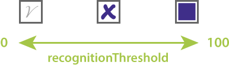

Different types of exams and questionnaires assume different types of marks. Answer sheets usually require the bubbles to be completely filled with a dark pen or marker. Ballot boxes are typically marked with checkmarks or crosses. Surveys and questionnaires are sometimes filled with a pencil so that corrections can be made. In addition, paper quality, watermarks, dirt, and even lighting conditions when photographing a completed form can reduce recognition accuracy.

All Aspose.OMR for C++ [recognition methods](/omr/cpp/recognition/) support `recognitionThreshold` parameter that allows you to fine-tune form processing and produce results with near 100% accuracy. This parameter is called **recognition accuracy threshold**.

From a technical standpoint, it defines the fill percentage of the bubble from `0%` (empty bubble) to `100%` (completely filled bubble). Lower values (`25`-`40`) allow even the lightest marks (such as pencil checkmarks and even dots) to be recognized. However, they may cause dirt, paper defects, or watermarks to be identified as false positives. Higher values (`70` or more) require a more solid fill and may cause pencil marks, checks and crosses to be ignored.



{} 
It is very important that all the bubbles in the form are filled in the same manner by everyone. Otherwise, the bulk recognition results may be unreliable, regardless of the threshold value.
{} 

## Hints

- Increase the recognition accuracy threshold if the paper you are printing forms on has security watermarks, such as ballots or answer sheets. Otherwise, watermarks within bubbles may be considered as choices.
- It is not recommended to increase the recognition accuracy threshold to values higher than `70`, unless you require the entire bubble to be completely filled with a dark pen or a marker.
- The automatic recognition threshold (if the recognition threshold parameter is omitted) depends on the bubble type and provides reliable results in most use cases.

## Example

```cpp
System::SharedPtr<Api::OmrEngine> engine = System::MakeObject<Api::OmrEngine>();
System::SharedPtr<Api::TemplateProcessor> processor = engine->GetTemplateProcessor(u"pattern.omr");
System::SharedPtr<Model::RecognitionResult> result = processor->RecognizeImage(u"ballot123.jpg", 30);
System::String resultCsv = result->GetCsv();
```
