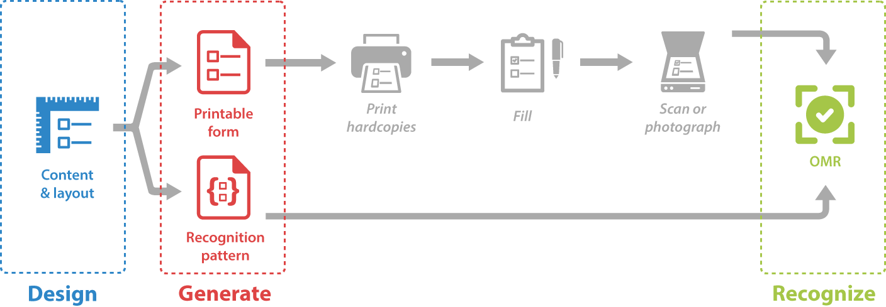

Aspose.OMR for C++ supports an end-to-end OMR workflow. With it, you can create OMR forms, generate print templates, and perform optical mark recognition. The workflow includes three main steps:

{} 
Aspose.OMR for C++ is a pure software OMR library that works without special hardware or accessories. You can print, fill out, and scan/photograph the questionnaires using any device, marker and paper so these steps are not covered in this guide.
{}

## Design

Describe the content and layout of the form using the specialized [**text markup language**](/omr/cpp/design-form/txt-markup/) or [**JSON**](/omr/cpp/design-form/json-markup/) notation.

## Generate

[**Generate**](/omr/cpp/generate-template/) **form image** that can be printed and shared with respondents.

## Recognize

[**Recognize**](/omr/cpp/recognition/) optical marks on scans or photos of completed forms and **get results** in most popular data exchange formats.
