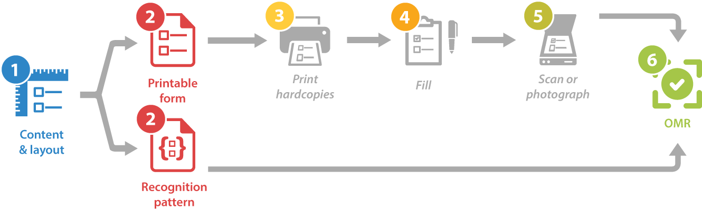
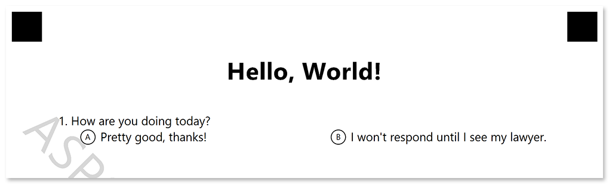
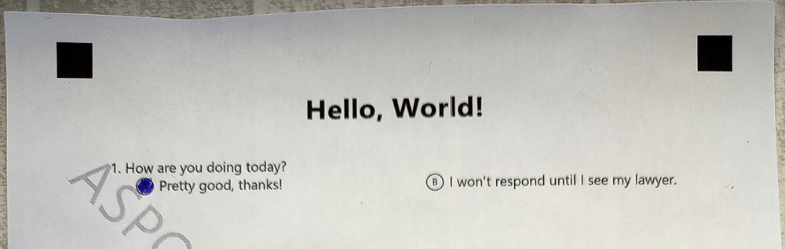

In this article, you will learn how to build 2 simple C++ applications for creating and recognizing a simple questionnaire with **Aspose.OMR for C++**.

{} 
We assume that you already have a basic knowledge of **Microsoft Visual Studio** and **C++**.
{} 

## You will need

- A [compatible](/omr/cpp/system-requirements/) OS with Microsoft Visual Studio installed. As an individual developer, you can use a free Visual Studio Community Edition.
- A printer for producing printed forms.
- A pen, a pencil, or a marker for filling answer bubbles.
- A smartphone with a high-resolution camera.
- **15 minutes** of spare time.

## Steps to be taken

While our OMR application requires minimal coding, the underlying process is a bit more complex than the typical _Hello World_. Let's look at the necessary steps to be taken.



1. **Design** the questionnaire.
2. **Generate** a printable form and recognition pattern files.
3. **Print** the form.
4. **Fill** the form.
5. **Scan** or take a photo of the form.
6. **Recognize** the form.

## Designing the questionnaire

Aspose.OMR for C++ not only performs recognition, but also allows you to design OMR forms of any layout and complexity.

The structure and layout of the questionnaire (template source) is defined in a plain-text file that uses a special notation. You can create it with any text editor, including Notepad or Visual Studio.

```
?text=Hello, World!
	font_style=bold
	font_size=24
	align=center

#How are you doing today?
	() Pretty good, thanks! () I won't respond until I see my lawyer.
```

In this article, we won't delve into the [full syntax](/omr/txt-markup/) of the template. Let's just take a look at its key building blocks:

- The text after `?text=` keyword is rendered as a simple paragraph. You can optionally format it by adding layout attributes (font, style, and the like) on the lines immediately following the text. Each attribute definition must be preceded by a **tab character**.
- The question text is provided on a new line starting with a hash (`#`). The hash itself is not rendered.
- The answers are provided on new lines immediately following the question. You can either place all answers on a single line or on several lines by adding line breaks. Each line must begin with a **tab character**.

Save the template source somewhere on you disk under the name **template.txt**. You will need it on the next step.

## Generating a form

Once you have finished with the questionnaire structure and layout, let's build a simple utility that generates a printable form from it.

1. Create a console C++ project in Visual Studio.
2. [Install](/omr/cpp/installation/) **Aspose.OMR.Cpp** NuGet package to the project.
3. Copy a form template file (**template.txt**) created on the previous step into the build directory of the project.
4. Initialize Aspose.OMR for C++ engine:  
   ```cpp
   System::SharedPtr<Api::OmrEngine> engine = System::MakeObject<Api::OmrEngine>();
   ```
5. Generate a form from the template source file:  
   ```cpp
   System::SharedPtr<Generation::GenerationResult> result = engine->GenerateTemplate(u"template.txt");
   ```
6. Save the result:  
   ```cpp
   result.Save("target", "omr-form");
   ```

**Full listing:**

```cpp
// Initialize OMR engine
System::SharedPtr<Api::OmrEngine> engine = System::MakeObject<Api::OmrEngine>();
// Generate and save printable form and recognition pattern file
System::SharedPtr<Generation::GenerationResult> result = engine->GenerateTemplate(u"template.txt");
result.Save("target", "omr-form");
```

Now run the program. If the template is correct, you should get 2 files in **bin\Debug** directory of the project:

- **omr-form.png**  
  A printable form in PNG format. Since we have not provided a [license](/omr/cpp/licensing/), there will be a watermark on the page.  
  
- **omr-form.omr**  
  A recognition pattern used by Aspose.OMR recognition engine. **This file is required for recognizing filled forms, make sure you do not accidentally delete it!**

## Answering the questionnaire

Let's take a break from the computer and get back to the good old pen and paper.

1. Print the form (**Hello.OMR.png**) generated on the previous step.
2. Mark an answer bubble.
3. Take a photo of the filled form (the entire sheet with all 4 crop marks) with your smartphone.  
   

## Recognizing the questionnaire

Now we are ready for what OMR stands for – optical mark recognition.

1. Create a console C++ project in Visual Studio.
2. [Install](/omr/cpp/installation/) **Aspose.OMR.Cpp** NuGet package to the project.
3. Copy the photo of the filled form (for example, **IMG_20220401.jpg**) into the build directory of the project.
4. Copy the previously generated recognition pattern (**omr-form.omr**) into the build directory of the project.
5. Initialize Aspose.OMR for C++ engine:  
   ```cpp
   System::SharedPtr<Api::OmrEngine> engine = System::MakeObject<Api::OmrEngine>();
   ```
6. Load the recognition pattern from **omr-form.omr** file:  
   ```cpp
   System::SharedPtr<Api::TemplateProcessor> processor = engine->GetTemplateProcessor(u"omr-form.omr");
   ```
7. Recognize the photo of the filled form:  
   ```cpp
   System::SharedPtr<Model::RecognitionResult> result = processor->RecognizeImage(u"IMG_20220401.jpg");
   ```
8. Convert the recognition result to comma-separated values (CSV) format:  
   ```cpp
   System::String resultCsv = result->GetCsv();
   ```

**Full listing:**

```cpp
// Initialize OMR engine
System::SharedPtr<Api::OmrEngine> engine = System::MakeObject<Api::OmrEngine>();
// Load recognition pattern file
System::SharedPtr<Api::TemplateProcessor> processor = engine->GetTemplateProcessor(u"omr-form.omr");
// Recognized completed survey
System::SharedPtr<Model::RecognitionResult> result = processor->RecognizeImage(u"IMG_20220401.jpg");
// Get results in CSV format
System::String resultCsv = result->GetCsv();
```

### Recognition result

Now run the program. You should get the following recognition results:

```
Element Name,Value,
Question1,"A"
```

## What's next?

Congratulations! You have taken the first steps in optical mark recognition technology. Read the [Developer reference](/omr/cpp/developer-reference/) and [API reference](https://reference.aspose.com/omr/cpp/aspose.omr/) for details on developing advanced OMR forms and applications with Aspose.OMR for C++.
