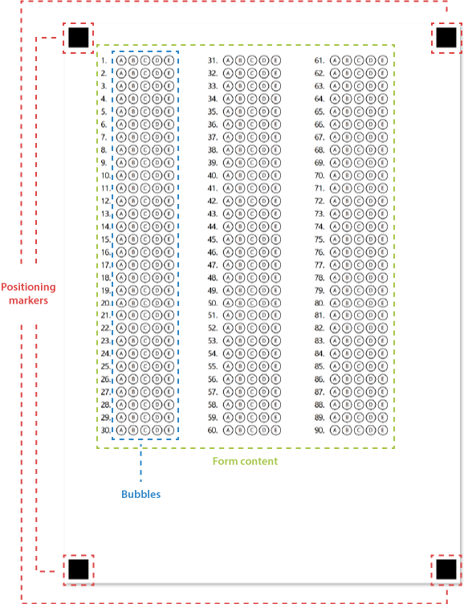

Machine-readable forms generated by Aspose.OMR for C++ have unified structure that allows the recognition engine to reliably associate handwritten marks with answers. Special layout elements are used to provide superior recognition accuracy regardless of the image quality, rotation angle and geometric distortions.

## Positioning markers

Located at the corners of the page, these 4 boxes allow a recognition engine to quickly and reliably determine the page size and orientation. Positioning markers are crucial for processing skewed scans and photos.

{} 
- The size and location of positioning markers are specially chosen to achieve the best recognition accuracy. Never remove these markers from the OMR form image in a graphics editor and do not change their size or position!
- Make sure that all 4 markers are present in the scanned or photographed completed form.
{} 

## Form content

Main area of the form containing response **bubbles** along with text, images, and other elements.
