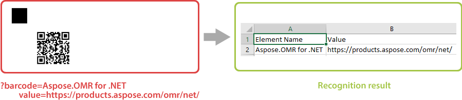
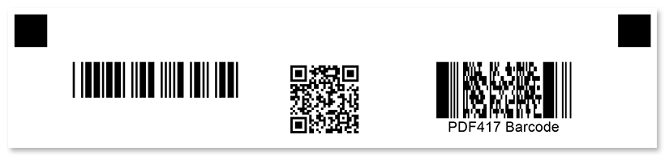

This element adds a barcode or QR code to the form based on the provided string. You can use it to link to your website or to uniquely identify a form (for example, generate personalized exam papers for each student).

Information from the barcode is decoded during recognition.



Aspose.OMR for Java can generate and recognize a wide variety of barcodes:

- QR
- Codabar
- Code11
- Code39
- Code39FullASCII
- Code93
- Code128
- GS1Code128
- EAN8
- EAN13
- EAN14
- SCC14
- SSCC18
- UPCA
- UPCE
- ISBN
- ISSN
- ISMN
- Standard2of5
- Interleaved2of5
- Matrix2of5
- ItalianPost25
- IATA2of5
- ITF14
- ITF6
- MSI
- VIN
- DeutschePostIdentcode
- DeutschePostLeitcode
- OPC
- PZN
- Code16K
- Pharmacode
- DataMatrix
- Aztec
- GS1Aztec
- Pdf417
- MacroPdf417
- AustraliaPost
- Postnet
- Planet
- OneCode
- RM4SCC
- Mailmark
- DatabarOmniDirectional
- DatabarTruncated
- DatabarLimited
- DatabarExpanded
- SingaporePost
- GS1DataMatrix
- AustralianPosteParcel
- SwissPostParcel
- PatchCode
- DatabarExpandedStacked
- DatabarStacked
- DatabarStackedOmniDirectional
- MicroPdf417
- GS1QR
- MaxiCode
- Code32
- DataLogic2of5
- DotCode
- DutchKIX
- UpcaGs1Code128Coupon
- UpcaGs1DatabarCoupon
- CodablockF
- GS1CodablockF
- GS1CompositeBar
- HIBCCode39LIC
- HIBCCode128LIC
- HIBCAztecLIC
- HIBCDataMatrixLIC
- HIBCQRLIC
- HIBCCode39PAS
- HIBCCode128PAS
- HIBCAztecPAS
- HIBCDataMatrixPAS
- HIBCQRPAS
- GS1DotCode
- HanXin
- GS1HanXin
- GS1MicroPdf417
- MicroQR
- RectMicroQR

## Syntax

The element is declared with `?barcode=[name]` statement. This statement must be placed on a separate line.

`name` property is used as an element's identifier in recognition results and as a reminder of the element's purpose in template source; for example, "_Web site_". The name is not displayed on the form.

### Attributes

An attribute is written as `[attribute_name]=[value]`. Each attribute must be placed on a **new line** immediately after the opening `?barcode=` statement or another attribute, and must begin with a **tab character**.

#### Required

A string encoded as a barcode is provided in **value** attribute. For example: `value=https://products.aspose.com/omr/`.

#### Optional

The **barcode** element can be customized by adding optional attributes to it.

Attribute | Default value | Description | Usage example
--------- | ------------- | ----------- | -------------
**barcode_type** | QR | Type of the barcode. Can take one of the following values: `QR`, `Codabar`, `Code11`, `Code39`, `Code39FullASCII`, `Code93`, `Code128`, `GS1Code128`, `EAN8`, `EAN13`, `EAN14`, `SCC14`, `SSCC18`, `UPCA`, `UPCE`, `ISBN`, `ISSN`, `ISMN`, `Standard2of5`, `Interleaved2of5`, `Matrix2of5`, `ItalianPost25`, `IATA2of5`, `ITF14`, `ITF6`, `MSI`, `VIN`, `DeutschePostIdentcode`, `DeutschePostLeitcode`, `OPC`, `PZN`, `Code16K`, `Pharmacode`, `DataMatrix`, `Aztec`, `GS1Aztec`, `Pdf417`, `MacroPdf417`, `AustraliaPost`, `Postnet`, `Planet`, `OneCode`, `RM4SCC`, `Mailmark`, `DatabarOmniDirectional`, `DatabarTruncated`, `DatabarLimited`, `DatabarExpanded`, `SingaporePost`, `GS1DataMatrix`, `AustralianPosteParcel`, `SwissPostParcel`, `PatchCode`, `DatabarExpandedStacked`, `DatabarStacked`, `DatabarStackedOmniDirectional`, `MicroPdf417`, `GS1QR`, `MaxiCode`, `Code32`, `DataLogic2of5`, `DotCode`, `DutchKIX`, `UpcaGs1Code128Coupon`, `UpcaGs1DatabarCoupon`, `CodablockF`, `GS1CodablockF`, `GS1CompositeBar`, `HIBCCode39LIC`, `HIBCCode128LIC`, `HIBCAztecLIC`, `HIBCDataMatrixLIC`, `HIBCQRLIC`, `HIBCCode39PAS`, `HIBCCode128PAS`, `HIBCAztecPAS`, `HIBCDataMatrixPAS`, `HIBCQRPAS`, `GS1DotCode`, `HanXin`, `GS1HanXin`, `GS1MicroPdf417`, `MicroQR`, `RectMicroQR`
**qr_version** | Automatic | QR Code version. Only applicable when **barcode_type** is `QR`. | `qr_version=40`
**codetext** | false | Add a string encoded as a barcode below the barcode image. | `codetext=true`
**align** | center | Horizontal alignment of the barcode image: `left`, `center` or `right`. This setting is ignored if the barcode is positioned by the absolute coordinates. | `align=right`
**height** | Automatic | Barcode height, in pixels. The width is adjusted automatically. | `height=300`
**x** | n/a | Set the absolute position of the barcode relative to the left edge of the page.<br />Overrides the value of **align** attribute. | `x=300`
**y** | n/a | Set the absolute position of the barcode relative to the top edge of the page. | `y=500`

## Allowed child elements

None.

## Example

```
?container=Example
	columns_count=3
?block=Column 1
	column=1
?barcode=Code 39 barcode
	value=Code39
	barcode_type=code39standard
	align=left
	height=150
&block
?block=Column 2
	column=2
?barcode=QR code
	value=https://products.aspose.com/omr/
	height=300
&block
?block=Column 3
	column=3
?barcode=stacked linear barcode
	value=PDF417 Barcode
	barcode_type=PDF417
	codetext=true
	height=300
&block
&container
```


