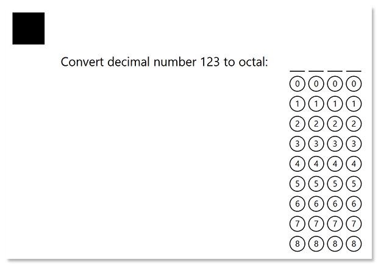

This element generates a block consisting of numbered bubbles. When recognized, all marked bubbles form a single response. This is an OMR-specific approach to collecting numeric data, such as a TIN or phone number, or getting a response to a math test without the use of optical character recognition (OCR).


## Syntax

The element is declared with `?grid=[name]` statement. This statement must be placed on a separate line.

`name` property is used as an element's identifier in recognition results and is displayed as a label on the form.

### Attributes

An attribute is written as `[attribute_name]=[value]`. Each attribute must be placed on a **new line** immediately after the opening `?grid=` statement or another attribute, and must begin with a **tab character**.

Attribute | Default value | Description | Usage example
--------- | ------------- | ----------- | -------------
**sections_count** | 8 | The maximum number of digits in the combined response. Each digit is represented as a column of bubbles. | `sections_count=7`
**options_count** | 10 | The number of bubbles for each column. Bubble numbering always starts with _0_. | `options_count=8`
**bubble_size** | `normal` | Size of bubbles:<ul><li>`extrasmall` - 40 pixels</li><li>`small` - 50 pixels</li><li>`normal` - 60 pixels</li><li>`large` - 80 pixels</li><li>`extralarge` - 100 pixels</li></ul>Overrides the global bubble size configured in [page settings](/omr/java/generate-template/page-setup/).

## Recognition behavior

Numbers from each marked bubble are merged into a single number.

If several bubbles are marked in one row / column, they are also merged into a number with multiple digits. For example, if the respondent marks bubbles "_3_" and "_7_" in one row and "_5_" in another, the recognition result for the **grid** element will be "_375_".

If this behavior is undesirable, instruct respondents to select only one bubble per column.

## Example

```text
?grid=Convert decimal number 123 to octal
	sections_count=4
	options_count=9
```


