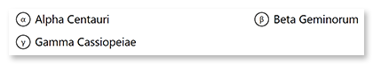

This element generates a question with a fixed number of responses. The respondent can select one or more responses by filling in the bubble next to them or by selecting a score on the rating scale.

## Syntax

The element is declared with `#` statement immediately followed by a question text. This statement must be placed on a separate line.

### Responses

Responses are provided on new lines after the opening `#` statement and continue until an empty line or another element declaration is found. Each line must begin with a **tab character**. 

The response is declared in the form `([character]) {Response text}`, where `character` specifies the symbol to be placed inside the response bubble. For example, `(α) Alpha Centauri`. The character is optional; if it is omitted, the letters _A_ through _Z_ will be used.

Multiple responses can be placed one after the other or on new lines starting with a **tab character**. If the response code is placed on a new line, it will be rendered on a new line in the generated form. For example:

```text
	(α) Alpha Centauri (β) Beta Geminorum
	(γ) Gamma Cassiopeiae
```



### Rating scale

You can omit the response text and use `([character])` syntax alone to create rating scales. For example, `(5) (4) (3) (2) (1)`.


## Examples

Check out the code examples to see how questions can be used.

### Closed-ended question

```text
#Which Aspose.OMR features do you consider the most valuable?
	() Recognition accuracy () Wide range of supported file formats
	() Form generation () QR codes and barcodes support
```


### Yes / no options

```
#Would you recommend Aspose.OMR to your colleagues?
	(Yes) Yes, sure! (No) Unlikely
```


### Question with a rating scale

```
#On a scale of 5 to 1, how do you feel?
	(5)(4)(3)(2)(1)
```


