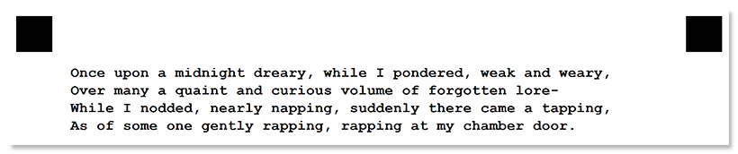

This element is used to add one or more lines of text to the form.

## Syntax

The element declaration begins with `?text=` statement followed by a text to be displayed on the form, and continues until an empty line, another element declaration, or an attribute is found.

New lines following `?text=` declaration are treated as line breaks in the text.

{} 
Never add a **tab character** before subsequent lines of text. Otherwise, they will be misinterpreted as attributes.
{}

### Attributes

The **text** element can be customized by adding optional attributes to it.

An attribute is written as `[attribute_name]=[value]`. Each attribute must be placed on a **new line** immediately after the opening `?text=` statement or another attribute, and must begin with a **tab character**.

Attribute | Default value | Description | Usage example
--------- | ------------- | ----------- | -------------
**font_family** | Segoe UI | The font family for the text. | `font_family=Courier New`
**font_style** | regular | The font style for a text: `bold`, `italic` or `underline`. | `font_style=bold`
**font_size** | 12 | Font size for the text. | `font_size=16`

{} 
The selected font must be installed in the system that generates the printed form! Otherwise, form generation will fail with an exception.
{}

## **Example**

```text
?text=Once upon a midnight dreary, while I pondered, weak and weary,
Over many a quaint and curious volume of forgotten lore-
While I nodded, nearly napping, suddenly there came a tapping,
As of some one gently rapping, rapping at my chamber door.
	font_family=Courier New
	font_style=bold
```


