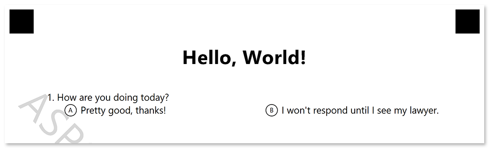

In this article, you will learn how to build 2 simple Java applications for creating and recognizing a simple questionnaire with **Aspose.OMR for Java**.

{} 
We assume that you already have a basic knowledge of Java development.
{} 

## You will need

- A [compatible](/omr/java/system-requirements/) OS and Java development environment.
- A printer for producing printed forms.
- A pen, a pencil, or a marker.
- A smartphone with a high-resolution camera.
- **15 minutes** of spare time.

## Steps to be taken

While our OMR application requires minimal coding, the underlying process is a bit more complex than the typical _Hello World_. Let's look at the necessary steps to be taken.


1. **Design** the questionnaire.
2. **Generate** a printable form and recognition pattern files.
3. **Print** the form.
4. **Fill** the form.
5. **Scan** or take a photo of the form.
6. **Recognize** the form.

## Designing the questionnaire

Aspose.OMR for Java not only performs recognition, but also allows you to design OMR forms of any layout and complexity. The structure and layout of the questionnaire (template source) is defined in a plain-text file that uses a special notation. You can create it with any text editor, including Notepad.

```
?text=Hello, World!
	font_style=bold
	font_size=24

#How are you doing today?
	() Pretty good, thanks! () I won't respond until I see my lawyer.
```

For the purposes of this article, there is no need to delve into the full template syntax. Let's just take a look at its key building blocks:

- The text after `?text=` keyword is rendered as a simple paragraph. You can optionally format it by adding layout attributes (font, style, and the like) on the lines immediately following the text. Each attribute definition must be preceded by a **tab character**.
- The question text is provided on a new line starting with a hash (`#`). The hash itself is not rendered.
- The answers are provided on new lines immediately following the question. You can either place all answers on a single line or on several lines by adding line breaks. Each line must begin with a **tab character**.

Save the template source somewhere on you disk under the name **template.txt**. You will need it on the next step.

## Generating a form

Once you have finished with the questionnaire structure and layout, let's build a simple utility that generates a printable form from it.

1. [Install](/omr/java/installation/) **Aspose.OMR for Java**.
2. Create an instance of **OmrEngine** class:  
   ```java
   OmrEngine engine = new OmrEngine();
   ```
3. Generate a form from the template source file:  
   ```java
   GenerationResult res = engine.generateTemplate("source.txt");
   ```
4. Save the result:  
   ```java
   res.Save("target", "hello");
   ```

**Full listing:**

```java
OmrEngine engine = new OmrEngine();
GenerationResult res = engine.generateTemplate("source.txt");
res.Save("target", "hello");
```

Run the application. If the template is correct, you should get 2 files in **bin\Debug** directory of the project:

- **hello.png**  
  A printable form in PNG format. Since we have not provided a [license](/omr/java/licensing/), there will be a watermark on the page.  
  
- **hello.omr**  
  A recognition pattern used by Aspose.OMR for Java recognition engine. **This file is required for recognizing filled forms, make sure you do not accidentally delete it!**

## Answering the questionnaire

Let's take a break from the computer and get back to the good old pen and paper.

1. Print the form (**hello.png**) generated on the previous step.
2. Mark an answer bubble.
3. Take a photo of the filled form (the entire sheet with **all 4 crop marks**) with your smartphone.  
   

## Recognizing the questionnaire

Now we are ready for what OMR stands for – optical mark recognition of machine-readable forms.

1. Create an instance of **OmrEngine** class:  
   ```java
   OmrEngine engine = new OmrEngine();
   ```
2. Load the recognition pattern from **hello.omr** file:  
   ```java
   TemplateProcessor processor = engine.getTemplateProcessor("hello.omr");
   ```
3. Recognize the photo of the filled form:  
   ```java
   RecognitionResult result = processor.recognizeImage("completed-form.png");
   ```
8. Convert the recognition result to comma-separated values (CSV) format and output it to the console:  
   ```java
   String resultCsv = result.getCsv();
   System.out.println(resultCsv);
   ```

**Full listing:**

```c#
OmrEngine engine = new OmrEngine();
TemplateProcessor processor = engine.getTemplateProcessor("hello.omr");
RecognitionResult result = processor.recognizeImage("completed-form.png");
String resultCsv = result.getCsv();
System.out.println(resultCsv);
```

### Recognition result

Run the application. You should see results of the recognition in the console output:

```
Element Name,Value,
Question1,"A"
```

## What's next?

Congratulations! You have taken the first steps in optical mark recognition technology. Read the [Developer reference](/omr/java/developer-guide/) and [API reference](https://apireference.aspose.com/omr/java) for details on developing advanced OMR forms and applications with Aspose.OMR for Java.
