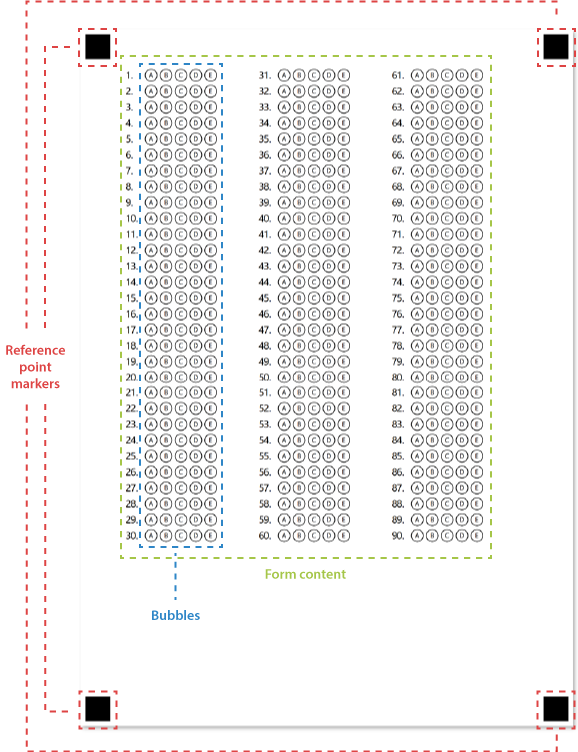

Machine-readable forms generated by Aspose.OMR for Java have unified structure that allows the recognition engine to reliably associate handwritten marks with answers. Special layout elements are used to provide superior recognition accuracy regardless of the image quality, rotation angle and geometric distortions.

## Reference point markers

Located at the corners of the page, these 4 black squares allow a recognition engine to quickly find inner elements of the form and determine its size and orientation. Reference point markers are crucial for form recognition.

Due to their importance, reference point markers are always rendered above all other elements of the form.

{}
**Important considerations:**

- Never remove these markers from the OMR form and do not change their size or position in a graphics editor.
- When scanning or photographing completed forms, ensure that all 4 markers are present in the image.
{} 

## Form content

Main area of the form containing response **bubbles** along with text, images, and other elements.
