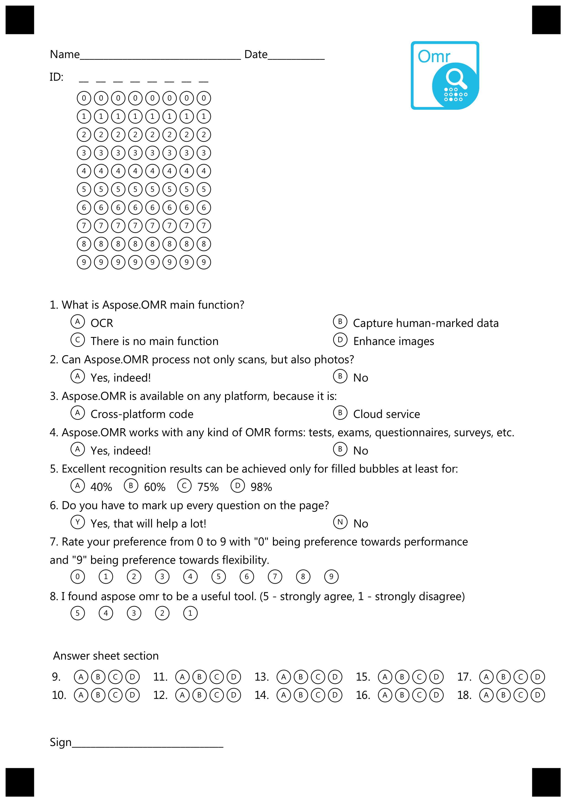

{} 
This article contains a summary of recent changes, enhancements and bug fixes in [**Aspose.OMR for JAVA 22.12 (December 2022)**](https://releases.aspose.com/java/repo/com/aspose/aspose-omr/22.12/) release.
{} 

## What was changed

Key | Summary | Category
--- | ------- | --------
OMRJAVA-61 | Added new generation element Image. See [Including Image](#including-image)  | New feature

## Known issues and limitations

_No issues._


## Public API changes and backwards compatibility

This section lists all public API changes introduced in **Aspose.OMR for JAVA 22.12** that may affect the code of existing applications.

### Added public APIs:

The following public APIs have been added in this release:

#### Including image

A new **Image** element has been added to [template layout](/java/create-omr-template/) that allows to include static images into template, e.g. png\jpg\bmp.

[Examples](/java/images/)

### Updated public APIs:

_No changes._

### Removed public APIs:

_No changes._

## Usage examples

See the examples below to learn more about the changes introduced in this release:

### Generating form with image

```
?text=Name__________________________________ Date____________
?grid=ID
	sections_count=8
#What is Aspose.OMR main function?
	() OCR () Capture human-marked data
	() There is no main function () Enhance images
#Can Aspose.OMR process not only scans, but also photos?
	() Yes, indeed! () No
#Aspose.OMR is available on any platform, because it is:
	() Cross-platform code () Cloud service
#Aspose.OMR works with any kind of OMR forms: tests, exams, questionnaires, surveys, etc.
	() Yes, indeed! () No
#Excellent recognition results can be achieved only for filled bubbles at least for:
	() 40% () 60% () 75% () 98%
#Do you have to mark up every question on the page?
	(Yes) Yes, that will help a lot! (No) No
#Rate your preference from 0 to 9 with "0" being preference towards performance
and "9" being preference towards flexibility.
	(0) (1) (2) (3) (4) (5) (6) (7) (8) (9)
#I found aspose omr to be a useful tool. (5 - strongly agree, 1 - strongly disagree)
	(5) (4) (3) (2) (1)

?text= Answer sheet section
?answer_sheet=MainQuestions
	elements_count=10
	columns_count=5

?text=Sign________________________________

?image=logo.png
	height=300
	width=300
	x=1800
	y=180
```



