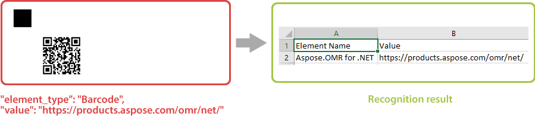

This element adds a barcode or QR code to the form based on the provided string. You can use it to link to your website or to uniquely identify a form (for example, generate personalized exam papers for each student).

Information from the barcode is decoded during recognition.



Aspose.OMT for .NET can generate and recognize a wide variety of barcodes:

- AustralianPosteParcel
- AustraliaPost
- Aztec
- Codabar
- CodablockF
- Code11
- Code128
- Code16K
- Code32
- Code39Extended
- Code39Standard
- Code93Extended
- Code93Standard
- DatabarExpanded
- DatabarExpandedStacked
- DatabarLimited
- DatabarOmniDirectional
- DatabarStacked
- DatabarStackedOmniDirectional
- DatabarTruncated
- DataLogic2of5
- DataMatrix
- DeutschePostIdentcode
- DeutschePostLeitcode
- DotCode
- DutchKIX
- EAN13
- EAN14
- EAN8
- GS1Code128
- GS1DataMatrix
- GS1QR
- IATA2of5
- Interleaved2of5
- ISBN
- ISMN
- ISSN
- ItalianPost25
- ITF14
- ITF6
- MacroPdf417
- Mailmark
- Matrix2of5
- MaxiCode
- MicroPdf417
- MSI
- OneCode
- OPC
- PatchCode
- Pdf417
- Pharmacode
- Planet
- Postnet
- PZN
- QR code
- RM4SCC
- SCC14
- SSCC18
- Standard2of5
- SwissPostParcel
- SwissQR
- UPCA
- UPCE
- VIN

## Declaration

This element is declared as an object with `"element_type": "Barcode"` property.

A string encoded as a barcode is specified in the **value** property.

```json
{
	"element_type": "Barcode",
	"value": "https://products.aspose.com/omr/"
}
```

### Required properties

Name | Type | Description
---- | ---- | -----------
**element_type** | string | Must be `"Barcode"` (case-insensitive).
**value** | string | A string encoded as a barcode.

### Optional properties

Name | Type | Default value | Description
---- | ---- | ------------- | -----------
**name** | string | _n/a_ | Used as an element's identifier in recognition results and as a reminder of the element's purpose in template source; for example, "_Web site_".<br />This text is not displayed on the form.
**barcode_type** | string | "QR" | Type of the barcode. Can take one of the following values: `"AustralianPosteParcel"`, `"AustraliaPost"`, `"Aztec"`, `"Codabar"`, `"CodablockF"`, `"Code11"`, `"Code128"`, `"Code16K"`, `"Code32"`, `"Code39Extended"`, `"Code39Standard"`, `"Code93Extended"`, `"Code93Standard"`, `"DatabarExpanded"`, `"DatabarExpandedStacked"`, `"DatabarLimited"`, `"DatabarOmniDirectional"`, `"DatabarStacked"`, `"DatabarStackedOmniDirectional"`, `"DatabarTruncated"`, `"DataLogic2of5"`, `"DataMatrix"`, `"DeutschePostIdentcode"`, `"DeutschePostLeitcode"`, `"DotCode"`, `"DutchKIX"`, `"EAN13"`, `"EAN14"`, `"EAN8"`, `"GS1Code128"`, `"GS1DataMatrix"`, `"GS1QR"`, `"IATA2of5"`, `"Interleaved2of5"`, `"ISBN"`, `"ISMN"`, `"ISSN"`, `"ItalianPost25"`, `"ITF14"`, `"ITF6"`, `"MacroPdf417"`, `"Mailmark"`, `"Matrix2of5"`, `"MaxiCode"`, `"MicroPdf417"`, `"MSI"`, `"OneCode"`, `"OPC"`, `"PatchCode"`, `"Pdf417"`, `"Pharmacode"`, `"Planet"`, `"Postnet"`, `"PZN"`, `"QR"`, `"RM4SCC"`, `"SCC14"`, `"SSCC18"`, `"Standard2of5"`, `"SwissPostParcel"`, `"SwissQR"`, `"UPCA"`, `"UPCE"`, `"VIN"`.
**qr_version** | integer | _Automatic_ | QR Code version. Only applicable when **barcode_type** is `"QR"`.
**codetext** | Boolean | false | Add a string from the **value** property below the barcode image.
**align** | string | "center" | Horizontal alignment of the barcode image: `"left"`, `"center"` or `"right"`.
**height** | integer | _Automatic_ | Barcode height, in pixels. The width is adjusted automatically.
**x** | integer | _n/a_ | Set the absolute position of the barcode relative to the left edge of the page.<br />Overrides the value of **align** property.
**y** | integer | _n/a_ | Set the absolute position of the barcode relative to the top edge of the page.

## Allowed child elements

None.

## Example

```json
{
	"element_type": "Template",
	"children": [
		{
			"element_type": "Page",
			"children": [
				{
					"element_type": "Container",
					"name": "Three-column layout",
					"columns_count": 3,
					"children": [
						{
							"element_type": "Block",
							"column": 1,
							"children": [
								{
									"element_type": "Barcode",
									"value": "Code39",
									"barcode_type": "code39standard",
									"align": "left",
									"height": 150
								}
							]
						},
						{
							"element_type": "Block",
							"column": 2,
							"children": [
								{
									"element_type": "Barcode",
									"value": "https://products.aspose.com/omr/",
									"height": 300
								}
							]
						},
						{
							"element_type": "Block",
							"column": 3,
							"children": [
								{
									"element_type": "Barcode",
									"value": "PDF417 Barcode",
									"barcode_type": "PDF417",
									"codetext": true,
									"height": 300
								}
							]
						}
					]
				}
			]
		}
	]
}
```


