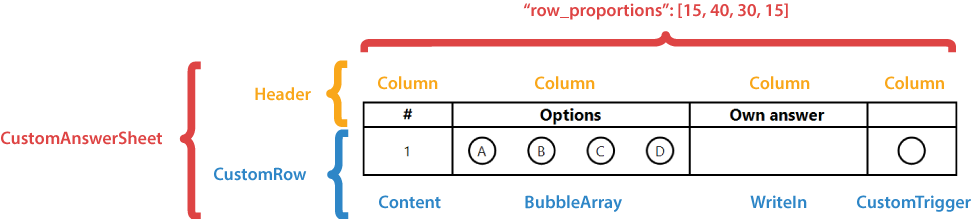

**CustomAnswerSheet** element generates a numbered list of answers. Answers can be arranged in multiple columns to make more efficient use of space.

You can fully control the layout and content of answer rows and use [**WriteIn**](/omr/json-markup/writein/) elements to handle open-ended questions.

**CustomAnswerSheet** is best suited for exam papers with open-ended questions.

## Declaration

This element is declared as an object with `"element_type": "CustomAnswerSheet"` property.

**CustomAnswerSheet** element includes [**Header**]() and [**CustomRow**]() elements. These elements are provided as an array of objects in the **children** property.



### CustomAnswerSheet required properties

Name | Type | Description
---- | ---- | -----------
**element_type** | string | Must be `"CustomAnswerSheet"` (case-insensitive).
**amount** | integer | The number of exam questions that the answer sheet corresponds to. Each question will correspond to a numbered answer.
**columns_count** | integer | The number of columns to arrange answers into. Use multiple columns to make the answer sheet more compact.
**row_proportions** | array | The content of each answer is divided into one or more columns. This attribute specifies the number of columns and their proportions.<br />The number of columns is determined by the array length. Column widths (in percent) are provided as array items. The grand total of all column widths must not exceed 100.
**children** | array | Must contain [**Header**]() and [**CustomRow**]() elements.

### CustomAnswerSheet optional properties

Name | Type | Default value | Description
---- | ---- | ------------- | -----------
**name** | string | _n/a_ | Used as a reminder of the element's purpose; for example, "_Biology Quiz_".
**border** | string | "none" | Whether to draw a border around the field.<ul><li>`"none"` - no border.</li><li>`"square"` - draw a rectangular border.</li><li>`rounded` - draw a rectangular border with rounded corners.</li></ul>
**border_size** | integer | 3 | Width of all borders.
**border_color** | string | "Black" | Color of all borders. Can be picked from one of the supported values.
**border_top_style** | object | _inherits border_size and border_color_ | Override the width and color of the element's top border. Provided as the following object: `{"size": <border width>, "color": "<border color>", "disable": <true \| false>}`. Specifying `true` in the `disable` property removes the top border.
**border_bottom_style** | object | _inherits border_size and border_color_ | Override the width and color of the element's bottom border. Provided as the following object: `{"size": <border width>, "color": "<border color>", "disable": <true \| false>}`. Specifying `true` in the `disable` property removes the bottom border.
**border_left_style** | object | _inherits border_size and border_color_ | Override the width and color of the element's left border. Provided as the following object: `{"size": <border width>, "color": "<border color>", "disable": <true \| false>}`. Specifying `true` in the `disable` property removes the left border.
**border_right_style** | object | _inherits border_size and border_color_ | Override the width and color of the element's right border. Provided as the following object: `{"size": <border width>, "color": "<border color>", "disable": <true \| false>}`. Specifying `true` in the `disable` property removes the right border.

### Header element

The child element of the **CustomAnswerSheet**, which defines heading cells for answer's columns. It must be the first item in the **children** array of **CustomAnswerSheet** element.

This element is declared as an object with `"element_type": "Header"` property.

For each column defined in [**row_proportions**]() property of the parent **CustomAnswerSheet** element, **Header** element must include a **Column** child element, which defines the heading text. All **Column** elements are provided as an array of objects in the **children** property of the **Header** element.

#### Column element

The child element of the **Header**, which defines the heading text for the corresponding column.

This element is declared as an object with `"element_type": "Column"` property.

The text displayed in the column header cell is specified in the **name** property.

##### Column required properties

Name | Type | Description
---- | ---- | -----------
**element_type** | string | Must be `"Column"` (case-insensitive).
**name** | string | A line of text displayed in the column header cell.

##### Column optional properties

Name | Type | Default value | Description
---- | ---- | ------------- | -----------
**font_family** | string | "Segoe UI" | The font family for the text.
**font_style** | string / array | "regular" | The font style for a text: `"bold"`, `"italic"` or `"underline"`.<br />Several font styles can be combined by providing them as an array; for example `["bold", "italic"]`.
**font_size** | integer | 12 | Font size for the text.
**align** | string | "left" | Horizontal text alignment: `"left"`, `"center"` or `"right"`.
**content_type** | string | "Normal" | Set the value of this property to `"Cells"` to draw a border around every character, including spaces.

### CustomRow element

This child element of the **CustomAnswerSheet** defines the structure on an answer.

This element is declared as an object with `"element_type": "CustomRow"` property.

{} 

This element and its child elements can reference `%index%` variable, which is replaced with the current answer's ordinal.

For example, `Answer %index%` for the 4th answer will be rendered as `Answer 4`.

{}

For each column defined in [**row_proportions**]() property of the parent **CustomAnswerSheet** element, add a child element of one of the following types (in any order or combination) to the **children** array of **CustomRow** element:

- [**Content**](/omr/json-markup/content/) element which allows you to provide some explanatory text.
- [**WriteIn**](/omr/json-markup/writein/) element, used to provide your own answer to open-ended questions.
- [**BubbleArray**]()
- [**CustomTrigger**]()

#### CustomRow required properties

Name | Type | Description
---- | ---- | -----------
**element_type** | string | Must be `"CustomRow"` (case-insensitive).
**children** | array | Defines the structure of an answer.

#### CustomRow optional properties

Name | Type | Default value | Description
---- | ---- | ------------- | -----------
**name** | string | _n/a_ | Used as an identifier of each generated row. Use **%index%** variable to guarantee the uniqueness; for example, `"Row %index%"`.

#### BubbleArray element

Inserts a specified amount of bubbles.

This element is declared as an object with `"element_type": "BubbleArray"` property.

##### BubbleArray required properties

Name | Type | Description
---- | ---- | -----------
**element_type** | string | Must be `"BubbleArray"` (case-insensitive).
**answers_list** | array | Characters to be drawn inside bubbles. Array length determines the total number of bubbles.

##### BubbleArray optional properties

Name | Type | Default value | Description
---- | ---- | ------------- | -----------
**name** | string | _n/a_ | An identifier, which can be used by [**CustomTrigger**]() element. Use **%index%** variable to guarantee the uniqueness; for example, `"Bubbles %index%"`.
**bubble_size** | string | "normal" | Size of bubbles: `"extrasmall"`, `"small"`, `"normal"`, `"large"`, or `"extralarge"`.
**bubble_type** | string | "round" | Bubble style: `"round`" or `"square"`.
**font_family** | string | "Segoe UI" | The font family for the bubble character.
**font_style** | string / array | "regular" | The font style for the bubble character: `"bold"`, `"italic"` or `"underline"`.<br />Several font styles can be combined by providing them as an array; for example `["bold", "italic"]`.
**font_size** | integer | 12 | Font size for the bubble character.

#### CustomTrigger element

Inserts a special bubble that, when marked, replaces the value of the specified [**BubbleArray**]() with the **value** property of the **CustomTrigger** element. It can be used to offer the respondent the option to intentionally skip certain questions, or to control processing of [**WriteIn**](/omr/json-markup/writein/) elements.

This element is declared as an object with `"element_type": "CustomTrigger"` property.

##### CustomTrigger required properties

Name | Type | Description
---- | ---- | -----------
**element_type** | string | Must be `"CustomTrigger"` (case-insensitive).
**target** | string | Name of [**BubbleArray**]() element whose value will be replaced. Use **%index%** variable to point to the same row where the **CustomTrigger** element instance is rendered; for example, `"Bubbles %index%"`.
**value** | string | The replacement value to be used when the element is marked; for example `"Prefer not to answer"`.

##### CustomTrigger optional properties

Name | Type | Default value | Description
---- | ---- | ------------- | -----------
**name** | string | _n/a_ | An identifier of the **CustomTrigger** element. Use **%index%** variable to guarantee the uniqueness; for example, "_Own choice %index%_".
**trigger_type** | string | "ReplaceValue" | Action when the bubble is marked. `"ReplaceValue"` replaces the value of the [**BubbleArray**]() specified in **target** property with the **value** property.<br />This property is reserved for future use; you can omit it.
**bubble_size** | string | "normal" | Size of bubbles: `"extrasmall"`, `"small"`, `"normal"`, `"large"`, or `"extralarge"`.
**bubble_type** | string | "round" | Bubble style: `"round`" or `"square"`.

## Example

```json
{
	"element_type": "Template",
	"children": [
		{
			"element_type": "Page",
			"children": [
				{
					"element_type": "CustomAnswerSheet",
					"amount": 15,
					"columns_count": 3,
					"row_proportions": [15, 45, 25, 15],
					"children": [
						{
							"element_type": "Header",
							"children": [
								{
									"element_type": "Column",
									"name": "#",
									"font_size": 6,
									"font_style": "bold",
									"align": "center"
								},
								{
									"element_type": "Column",
									"name": "Choice",
									"font_size": 6,
									"font_style": "bold",
									"align": "center"
								},
								{
									"element_type": "Column",
									"name": "Own value",
									"font_size": 6,
									"font_style": "bold",
									"align": "center"
								},
								{
									"element_type": "Column",
									"name": "Skip",
									"font_size": 6,
									"font_style": "bold",
									"align": "center"
								}
							]
						},
						{
							"element_type": "CustomRow",
							"name": "Row %index%",
							"children": [
								{
									"element_type": "Content",
									"name": "%index%",
									"font_size": 6,
									"align": "center"
								},
								{
									"element_type": "BubbleArray",
									"name": "Bubbles %index%",
									"answers_list": ["A", "B", "C", "D"],
									"font_size": 5,
									"bubble_size": "small"
								},
								{
									"element_type": "WriteIn",
									"name": "Own value for %index%",
									"required": true
								},
								{
									"element_type": "CustomTrigger",
									"name": "Skip question %index%",
									"value": "Prefer not to answer",
									"target": "Bubbles %index%",
									"bubble_size": "small"
								}
							]
						}
					]
				}
			]
		}
	]
}
```


