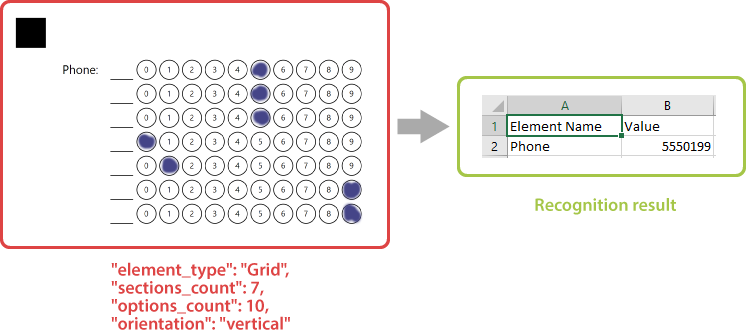
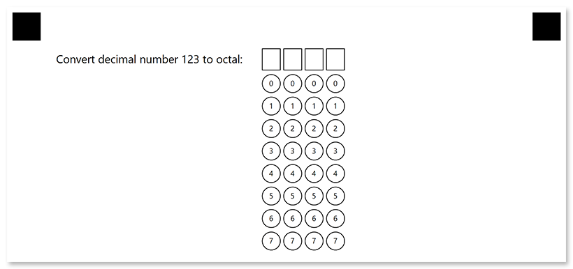
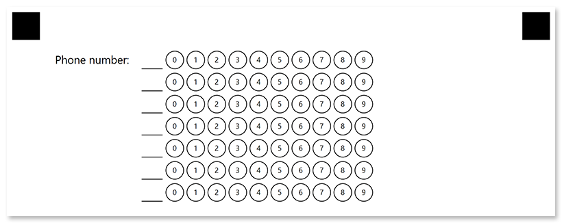

This element generates a block consisting of numbered bubbles. The block is recognized as a whole, resulting in all marked bubbles forming a single answer.

**Grid** element is an OMR-specific approach to collecting simple numeric data such as a TIN or phone number, or getting an answer to a math test without using optical character recognition (OCR).



## Declaration

This element is declared as an object with `"element_type": "Grid"` property.

The maximum number of digits in the combined response is specified in the **sections_count** property.

The number of bubbles for each digit is specified in the **options_count** property.

```json
{
	"element_type": "Grid",
	"sections_count": 7,
	"options_count": 10
}
```

### Required properties

Name | Type | Description
---- | ---- | -----------
**element_type** | string | Must be `"Grid"` (case-insensitive).
**sections_count** | integer | The maximum number of digits in the combined response. Each digit is represented as a line or column of bubbles, depending on the element's **orientation** property.
**options_count** | integer | The number of bubbles for each digit.

### Optional properties

Name | Type | Default value | Description
---- | ---- | ------------- | -----------
**name** | string | _n/a_ | Used as an element's identifier in recognition results and is displayed as a label on the form.
**align** | string | "left" | Horizontal alignment of **Grid** element: `"left"`, `"center"` or `"right"`.
**orientation** | string | "horizontal" | Element's orientation:<ul><li>`"horizontal"` - each digit is represented as a column of bubbles;</li><li>`"vertical"` - each digit is represented as a row of bubbles.</li></ul>
**header_type** | string | "underline" | The type of the box to be displayed in front of each column / row. This box can be used for hand-writing the answer in addition to marking bubbles.<ul><li>`"underline"` - draw a horizontal line.</li><li>`"square"` - draw a box.</li></ul>
**header_border_size** | integer | 3 | Border width of the box to be displayed in front of each column / row.
**header_border_color** | string | "black" | Border color of the box to be displayed in front of each column / row. Can be picked from one of the supported values.
**vertical_margin** | integer| 0 | Vertical spacing between the element's lines, in pixels.
**bubble_size** | string | "normal" | Size of bubbles: `"extrasmall"`, `"small"`, `"normal"`, `"large"`, or `"extralarge"`.
**bubble_type** | string | "round" | Bubble style: `"round`" or `"square"`.
**x** | integer | _n/a_ | Set the absolute position of the **Grid** element relative to the left edge of the page.<br />Overrides the value of **align** property.
**y** | integer | _n/a_ | Set the absolute position of the **Grid** element relative to the top edge of the page.
**column** | integer | 1 | The number of the column where the **Grid** element will be placed. Only applicable if **Grid** is placed in a multi-column [**Container**](/omr/json-markup/container/) element.

## Recognition behavior

Numbers from each marked bubble are merged into a single number.

If several bubbles are marked in one row / column, they are also merged into a number with multiple digits. For example, if the respondent marks bubbles "_3_" and "_7_" in one row and "_5_" in another, the recognition result for the **grid** element will be "_375_".

If this behavior is undesirable, instruct respondents to select one bubble per row / column (depending on the `orientation` property) or use [**CompositeGrid**](/omr/json-markup/compositegrid/) element.

## Allowed child elements

None.

## Examples

Check out the code examples to see how **grid** elements can be used.

### Horizontal grid

```json
{
	"element_type": "Template",
	"children": [
		{
			"element_type": "Page",
			"children": [
				{
					"element_type": "Grid",
					"name": "Convert decimal number 123 to octal",
					"sections_count": 4,
					"options_count": 8,
					"bubble_size": "large",
					"header_type": "square"
				}
			]
		}
	]
}
```



### Vertical grid

```json
{
	"element_type": "Template",
	"children": [
		{
			"element_type": "Page",
			"children": [
				{
					"element_type": "Grid",
					"name": "Phone number",
					"sections_count": 7,
					"options_count": 10,
					"bubble_size": "large",
					"orientation": "vertical"
				}
			]
		}
	]
}
```


