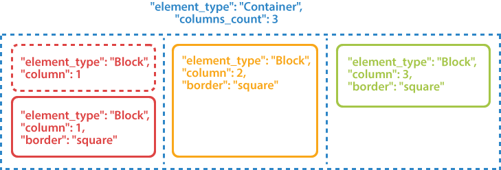
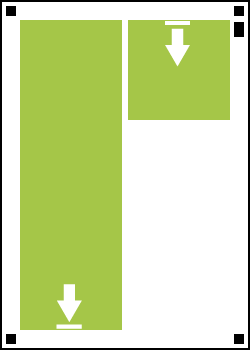

This element is used to organize content within [**Containers**](/omr/json-markup/container/). **Block** elements can only be nested within [**Container**](/omr/json-markup/container/) elements.

**Block** elements may have no visual representation or have a border around them.



## Declaration

**Block** element is declared as an object with `"element_type": "Block"` property.

Elements displayed inside blocks are provided as an array of objects in the **children** property.

```json
{
	"element_type": "Block",
	"children": [
		/*** put child elements here */
	]
}
```

### Required properties

Name | Type | Description
---- | ---- | -----------
**element_type** | string | Must be `"Block"` (case-insensitive).
**children** | array | [Child elements]().

### Optional properties

Name | Type | Default value | Description
---- | ---- | ------------- | -----------
**name** | string | _n/a_ | Used as a reminder of the element's purpose; for example, "_Column 1_". You can use the same value for multiple blocks.<br />This text is not displayed on the form.
**column** | integer | 1 | The number of the column in which the Block will be placed.<br />This number must not exceed the number of columns of the parent [**Container**](/omr/json-markup/container/) element.
**border** | string | "none" | Whether to draw a border around the Block element.<ul><li>`"none"` - no border.</li><li>`"square"` - draw a rectangular border.</li><li>`rounded` - draw a rectangular border with rounded corners.</li></ul>
**border_size** | integer | 3 | Width of the **Block** borders.
**border_color** | string | "Black" | Color of the **Block** borders. Can be picked from one of the supported values.
**border_top_style** | object | _inherits border_size and border_color_ | Override the width and color of the element's top border. Provided as the following object: `{"size": <border width>, "color": "<border color>", "disable": <true \| false>}`. Specifying `true` in the `disable` property removes the top border.
**border_bottom_style** | object | _inherits border_size and border_color_ | Override the width and color of the element's bottom border. Provided as the following object: `{"size": <border width>, "color": "<border color>", "disable": <true \| false>}`. Specifying `true` in the `disable` property removes the bottom border.
**border_left_style** | object | _inherits border_size and border_color_ | Override the width and color of the element's left border. Provided as the following object: `{"size": <border width>, "color": "<border color>", "disable": <true \| false>}`. Specifying `true` in the `disable` property removes the left border.
**border_right_style** | object | _inherits border_size and border_color_ | Override the width and color of the element's right border. Provided as the following object: `{"size": <border width>, "color": "<border color>", "disable": <true \| false>}`. Specifying `true` in the `disable` property removes the right border.
**is_clipped** | Boolean | false | If set to `true`, the content of the **Block** element is stored as an image during recognition, similar to the [**WriteIn**](/omr/json-markup/writein/) element. The image can be can be passed to optical character recognition library, such as [Aspose.OCR](https://products.aspose.app/ocr), or saved.<br />If the **Block** contains OMR elements, they will be recognized even if this property is set to `true`.
**background_color** | string | _no fill_ | Background color of the block element. Can be picked from one of the supported values.
**height** | integer | _Automatically adjust height to fit content_ | Set fixed block height, in pixels.
**horizontal_padding** | integer | 20 | Set the left and right padding of the block, in pixels.
**vertical_padding** | integer | 20 | Set the top and bottom padding of the block, in pixels.
**overflow** | string | _Inherit the global page settings_ | Define how to clip and wrap elements inside the block:<ul><li>`noclip` - overflow content is displayed outside of the block boundaries;</li><li>`clip` - the content outside of the horizontal and vertical boundaries of the block will be invisible;</li><li>`wrap` - the content that does not match the block's bounds will automatically appear in the next column.</li></ul>See [Clipping and wrapping block content](#clipping-and-wrapping-block-content) for details.

## Allowed child elements

All, except for another **Block**.

## Clipping and wrapping block content

When designing OMR forms, you may run into a situation where the content does not fit inside the block. The handling of these edge cases is performed through the use of `overflow` property.

{} 
This property overrides the global page setting for the specific block.
{} 

### `"overflow"="noclip"`

Overflow content is rendered outside the block boundaries. This can result in content overlapping with other elements or being clipped at page boundaries.

This is the default rendering method.


### `"overflow"="clip"`

Overflow content will be invisible. Cropping will be done both horizontally and vertically. This may result in some content (images, bubbles, text, and so on) not being presented in the rendered OMR form.


### `"overflow"="wrap"`

Content that does not fit inside the block will automatically appear in the next column. This rendering method only applies to multi-column layouts and cannot slice monolithic elements such as images and barcodes.



## **Examples**

Check out the code examples to see how **Block** elements can be used and combined with each other.

### Two-column layout

```json
{
	"element_type": "Template",
	"children": [
		{
			"element_type": "Page",
			"children": [
				{
					"element_type": "Container",
					"name": "Two-column layout",
					"columns_count": 2,
					"children": [
						{
							"element_type": "Block",
							"column": 1,
							"children": [
								{
									"element_type": "Content",
									"name": "First column, first block."
								}
							]
						},
						{
							"element_type": "Block",
							"column": 1,
							"border": "square",
							"children": [
								{
									"element_type": "Content",
									"name": "First column, second block."
								}
							]
						},
						{
							"element_type": "Block",
							"column": 2,
							"border": "square",
							"border_size": 10,
							"border_color": "Blue",
							"children": [
								{
									"element_type": "Content",
									"name": "Second column, first block."
								}
							]
						}
					]
				}
			]
		}
	]
}
```


### Fake table layout

```json
{
	"element_type": "Template",
	"children": [
		{
			"element_type": "Page",
			"children": [
				{
					"element_type": "Container",
					"name": "Fake table layout",
					"columns_count": 2,
					"block_right_margin": 0,
					"block_bottom_margin": 0,
					"block_top_padding": 0,
					"children": [
						{
							"element_type": "Block",
							"column": 1,
							"border": "square",
							"children": [
								{
									"element_type": "Content",
									"name": "Row 1, cell 1"
								}
							]
						},
						{
							"element_type": "Block",
							"column": 1,
							"border": "square",
							"children": [
								{
									"element_type": "Content",
									"name": "Row 2, cell 1"
								}
							]
						},
						{
							"element_type": "Block",
							"column": 2,
							"border": "square",
							"children": [
								{
									"element_type": "Content",
									"name": "Row 1, cell 2"
								}
							]
						},
						{
							"element_type": "Block",
							"column": 2,
							"border": "square",
							"children": [
								{
									"element_type": "Content",
									"name": "Row 2, cell 2"
								}
							]
						}
					]
				}
			]
		}
	]
}
```


