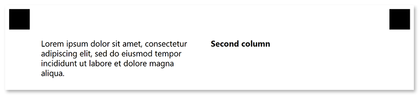

This element is used to add a single line of text to the parent element. **Content** elements can only be nested _within other elements_ and cannot be used at the top level of the form hierarchy.

## Declaration

**Content** element is declared as an object with `"element_type": "Content"` property.

The text displayed in the form is specified in the **name** property.

```json
{
	"element_type": "Content",
	"name": "Text goes here"
}
```

### Required properties

Name | Type | Description
---- | ---- | -----------
**element_type** | string | Must be `"Content"` (case-insensitive).
**name** | string | A line of text displayed in the form.

### Optional properties

Name | Type | Default value | Description
---- | ---- | ------------- | -----------
**font_family** | string | "Segoe UI" | The font family for the text.
**font_style** | string / array | "regular" | The font style for a text: `"bold"`, `"italic"` or `"underline"`.<br />Several font styles can be combined by providing them as an array, for example `["bold", "italic"]`.
**font_size** | integer | 12 | Font size for the text.
**color** | string | black | Text color. Can be picked from one of the supported values.
**align** | string | "left" | Horizontal text alignment: `"left"`, `"center"` or `"right"`.
**content_type** | string | "Normal" | Set the value of this property to `"Cells"` to draw a border around every character, including spaces.

## Allowed child elements

None.

## **Examples**

Check out the code examples to see how **Content** elements can be used.

### Text inside blocks

```json
{
	"element_type": "Template",
	"children": [
		{
			"element_type": "Page",
			"children": [
				{
					"element_type": "Container",
					"name": "Example",
					"columns_count": 2,
					"children": [
						{
							"element_type": "Block",
							"column": 1,
							"children": [
								{
									"element_type": "Content",
									"name": "Lorem ipsum dolor sit amet, consectetur adipiscing elit, sed do eiusmod tempor incididunt ut labore et dolore magna aliqua."
								}
							]
						},
						{
							"element_type": "Block",
							"column": 2,
							"children": [
								{
									"element_type": "Content",
									"name": "Second column",
									"font_style": "bold"
								}
							]
						}
					]
				}
			]
		}
	]
}
```



### Date input box with content_type

```json
{
	"element_type": "Template",
	"children": [
		{
			"element_type": "Page",
			"children": [
				{
					"element_type": "Container",
					"name": "Example",
					"children": [
						{
							"element_type": "Block",
							"children": [
								{
									"element_type": "Content",
									"name": "  /  /    ",
									"content_type": "cells"
								}
							]
						}
					]
				}
			]
		}
	]
}
```


