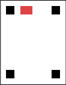
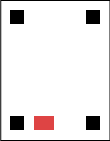

This element allows you to break large forms into several pages that are recognized as a single document. Pages must always be top-level elements in the form hierarchy and cannot be nested within other layout elements. The [source code]() of the form must include at least one **Page** element.

**Page** element does not have a visual representation and is only used to organize form content.

Generated pages are marked with a special QR code that is automatically added to their margin, even if you do not use the [**Barcode**](/omr/json-markup/elements-barcode/) element. This QR code is used as a page identifier and allows the recognition engine to treat multiple scanned images as one form.

{} 

- Even if a printable form is split into multiple pages, it will have a single recognition pattern (.OMR) file.
- At the moment, new pages are not automatically created, even if the content does not fit on one page.

{}

## Declaration

**Page** element is declared as an object with `"element_type": "Page"` property as a child of the [top-level **Template** element](). Multiple pages are provided as array items.

```json
{
	"element_type": "Page",
	"children": [
		/*** put child elements here */
	]
}
```

### Required properties

Name | Type | Description
---- | ---- | -----------
**children** | array | [Child elements]().

### Optional properties

Name | Type | Default value | Description
---- | ---- | ------------- | -----------
**name** | `string` | _n/a_ | Used as a reminder of the element's purpose; for example, "_Page 1_". You can use the same value for multiple pages.<br />This text is not displayed on the form.
**orientation** | `string` | _Portrait_ | Override individual page orientation: <ul><li>`Horizontal` - landscape</li><li>`Vertical` - portrait</li></ul>
**paper_size** | `string` | _A4_ | Override the physical dimensions for the individual page.<br />See details [below](#supported-paper-sizes).
**left_margin** | `int` | 210 pixels | Override the size of the left page margin in pixels.
**right_margin** | `int` | 210 pixels | Override the size of the right page margin in pixels.
**rotation_point_position** | `string` | _Below the top-right square positioning marker._ | Override the placement of the rectangular positioning marker that is used to detect the page orientation.<br />See details [below](#positioning-marker-placement).

#### Supported paper sizes

The `paper_size` property controls the paper size of the generated form. All form elements will be re-aligned to best match the selected paper size.

Enumeration | Page dimensions (pixels) | Page dimensions (mm) | Page dimensions (inches)
----------- | ------------------------ | -------------------- | ------------------------
`A3` | 3508 x 4961 | 297 x 420 | 11.7 x 16.5
`A4`| 2480 x 3508 | 210 x 297 | 8.3 x 11.7
`Legal` | 2551 x 4205 | 215.9 x 355.6 | 8.5 x 14
`Letter`| 2551 x 3295 | 215.9 x 279.4 | 8.5 x 11
`p8519` | 2551 x 5702 | 215.9 x 482.6 | 8.5 x 19
`p8521` | 2551 x 6302 | 215.9 x 533.4 | 8.5 x 21
`Tabloid` | 3295 x 5102 | 279 x 432 | 11 x 17

{} 
The selected paper size does not affect the size of bubbles, images or fonts. Changing the paper size only affects the positioning of elements on the page.
{} 

#### Positioning marker placement

The `rotation_point_position` property controls the placement of the rectangular positioning marker that is used to detect the page orientation:

Enumeration | Result
----------- | ------
`TopLeft1` | 
`TopLeft2` | 
`TopRight1` | 
`TopRight2` | 
`BottomLeft1` | 
`BottomLeft2` | 
`BottomRight1` | 
`BottomRight2` | 

## Allowed child elements

All, except for other **Page** elements.

## **Example**

```json
{
	"element_type": "Template",
	"children": [
		{
			"element_type": "Page",
			"children": [
				{
					"element_type": "Text",
					"name": "Biology Quiz: Plants",
					"font_size": 16,
					"font_style": "bold"
				},
				{
					"element_type": "EmptyLine"
				},
				{
					"element_type": "AnswerSheet",
					"name": "Plants",
					"elements_count": 90,
					"columns_count": 3,
					"answers_count": 5,
				}
			]
		},
		{
			"element_type": "Page",
			"children": [
				{
					"element_type": "Text",
					"name": "Biology Quiz: Animals",
					"font_size": 16,
					"font_style": "bold"
				},
				{
					"element_type": "EmptyLine"
				},
				{
					"element_type": "AnswerSheet",
					"name": "Animals",
					"elements_count": 90,
					"columns_count": 3,
					"answers_count": 5,
				}
			]
		}
	]
}
```


