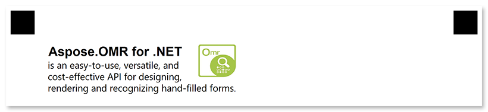

This element is used to combine [text](/omr/json-markup/content/) and [images](/omr/json-markup/image/).

## Declaration

**Paragraph** element is declared as an object with `"element_type": "Paragraph"` property.

Texts and images are provided as an array of objects in the `children` property.

```json
{
	"element_type": "Paragraph",
	"children": [
		/*** put child elements here */
	]
}
```

### Required properties

Name | Type | Description
---- | ---- | -----------
**element_type** | string | Must be `"Paragraph"` (case-insensitive).
**children** | array | [Child elements]().

### Optional properties

Name | Type | Default value | Description
---- | ---- | ------------- | -----------
**name** | string | _n/a_ | Used as a reminder of the element's purpose; for example, "_Important notice_". You can use the same value for multiple paragraphs.<br />This text is not displayed on the form.
**paragraph_type** | string | "normal" | Defines how paragraph elements are rendered:<ul><li>`ImageWrap` - wrap text around the image.</li><li>`Inline` - place all paragraph elements on the same line.</li></ul>Omitting this attribute or setting it to `normal` will cause the text to overlay the image.
**vertical_align** | string | "center" | Controls how inline elements of different sizes align vertically within the lines of a paragraph:<ul><li>`top` - the elements are aligned with the top of the tallest element on the line.</li><li>`center` - smaller elements are placed in the middle of the line.</li><li>`bottom` - the bottom of the elements are aligned with the bottom of the entire line.</li></ul>If all paragraph elements have the same height, this property does not visually apply.

## Image wrapping

To allow the text to wrap around an image:

1. Set the **width**, **height**, **x** and **y** properties of the [**Image**](/omr/json-markup/image/) element.
2. Set the **paragraph_type** property of the **Paragraph** element to `"ImageWrap"`.

## Allowed child elements

- [**Content**](/omr/json-markup/content/)
- [**Image**](/omr/json-markup/image/)
- [**EmptyLine**](/omr/json-markup/emptyline/)
- [**ChoiceBox**](/omr/json-markup/choicebox/)

## **Examples**

Check out the code examples to see how **Paragraph** elements can be used.

### Multi-line paragraph

```json
{
	"element_type": "Template",
	"children": [
		{
			"element_type": "Page",
			"children": [
				{
					"element_type": "Container",
					"name": "Example",
					"children": [
						{
							"element_type": "Block",
							"children": [
								{
									"element_type": "Paragraph ",
									"children": [
										{
											"element_type": "Content",
											"name": "The Raven by Edgar Allan Poe",
											"font_style": "bold",
											"font_size": 16
										},
										{
											"element_type": "EmptyLine"
										},
										{
											"element_type": "Content",
											"name": "Once upon a midnight dreary, while I pondered, weak and weary,"
										},
										{
											"element_type": "Content",
											"name": "Over many a quaint and curious volume of forgotten lore-"
										},
										{
											"element_type": "Content",
											"name": "While I nodded, nearly napping, suddenly there came a tapping,",
											"font_style": "italic"
										},
										{
											"element_type": "Content",
											"name": "As of some one gently rapping, rapping at my chamber door.",
											"font_style": "italic"
										}
									]
								}
							]
						}
					]
				}
			]
		}
	]
}
```


### Text with image

```json
{
	"element_type": "Template",
	"children": [
		{
			"element_type": "Page",
			"children": [
				{
					"element_type": "Container",
					"name": "Example",
					"children": [
						{
							"element_type": "Block",
							"children": [
								{
									"element_type": "Paragraph ",
									"paragraph_type": "ImageWrap",
									"children": [
										{
											"element_type": "Image",
											"name": "logo.jpg",
											"x": 1000,
											"y": 200,
											"height": 175,
											"width": 200
										},
										{
											"element_type": "Content",
											"name": "Aspose.OMR for .NET",
											"font_style": "bold",
											"font_size": 16
										},
										{
											"element_type": "Content",
											"name": "is an easy-to-use, versatile, and cost-effective API for designing, rendering and recognizing hand-filled forms."
										}
									]
								}
							]
						}
					]
				}
			]
		}
	]
}
```


