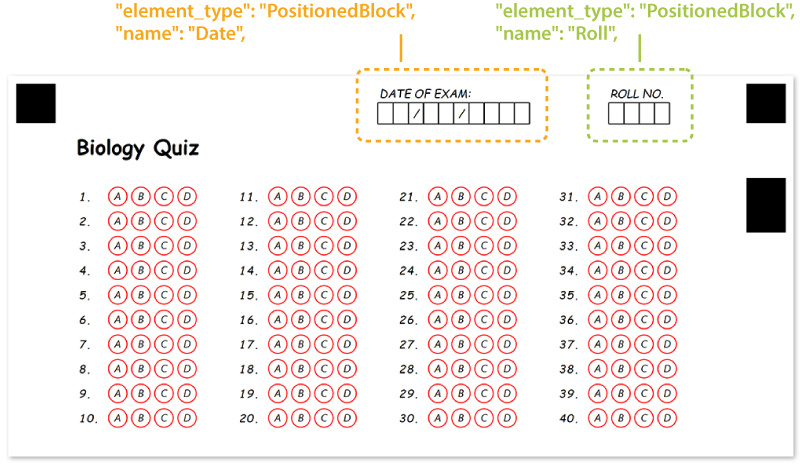

This element is used to place any number of other form elements at the specific coordinates on the page. This element does not have a visual representation by itself and is only used for organizing other content.

## Declaration

**PositionedBlock** element is declared as an object with `"element_type": "PositionedBlock"` property.

Elements displayed inside the block are provided as an array of objects in the **children** property.

```json
{
	"element_type": "PositionedBlock",
	"children": [
		/*** put child elements here */
	]
}
```

### Required properties

Name | Type | Description
---- | ---- | -----------
**element_type** | string | Must be `"PositionedBlock"` (case-insensitive).
**children** | array | [Child elements]().
**x** | integer | Absolute position of the block (in pixels) relative to the left edge of the page.
**y** | integer | Absolute position of the block (in pixels) relative to the top edge of the page.

### Optional properties

Name | Type | Default value | Description
---- | ---- | ------------- | -----------
**name** | string | _n/a_ | Used as a reminder of the element's purpose; for example, "_Student info_". You can use the same value for multiple blocks.<br />This text is not displayed on the form.
**width** | integer | _Automatically adjusted to fit content_ | Set fixed block width, in pixels.<br />The content that does not fit the block width may be clipped or wrapped based on the global page overflow setting.
**height** | integer | _Automatically adjusted to fit content_ | Set fixed block height, in pixels.<br />The content that does not fit the block height may be clipped based on the global page overflow setting.

## Allowed child elements

All, except for [**Page**](/omr/json-markup/page/) and [**Template**](/omr/json-markup/#asposeomr-template-structure).

## **Examples**

Check out the code example to see how **PositionedBlock** element can be used and combined with other elements.

```json
{
	"element_type": "Template",
	"children": [
		{
			"element_type": "Page",
			"children": [
				{
					"element_type": "Text",
					"name": "Biology Quiz",
					"font_size": 16,
					"font_style": "bold"
				},
				{
					"element_type": "EmptyLine"
				},
				{
					"element_type": "AnswerSheet",
					"name": "Plants",
					"elements_count": 40,
					"columns_count": 4,
					"answers_count": 4
				},
				{
					"element_type": "PositionedBlock",
					"name": "Date",
					"x": 1200,
					"y": 30,
					"children": [
						{
							"element_type": "Content",
							"name": "DATE OF EXAM:"
						},
						{
							"element_type": "Content",
							"name": "  /  /    ",
							"content_type": "cells"
						}
					]
				},
				{
					"element_type": "PositionedBlock",
					"name": "Roll",
					"x": 1950,
					"y": 30,
					"children": [
						{
							"element_type": "Content",
							"name": "ROLL NO."
						},
						{
							"element_type": "Content",
							"name": "    ",
							"content_type": "cells"
						}
					]
				}
			]
		}
	]
}
```


