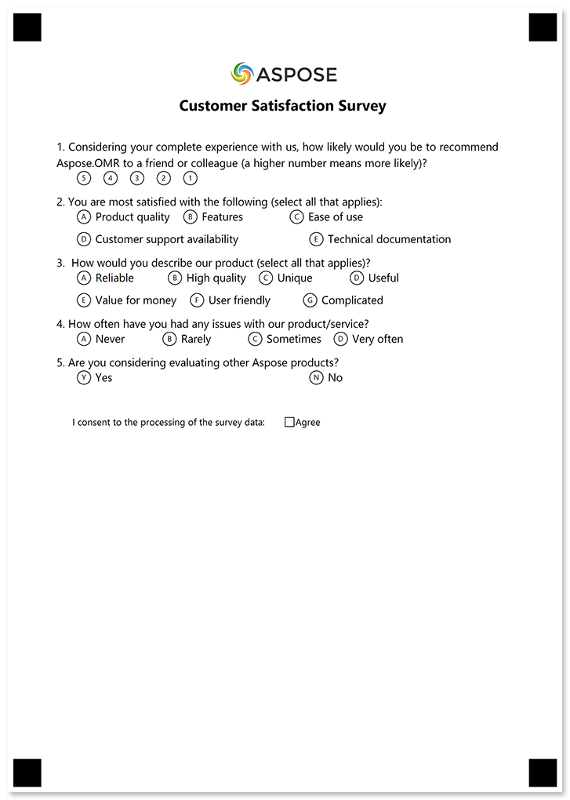
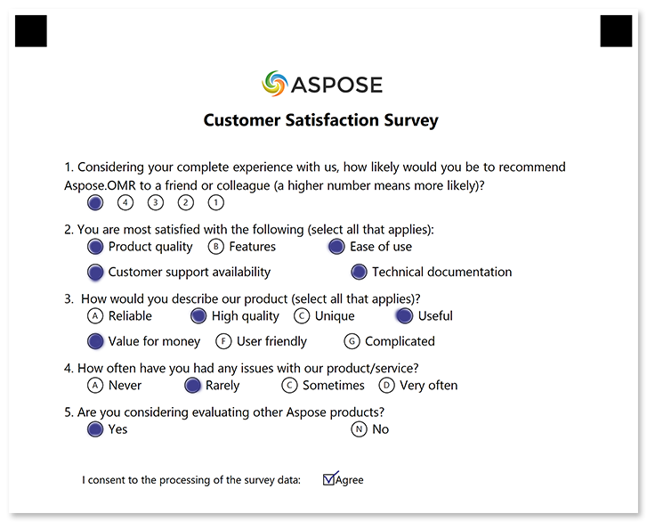

In this example, we'll show the source code for a customer satisfaction survey decorated with your logo.


## Used elements

- [**Checkbox**](/omr/json-markup/checkbox/)  
  Generate a list of answers with blank bubbles that can accommodate any kind of marks.
- [**EmptyLine**](/omr/json-markup/emptyline/)  
  Add a vertical spacing between elements.
- [**Image**](/omr/json-markup/image/)  
  Insert a picture.
- [**ChoiceBox**](/omr/json-markup/choicebox/)  
  Generate a question with a fixed number of answers.
- [**Text**](/omr/json-markup/text/)  
  Add one or more lines of text to the form.

## Source code

Adding images to a survey requires changes to both the application code and the template source.

### Application code

You must add all images you mention in the template to the global page settings when generating a printable form.

## Template source

```json
{
	"element_type": "Template",
	"children": [
		{
			"element_type": "Page",
			"children": [
				{
					"element_type": "Image",
					"name": "aspose-logo.png",
					"align": "center"
				},
				{
					"element_type": "Text",
					"name": "Customer Satisfaction Survey",
					"align": "center",
					"font_size": 16,
					"font_style": "bold"
				},
				{
					"element_type": "EmptyLine"
				},
				{
					"element_type": "ChoiceBox",
					"question_text": "Considering your complete experience with us, how likely would you be to recommend\r\nAspose.OMR to a friend or colleague (a higher number means more likely)?",
					"answers_string": "(5) (4) (3) (2) (1)"
				},
				{
					"element_type": "ChoiceBox",
					"question_text": "You are most satisfied with the following (select all that applies):",
					"answers_string": "() Product quality () Features () Ease of use\r\n() Customer support availability () Technical documentation"
				},
				{
					"element_type": "ChoiceBox",
					"question_text": "How would you describe our product (select all that applies)?",
					"answers_string": "() Reliable () High quality () Unique () Useful\r\n() Value for money () User friendly () Complicated"
				},
				{
					"element_type": "ChoiceBox",
					"question_text": "How often have you had any issues with our product/service?",
					"answers_string": "() Never () Rarely () Sometimes () Very often"
				},
				{
					"element_type": "ChoiceBox",
					"question_text": "Are you considering evaluating other Aspose products?",
					"answers_string": "(Yes) Yes (No) No"
				},
				{
					"element_type": "CheckBox",
					"name": "I consent to the processing of the survey data:",
					"bubble_size": "extrasmall",
					"font_size": 10,
					"threshold": 15,
					"children": [
						{
							"element_type": "Content",
							"name": "Agree",
							"font_size": 10
						}
					]
				}
			]
		}
	]
}
```

## Printable form



## Filled form



## Recognition results

```
Element Name,Value,
I consent to the processing of the survey data:,"Agree"
Question1,"5"
Question2,"A,C,D,E"
Question3,"B,D,E"
Question4,"B"
Question5,"Y"
```
