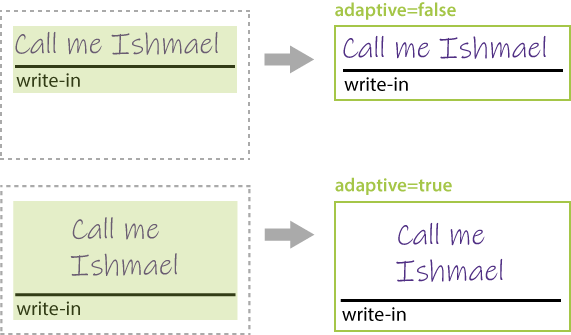

This element provides a blank field in which the respondent can hand write some text or draw a picture.

{} 

Write-in field always has an underline and "_write-in_" comment below.

{}

The hand-filled content of the **WriteIn** element is stored as an image during recognition and can be passed to optical character recognition library, such as [Aspose.OCR](https://products.aspose.app/ocr).


**WriteIn** element can be used to request some information in free form (name, phone, address, and the like) or to offer a respondent answer an open-ended question.

## Declaration

**WriteIn** element is declared as an object with `"element_type": "WriteIn"` property.

```json
{
	"element_type": "WriteIn"
}
```

### Required properties

Name | Type | Description
---- | ---- | -----------
**element_type** | string | Must be `"WriteIn"` (case-insensitive).

### Optional properties

Name | Type | Default value | Description
---- | ---- | ------------- | -----------
**name** | string | _n/a_ | Used as a reminder of the element's purpose; for example, "_Phone_". You can use the same value for multiple elements.<br />This text is not displayed on the form.
**required** | Boolean | false | Set to `true` to store the hand-filled content of the element as an image during recognition. Set to `false` or omit the property to ignore this element during recognition.
**hint** | string | "write-in" | Redefine the underlying label of the write-in element.
**color** | string | black | Color of the underlying label text. Can be picked from one of the supported values.
**adaptive** | Boolean | false | Set to `true` to fill the remaining height of the parent container with the write-in element. Set to `false` or omit the property to render the write-in element with the fixed height. See [Adaptive write-in height](#adaptive-write-in-height) for details.

## Adaptive write-in height

The `adaptive` property affects both the rendering height of the write-in element and the height of the handwriting / drawing capture area.



## Combining with VerticalChoicebox elements

**WriteIn** element can be included into [**VerticalChoicebox**](/omr/json-markup/VerticalChoicebox/) element to give the respondent the opportunity to provide a free-form answer to an open-ended question.

In this case, the content of the element is stored as an image only if the respondent marks the corresponding bubble.

## Allowed child elements

None.

## Example

```json
{
	"element_type": "Template",
	"children": [
		{
			"element_type": "Page",
			"children": [
				{	
					"element_type": "Container",
					"name": "Example",
					"children": [
						{
							"element_type": "Block",
							"children": [
								{
									"element_type": "Content",
									"name": "Your phone number:",
									"font_style": "bold"
								},
								{
									"element_type": "WriteIn",
									"name": "Phone",
									"required": true
								}
							]
						}
					]
				}
			]
		}
	]
}
```


