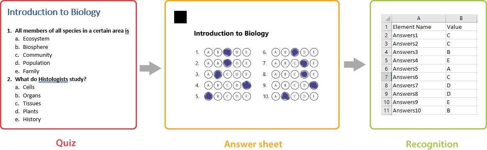

An answer sheet is a special paper form supplemental to an assessment, on which the respondent marks the bubbles to answer the questions. It is commonly used for exams, quizzes, and tests. Automatic recognition of answer sheets is the most common use case for OMR systems.

Aspose.OMR offers a number of elements that allow you to design answer sheets of any layout and complexity.

## Elements

- [**answer_sheet**](/omr/txt-markup/answer_sheet/)  
  This element generates a numbered matrix of bubbles arranged in multiple columns to make more efficient use of space.
- [**grid**](/omr/txt-markup/grid/)  
  This element element generates a matrix of numbered bubbles that are combined into a single answer.
- [**custom_answer_sheet**](/omr/txt-markup/custom_answer_sheet/)  
  This element generates a numbered list of answers with full control over the layout and content of an answer.
- [**composite_grid**](/omr/txt-markup/composite_grid/)  
  This element generates a highly customizable matrix of numbered bubbles that are combined into a single answer.
