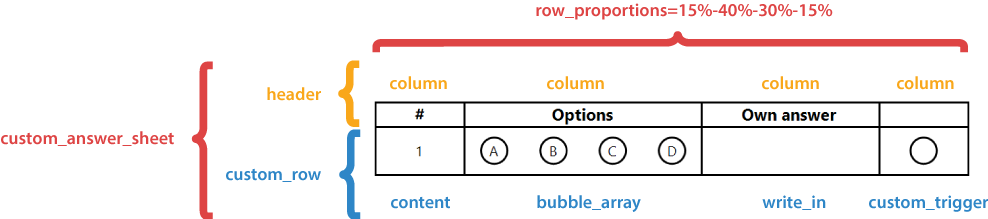
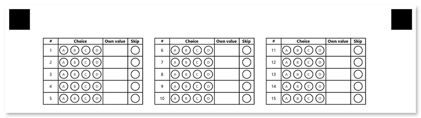

**Custom_answer_sheet** element generates a numbered list of answers. Answers can be arranged in multiple columns to make more efficient use of space.

You can fully control the layout and content of answer rows and use [**write-in**](/omr/txt-markup/write_in/) elements to handle open-ended questions.

**Custom_answer_sheet** is best suited for exam papers with open-ended questions.

## Syntax

The element declaration begins with `?custom_answer_sheet=[name]` statement and ends with `&custom_answer_sheet` statement. These statements must be placed on separate lines.

`name` property is used as a reminder of the element's purpose; for example, "_Biology Quiz_".

{} 

Never add empty lines after the opening `?custom_answer_sheet=` statement. Doing so will result in an error when rendering a form.

{}

**custom_answer_sheet** element includes [**header**]() and [**custom_row**]() elements.



### Required custom_answer_sheet attributes

An attribute is written as `[attribute_name]=[value]`. Each attribute must be placed on a **new line** immediately after the opening `?custom_answer_sheet=` statement or another attribute, and must begin with a **tab character**.

Attribute | Default value | Description | Usage example
--------- | ------------- | ----------- | -------------
**amount** | n/a | The number of exam questions that the answer sheet corresponds to. Each question will correspond to a numbered answer. | `amount=30`
**columns_count** | n/a | The number of columns to arrange answers into. Use multiple columns to make the answer sheet more compact. | `columns_count=3`
**row_proportions** | n/a | The content of each answer is divided into one or more columns. This attribute specifies the number of columns and their relative proportions.<br />The attribute value is provided in the following format: `{Column 1 width %}-{Column 2 width %}-...{Column N width %}`. The grand total of all column widths must not exceed 100%. | `row_proportions=15%-50%-20%-15%`

### Optional custom_answer_sheet attributes

Attribute | Default value | Description | Usage example
--------- | ------------- | ----------- | -------------
**border** | none | Whether to draw a border around the block.<ul><li>`none` - no border.</li><li>`square` - draw a rectangular border.</li><li>`rounded` - draw a rectangular border with rounded corners.</li></ul> | `border=square`
**border_size** | 3 | Width of all borders. | `border_size=10`
**border_color** | black | Color of all borders. Can be picked from one of the supported values. | `border_color=red`
**border_top_style** | _inherits border_size and border_color_ | Override the width and color of the element's top border in `<border width> <border color>` format. Specify `none` to remove the top border. | `border_top_style=10 red`
**border_bottom_style** | _inherits border_size and border_color_ | Override the width and color of the element's bottom border in `<border width> <border color>` format. Specify `none` to remove the bottom border. | `border_bottom_style=10 red`
**border_left_style** | _inherits border_size and border_color_ | Override the width and color of the element's left border in `<border width> <border color>` format. Specify `none` to remove the left border. | `border_left_style=10 red`
**border_right_style** | _inherits border_size and border_color_ | Override the width and color of the element's right border in `<border width> <border color>` format. Specify `none` to remove the right border. | `border_right_style=10 red`
**start_id** | 1 | The value from which the numbering of custom answer sheet rows begins. The number of each subsequent row is increased by 1. | `start_id=0`

### Header element

This child element of the **custom_answer_sheet** defines the heading texts for answer's columns. It must be the first child of **custom_answer_sheet** element.

The element declaration begins with `?header=` statement and ends with `&header` statement. These statements must be placed on separate lines. For each column defined in [**row_proportions**]() attribute of the parent **custom_answer_sheet** element, add a **column** sub-element, which defines the heading text.

#### Column element

This child element of the **header** defines the heading text for the corresponding column.

The element declaration begins with `?column=` statement followed by a text to be displayed. This statement must be placed on a separate line.

##### Column element attributes

The **column** element can be customized by adding optional attributes to it.

An attribute is written as `[attribute_name]=[value]`. Each attribute must be placed on a **new line** immediately after the opening `?column=` statement or another attribute, and must begin with a **tab character**.

Attribute | Default value | Description | Usage example
--------- | ------------- | ----------- | -------------
**font_family** | Segoe UI | The font family for the text. | `font_family=Courier New`
**font_style** | regular | The font style for a text: `bold`, `italic` or `underline`.<br />Several font styles can be combined by listing them separated by commas. | `font_style=bold, italic`
**font_size** | 12 | Font size for the text. | `font_size=16`
**align** | left | Horizontal text alignment: `left`, `center` or `right`. | `align=center`
**content_type** | Set this attribute to `cells` to draw a circle around every character, including spaces. | normal | `content_type=cells`

### Custom_row element

This child element of the **custom_answer_sheet** defines the structure on an answer. These statements must be placed on separate lines.

The element declaration begins with `?custom_row=[name]` statement and ends with `&custom_row` statement.

`name` property is used as an identifier of each generated row. Use **%index%** variable to guarantee the uniqueness; for example, `"Row %index%"`.

{} 

This element and its child elements can reference `%index%` variable, which is replaced with the current answer's ordinal.

For example, `Answer %index%` for the 4th answer will be rendered as `Answer 4`.

{}

For each column defined in [**row_proportions**]() attribute of the parent **custom_answer_sheet** element, add a sub-element of one of the following types (in any order or combination):

#### Content

Standard [**content**](/omr/txt-markup/content/) element which allows you to provide some explanatory text.

For example, `?content=A%index%`.

#### Write_in

Standard [**write_in**](/omr/txt-markup/write_in/) element, used to provide your own answer to open-ended questions.

#### Bubble_array

Inserts a specified amount of bubbles.

The element is declared with `?bubble_array=[name]` statement. This statement must be placed on a separate line.

`name` property is used as an identifier by [**custom_trigger**]() element. Use **%index%** variable to guarantee the uniqueness; for example `?bubble_array=b_%index%`.

##### Bubble_array element required attributes

An attribute is written as `[attribute_name]=[value]`. Each attribute must be placed on a **new line** immediately after the opening `?bubble_array=` statement or another attribute, and must begin with a **tab character**.

Attribute | Default value | Description | Usage example
--------- | ------------- | ----------- | -------------
**answers_list** | n/a | The number of bubbles and characters that will be drawn inside them. The value is provided in _({Character 1})({Character 2})...({Character N})_ format. | `answers_list=(α)(β)(γ)(δ)(ε)`

##### Bubble_array element optional attributes

An attribute is written as `[attribute_name]=[value]`. Each attribute must be placed on a **new line** immediately after the opening `?bubble_array=` statement or another attribute, and must begin with a **tab character**.

Attribute | Default value | Description | Usage example
--------- | ------------- | ----------- | -------------
**bubble_size** | Normal | Size of bubbles: `extrasmall`, `small`, `normal`, `large`, or `extralarge`. | `bubble_size=large`
**bubble_type** | round | Bubble style: `round` or `square`. | `bubble_type=square`
**font_family** | Segoe UI | The font family for the bubble character. | `font_family=Courier New`
**font_style** | regular | The font style for the bubble character: `bold`, `italic` or `underline`.<br />Several font styles can be combined by listing them separated by commas. | `font_style=bold, italic`
**font_size** | 12 | Font size for the bubble character. | `font_size=16`
**recogintion_values** | _Same as `answers_list`_ | The values returned in recognition results.<br />The number of answer keys must exactly match the total number of bubbles specified in `answers_list` property. | `recogintion_values=(1)(2)(3)(4)`

#### Custom_trigger

Inserts a special bubble that, when marked, replaces the value of the specified [**bubble_array**]() with its **value** attribute. It can be used to offer the respondent the option to intentionally skip certain questions, or to control processing of [**write_in**](/omr/txt-markup/write_in/) elements.

The element is declared with `?custom_trigger=[name]` statement. This statement must be placed on a separate line.

`name` property is used as an identifier of the **CustomTrigger** element. Use **%index%** variable to guarantee the uniqueness; for example, "_Own choice %index%_".

##### Custom_trigger element attributes

An attribute is written as `[attribute_name]=[value]`. Each attribute must be placed on a **new line** immediately after the opening `?custom_trigger=` statement or another attribute, and must begin with a **tab character**.

Attribute | Default value | Description | Usage example
--------- | ------------- | ----------- | -------------
**value** | n/a | The replacement value to be used when the element is marked. | `value=Prefer not to answer`
**target** | n/a | Name of [**bubble_array**]() element whose value will be replaced. Use **%index%** variable to point to the same row where the **custom_trigger** element instance is rendered. | `target=b_%index%`
**trigger_type** | ReplaceValue | Action when the bubble is marked. `ReplaceValue` replaces the value of the [**bubble_array**]() specified in **target** attribute with the **value** attribute.<br />This property is reserved for future use; you can omit it. | `trigger_type=replaceValue`
**bubble_size** | Normal | Size of bubbles: `extrasmall`, `small`, `normal`, `large`, or `extralarge`. | `bubble_size=large`
**bubble_type** | round | Bubble style: `round` or `square`. | `bubble_type=square`

## Example

```
?custom_answer_sheet=Example
	amount=15
	columns_count=3	
	row_proportions=15%-45%-25%-15%
?header=Header
?column=#
	font_size=6
	font_style=bold
	align=center
?column=Choice
	font_size=6
	font_style=bold
	align=center
?column=Own value
	font_size=6
	font_style=bold
	align=center
?column=Skip
	font_size=6
	font_style=bold
	align=center
&header
?custom_row=Row %index%
?content=%index%
	font_size=6
	align=center
?bubble_array=Bubbles %index%
	font_size=5
	answers_list=(A)(B)(C)(D)
	bubble_size=small
?write_in=Own value for %index%
	required=true
?custom_trigger=Skip question
	trigger_type=replaceValue
	value=Prefer not to answer
	target=Bubbles %index%
	bubble_size=small
&custom_row
&custom_answer_sheet
```


