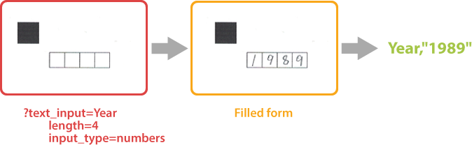

{} 
**text_input** element requires a handwritten recognition plugin to be installed. Otherwise, the corresponding markup syntax will be ignored.
{}

This element adds a handwritten text placeholder to the form. The placeholder consists of several boxes in which the respondent can write letters or numbers, one character in each box.

Handwritten characters written inside boxers are recognized automatically without the need for an external OCR library.



**text_input** element can be used to request name, phone number, address and other textual information in free form or to offer a respondent answer an open-ended question.

## Syntax

The element is declared with `?text_input=[name]` statement. This statement must be placed on a separate line.

`name` property is returned in the recognition results as an answer ID and also used as a reminder of the element's purpose in form's source code; for example, "_Phone_". This is an optional property - you can use the same **name** for multiple **text_input** elements or just omit it. The name is not displayed on the form.

**text_input** element can be nested within other elements or placed at the top level of the form hierarchy.

### Attributes

The **text_input** element can be customized by adding optional attributes to it.

An attribute is written as `[attribute_name]=[value]`. Each attribute must be placed on a **new line** immediately after the opening `?text_input=` statement or another attribute, and must begin with a **tab character**.

Attribute | Required | Description | Usage examples
--------- | -------- | ----------- | --------------
`length` | Yes | The number of character input placeholders. | `length=5`
`input_type` | No | The type of allowed characters:<ul><li>`numbers` (default)</li><li>`letters`</li></ul> | `input_type=numbers`
`cell_size` | No | The size of each placeholder:<ul><li>`normal` (default)</li><li>`large`</li><li>`extralarge`</li></ul> | `cell_size=large`

## Allowed child elements

None.

## Example

```
?text_input=Year
	length=4
	input_type=numbers
	cell_size=large
```


