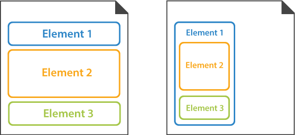

Layout elements are used to arrange other elements and define the appearance and design of the OMR form. 

Layout elements themselves are not recognized by Aspose.OMR; however, they may contain elements that are recognized.

## Default arrangement of elements

All form elements are rendered one below the other and occupy the entire width of the **page** or the **parent element**.

## Layout elements

- [**page**](/omr/txt-markup/page/)  
  This element is used to break large forms into several pages that are recognized as a single document.
- [**container**](/omr/txt-markup/container/)  
  This element is used to break content into columns and to add a footer to the form.
- [**block**](/omr/txt-markup/block/)  
  This element is used to organize other elements in columns.
- [**text**](/omr/txt-markup/text/)  
  This element is used to add one or more lines of text to the form. Can only be used at the top level of the form hierarchy.
- [**content**](/omr/txt-markup/content/)  
  This element is used to add a line of text to the parent element. Can only be used inside other elements.
- [**empty_line**](/omr/txt-markup/empty_line/)  
  This element is used to add vertical spacing between elements.
- [**image**](/omr/txt-markup/image/)  
  This element is used to add a picture.
- [**paragraph**](/omr/txt-markup/paragraph/)  
  This element is used to combine text and images.
- [**input_group**](/omr/txt-markup/input_group/)  
  This element is used to insert personalized information, such as the respondent's name or email, into the form.
