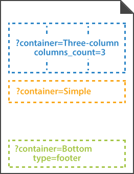
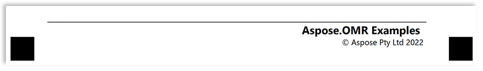

This element is used to break content into columns and to add a footer to the form. Nested containers must be placed inside [**block**](/omr/txt-markup/block/) elements.

**Container** element does not have a visual representation and is only used to arrange other elements.



## Syntax

The element declaration begins with `?container=[name]` statement and ends with `&container` statement. These statements must be placed on separate lines.

`name` property is used as a reminder of the container's purpose; for example, "_General Chemistry_". This is an optional property - you can use the same **name** for multiple containers or just omit it. The name is not displayed on the form.

### Attributes

The **container** element can be customized by adding optional attributes to it.

An attribute is written as `[attribute_name]=[value]`. Each attribute must be placed on a **new line** immediately after the opening `?container=` statement or another attribute, and must begin with a **tab character**.

Attribute | Default value | Description | Usage example
--------- | ------------- | ----------- | -------------
**columns_count** | 1 | The number of columns in the container (1 or more).<br />All columns have the same width regardless of their content. | `columns_count=2`
**columns_proportions** | n/a | Overrides the number of columns and sets their relative proportions.<br />The attribute value is provided in the following format: `{Column 1 width %}-{Column 2 width %}-...{Column N width %}`. The grand total of all column widths must not exceed 100%. | `columns_proportions=20%-40%-20%-20%`
**type** | normal | Determines whether the container is displayed inside the body of the form (`normal`) or as a footer at the bottom of the page (`footer`).<br />**Each [page](/omr/txt-markup/page/) can only have one footer!** | `type=footer`
**block_right_margin** | 40 | Right margin (in pixels) of container's columns. | `block_right_margin=60`
**block_bottom_margin** | 20 | Bottom margin (in pixels) of nested [**block**](/omr/txt-markup/block/) elements. | `block_bottom_margin=100`
**block_top_padding** | 20 | Top padding (in pixels) of nested [**block**](/omr/txt-markup/block/) elements. | `block_top_padding=50`


## Adding page footer

To add a footer that will appear at the bottom of the page:

1. Create a **container** element.
2. Set the `type` attribute of the **container** element to `footer`.
3. Provide the content of the footer.

## Allowed child elements

- [**block**](/omr/txt-markup/block/)
- [**answer_sheet**](/omr/txt-markup/answer_sheet/)
- [**grid**](/omr/txt-markup/grid/)
- [**composite_grid**](/omr/txt-markup/composite_grid/)

## Examples

Check out the code examples to see how **container** elements can be used and combined with each other.

### Three-column layout

```
?container=Three-column layout
	columns_count=3
?block=Column 1
	column=1
?content=First column
&block
?block=Column 2
	column=2
?content=Second column
&block
?block=Column 3
	column=3
?content=Third column
&block
&container
```


### Page footer

```
?container=Footer
	type=footer
?block=Copyright
?paragraph=
?content=Aspose.OMR Examples
	align=right
	font_style=Bold
	font_size=14
?content=© Aspose Pty Ltd 2022
	align=right
	font_size=10
&paragraph
&block
&container
```


