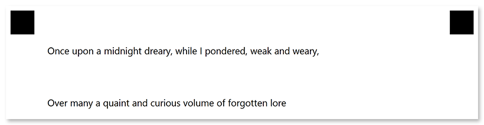

This element is used to add vertical spacing equal to one line of text between other elements.

## Syntax

The element is declared with `?empty_line=[name]` statement. This statement must be placed on a separate line.

`name` property is used as a reminder of the element's purpose; for example, "_Section break_". This is an optional property - you can use the same **name** for multiple **empty_line** elements or just omit it. The name is not displayed on the form.

### Attributes

The **empty_line** element can be customized by adding optional attributes to it.

An attribute is written as `[attribute_name]=[value]`. Each attribute must be placed on a **new line** immediately after the opening `?empty_line=` statement or another attribute, and must begin with a **tab character**.

Attribute | Default value | Description | Usage example
--------- | ------------- | ----------- | -------------
**height** | One line of text using the default font | Vertical spacing height, in pixels. Overrides the default line height. | `height=150`

## Allowed child elements

None.

## **Example**

```
?text=Once upon a midnight dreary, while I pondered, weak and weary,
?empty_line=Delimiter
	height=200
?text=Over many a quaint and curious volume of forgotten lore
```


