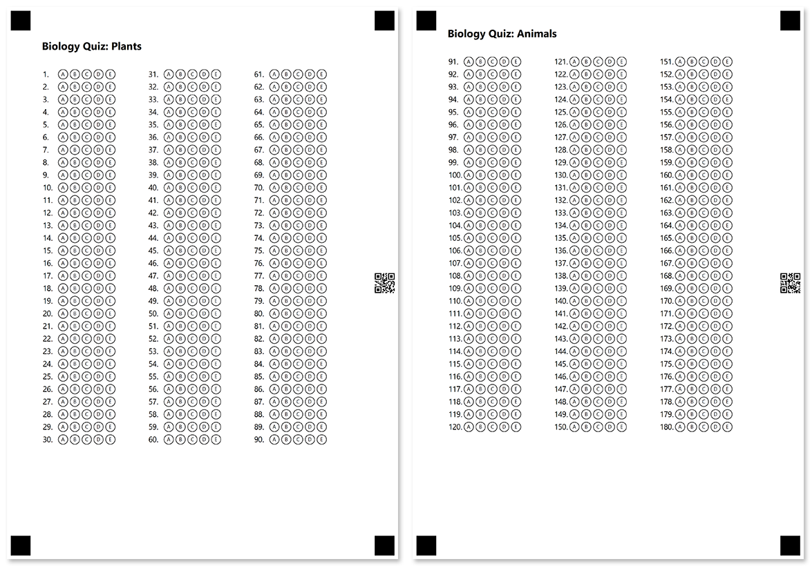

This element allows you to break large forms into several pages that are recognized as a single document. Pages must always be top-level elements in the form hierarchy and cannot be included into other elements.

**Page** element does not have a visual representation and is only used to organize form content.

Generated pages are marked with a special QR code that is automatically added to their margin, even if you do not use the [**barcode**](/omr/txt-markup/elements-barcode/) element. This QR code is used as a page identifier and allows the recognition engine to treat multiple scanned images as one form.

{} 

- Even if a printable form is split into multiple pages, it will have a single recognition pattern (.OMR) file.
- If you do not add the **page** element, the entire content of the form will be placed on one page.
- At the moment, new pages are not automatically created, even if the content does not fit on one page.

{}

## Syntax

The element declaration begins with `?page=` statement and ends with `&page` statement. These statements must be placed on separate lines.

{} 

If you use pages, include all other elements in them. Elements outside of **page** elements will not be rendered.

{}

## Allowed child elements

All, except for other **page** elements.

## **Example**

```
?page=
?text=Biology Quiz: Plants
	font_size=16
	font_style=bold
?empty_line=
?answer_sheet=Plants
	columns_count=3
	elements_count=90
	answers_count=5
&page
?page=
?text=Biology Quiz: Animals
	font_size=16
	font_style=bold
?empty_line=
?answer_sheet=Animals
	columns_count=3
	elements_count=90
	answers_count=5
&page
```


