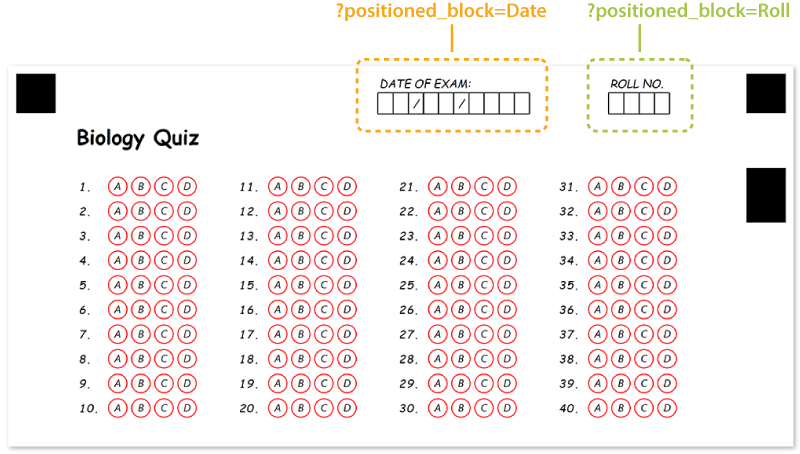

This element is used to place any number of other form elements at the specific coordinates on the page. This element does not have a visual representation by itself and is only used for organizing other content.

## Syntax

The element declaration begins with `?positioned_block=[name]` statement and ends with `&positioned_block` statement. These statements must be placed on separate lines.

`name` is used as a reminder of the block's purpose; for example, "_Student info_". This is an optional attribute - you can use the same **name** for multiple blocks or just omit it. The name is not displayed on the form.

{} 
Never add empty lines after the opening `?positioned_block=` statement. Doing so will result in an error when rendering a form.
{}

### Attributes

An attribute is written as [attribute_name]=[value]. Each attribute must be placed on a new line immediately after the opening ?positioned_block= statement or another attribute, and must begin with a tab character.

#### Required

Attribute | Description | Usage example
--------- | ----------- | -------------
**x** | Absolute position of the block (in pixels) relative to the left edge of the page. | `x=1200`
**y** | Absolute position of the block (in pixels) relative to the top edge of the page. | `x=30`

#### Optional

The **positioned_block** element can be further customized by adding optional attributes to it.

Attribute | Default value | Description | Usage example
--------- | ------------- | ----------- | -------------
**width** | _Automatically adjusted to fit content_ | Set fixed block width, in pixels.<br />The content that does not fit the block width may be clipped or wrapped based on the global page overflow setting. | `width=300`
**height** | _Automatically adjusted to fit content_ | Set fixed block height, in pixels.<br />The content that does not fit the block height may be clipped based on the global page overflow setting. | `height=200`

## Allowed child elements

All, except for [**page**](/omr/txt-markup/page/).

## **Examples**

Check out the code example to see how **positioned_block** element can be used and combined with other elements.

```text
?content=Biology Quiz
	font_size=16
	font_style=bold
?empty_line=
?answer_sheet=Plants
	columns_count=4
	elements_count=40
	answers_count=4
?positioned_block=Date
	x=1200
	y=30
?content=DATE OF EXAM:
?content=  /  /    
	content_type=Cells
&positioned_block
?positioned_block=Roll
	x=1950
	y=30
?content=ROLL NO.
?content=    
	content_type=Cells
&positioned_block
```


