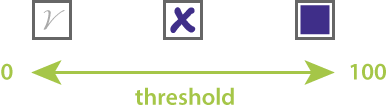
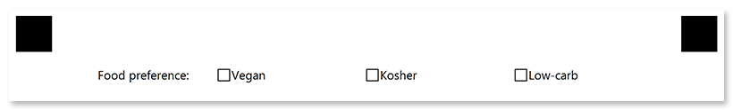

This element provides a list of answers with blank boxes, which can contain any marks - from marker filling to light pencil checks.

You can directly specify the recognition accuracy for this element so that even the lightest marks are detected.

## Syntax

The element declaration begins with `?checkbox=[name]` statement and ends with `&checkbox` statement. These statements must be placed on separate lines.

`name` property is used as an element's identifier in recognition results and is displayed as a label on the form; for example, "_Food preference_".

Answers are provided using standard [**content**](/omr/txt-markup/content/) elements that are placed inside the **checkbox** declaration.

### Attributes

The **checkbox** element can be customized by adding optional attributes to it.

An attribute is written as `[attribute_name]=[value]`. Each attribute must be placed on a **new line** immediately after the opening `?checkbox=` statement or another attribute, and must begin with a **tab character**.

Attribute | Default value | Description | Usage example
--------- | ------------- | ----------- | -------------
**threshold** | 3 | Set the recognition accuracy for the answer boxes, from 0 to 100. Lower values allow even the lightest marks to be recognized, but may cause dirt or paper defects to be treated as marks. Higher values require a more solid fill and may cause pencil marks or small checks to be ignored.<br /><br /> | `threshold=35`
**hide_name** | false | Set to `true` to hide the label (**name**) of the **checkbox** element. | `hide_name=true`
**bubble_size** | Normal | Size of boxes: `extrasmall`, `small`, `normal`, `large`, or `extralarge`. | `bubble_size=large`
**bubble_type** | square | Bubble style: `round` or `square`. | `bubble_type=round`
**align** | left | Horizontal alignment of **checkbox** element: `left`, `center` or `right`. | `align=center`
**font_style** | regular | The font style for a checkbox label: `bold`, `italic` or `underline`.<br />Several font styles can be combined by listing them separated by commas. | `font_style=bold, italic`
**font_size** | 12 | Font size for the checkbox label. | `font_size=16`
**multiselect** | true | Set to `false` to allow the OMR API to validate whether multiple answers are selected and throws an exception if more than one choice is detected. Set to `true` to accept multiple answers.<br />Overrides the `Multiselect` page setting. | `multiselect=false`

## Allowed child elements

- [**content**](/omr/txt-markup/content/)

## Example

```
?checkbox=Food preference:
	bubble_size=extrasmall
	font_size=10
?content=Vegan
	font_size=10
?content=Kosher
	font_size=10
?content=Low-carb
	font_size=10
&checkbox
```


