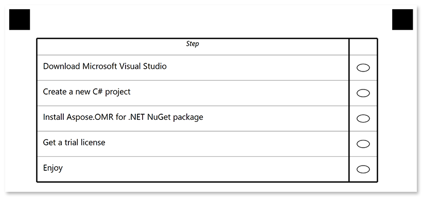

This element organizes questions and answers in a tabular structure (rows and columns) for better readability.

Tables are best suited for large surveys where all questions have the same set of answers.

## Syntax

The element declaration begins with `?table=[name]` statement and ends with `&table` statement. These statements must be placed on separate lines.

**table** elements can only be nested within [**block**](/omr/txt-markup/block/) elements and cannot be used at the top level of the form hierarchy.

`name` property is used as an element's identifier and as a reminder of the element's purpose in template source; for example, `"Satisfaction survey"`.<br />This text is not displayed on the form.

{} 

Never add empty lines after the opening `?table=` statement. Doing so will result in an error when rendering a form.

{}

**Table** element includes an optional [**table_title**]() element, [**table_header**]() element and one or more [**question**]() elements.


### Table attributes

An attribute is written as `[attribute_name]=[value]`. Each attribute must be placed on a **new line** immediately after the opening `?table=` statement or another attribute, and must begin with a **tab character**.

#### Required table attributes

Attribute | Default value | Description | Usage example
--------- | ------------- | ----------- | -------------
**answers_count** | n/a | The number of answers common to all questions in the table. The answers are presented in columns. | `answers_count=3`

#### Optional table attributes

Attribute | Default value | Description | Usage example
--------- | ------------- | ----------- | -------------
**table_type** | normal | Table style:<ul><li>`normal` - standard table</li><li>`striped` - zebra-striped table rows</li><li>`equalCells` - make all table columns equal</li></ul> | `table_type=striped`

### table_title element

This optional element defines the title row of the table. If **table_title** element is omitted, the table will be rendered without a title row.

The element is declared with ?table_title= statement immediately followed by the title text. This statement must be placed on a separate line.

#### table_title attributes

The **table_title** element can be customized by adding optional attributes to it.

An attribute is written as `[attribute_name]=[value]`. Each attribute must be placed on a **new line** immediately after the opening `?table_title=` statement or another attribute, and must begin with a **tab character**.

Attribute | Default value | Description | Usage example
--------- | ------------- | ----------- | -------------
**font_family** | Segoe UI | The font family for the title text. | `font_family=Courier New`
**font_style** | regular | The font style for the title text: `bold`, `italic` or `underline`.<br />Several font styles can be combined by listing them separated by commas. | `font_style=bold, italic`
**font_size** | 12 | Font size for the title text. | `font_size=16`
**color** | black | Color of the title text. Can be picked from one of the supported values. | `color=red`
**background_color** | transparent | Background color of the title row. Can be picked from one of the supported values. | `background_color=gray`
**border** | none | Whether to draw a border around the title row.<ul><li>`none` - no border.</li><li>`square` - draw a rectangular border.</li><li>`rounded` - draw a rectangular border with rounded corners.</li></ul> | `border=square`
**border_size** | 3 | Width of the title row borders. | `border_size=10`
**border_color** | black | Color of the title row borders. Can be picked from one of the supported values. | `border_color=red`
**border_top_style** | _inherits border_size and border_color_ | Override the width and color of the element's top border in `<border width> <border color>` format. Specify `none` to remove the top border. | `border_top_style=10 red`
**border_bottom_style** | _inherits border_size and border_color_ | Override the width and color of the element's bottom border in `<border width> <border color>` format. Specify `none` to remove the bottom border. | `border_bottom_style=10 red`
**border_left_style** | _inherits border_size and border_color_ | Override the width and color of the element's left border in `<border width> <border color>` format. Specify `none` to remove the left border. | `border_left_style=10 red`
**border_right_style** | _inherits border_size and border_color_ | Override the width and color of the element's right border in `<border width> <border color>` format. Specify `none` to remove the right border. | `border_right_style=10 red`

### table_header element

This element specifies the content of the table header row.

The element declaration begins with `?table_header=[name]` statement and ends with `&table_header` statement. These statements must be placed on separate lines.

`name` property is used as a reminder of the element's purpose; for example, "_Preference_". This is an optional property - you can use the same **name** for multiple elements or just omit it.

**Table_header** element includes a [content](/omr/txt-markup/content/) element that defines the question text and several [**answer_value**]() elements that define the answers. The number of **answer_value** elements must be equal to the value of the [**answers_count**]() attribute of the **table** element.

#### table_header attributes

The **table_header** element can be customized by adding optional attributes to it.

An attribute is written as `[attribute_name]=[value]`. Each attribute must be placed on a **new line** immediately after the opening `?table_header=` statement or another attribute, and must begin with a **tab character**.

Attribute | Default value | Description | Usage example
--------- | ------------- | ----------- | -------------
**font_family** | Segoe UI | The font family for the header text. | `font_family=Courier New`
**font_style** | regular | The font style for the header text: `bold`, `italic` or `underline`.<br />Several font styles can be combined by listing them separated by commas. | `font_style=bold, italic`
**font_size** | 12 | Font size for the header text. | `font_size=16`

#### answer_value element

The **answer_value** element defines the answer text that will be displayed in the table header. The number of **answer_value** elements must be equal to the value of the [**answers_count**]() attribute of the **table** element.

The element is declared with `?answer_value=` statement immediately followed by an answer text. This statement must be placed on a separate line.

### question element

The **question** element defines the question text. A table can include multiple question elements that will be displayed as table rows.

The element is declared with `?question=` statement immediately followed by a question text. This statement must be placed on a separate line.

## Examples

Check out the code examples to see how tables can be used.

### Product satisfaction survey

```
?container=Example
?block=
?table=Survey
	answers_count=3
	table_type=striped
?table_title=Product satisfaction survey
	font_size=16
	font_style=Bold
?table_header=table_header
	font_size=10
	font_style=Italic
?content=Question
?answer_value=Yes
?answer_value=No
?answer_value=I don't know
&table_header
?question=Is Aspose.OMR for .NET easy to use?
?question=Are you satisfied with Aspose.OMR for .NET performance?
?question=Are you satisfied with Aspose.OMR for .NET recognition accuracy?
&table
&block
&container
```


### Checklist

```
?container=Example
?block=
?table=Checklist
	answers_count=1
?table_header=table_header
	font_size=10
	font_style=Italic
?content=Step
?answer_value=
&table_header
?question=Download Microsoft Visual Studio
?question=Create a new C# project
?question=Install Aspose.OMR for .NET NuGet package
?question=Get a trial license
?question=Enjoy
&table
&block
&container
```


