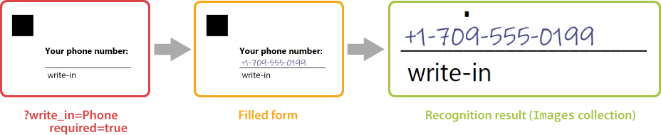
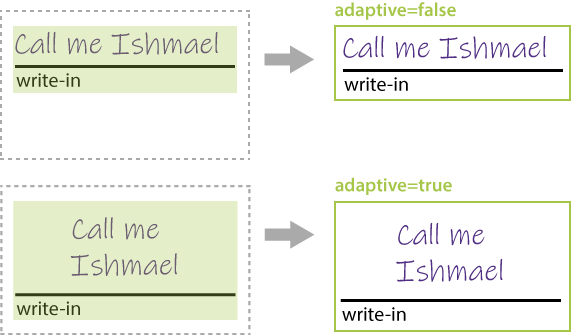
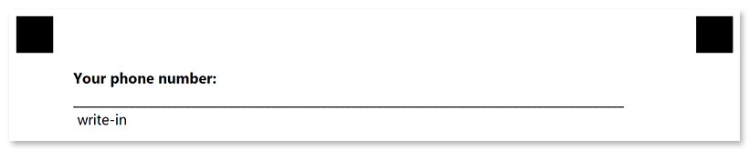

This element provides a blank field in which the respondent can hand write some text or draw a picture.

{} 

Write-in field always has an underline and "_write-in_" comment below.

{}

The hand-filled content of the **write_in** element is stored as an image during recognition and can be passed to optical character recognition library, such as [Aspose.OCR](https://products.aspose.app/ocr).



**Write_in** element can be used to request some information in free form (name, phone, address, and the like) or to offer a respondent answer an open-ended question.

## Syntax

The element is declared with `?write_in=[name]` statement. This statement must be placed on a separate line.

`name` property is used as a reminder of the element's purpose; for example, "_Phone_". This is an optional property - you can use the same **name** for multiple **write_in** elements or just omit it. The name is not displayed on the form.

**write_in** element can only be nested within other elements and cannot be used at the top level of the form hierarchy.

### Attributes

The **write_in** element can be customized by adding optional attributes to it.

An attribute is written as `[attribute_name]=[value]`. Each attribute must be placed on a **new line** immediately after the opening `?write_in=` statement or another attribute, and must begin with a **tab character**.

Attribute | Default value | Description | Usage example
--------- | ------------- | ----------- | -------------
**required** | false | Set to `true` to store the hand-filled content of the element to an image during recognition. Set to `false` or omit the attribute to ignore this element during recognition. | `required=true`
**hint** | "write-in" | Redefine the underlying label of the write-in element. | `hint=phone`
**color** | black | Color of the underlying label text. Can be picked from one of the supported values. | `color=red`
**adaptive** | false | Set to `true` to fill the remaining height of the parent container with the write-in element. Set to `false` or omit the attribute to render the write-in element with the fixed height. See [Adaptive write-in height](#adaptive-write-in-height) for details. | `adaptive=true`

## Adaptive write-in height

The `adaptive` attribute affects both the rendering height of the write-in element and the height of the handwriting / drawing capture area.



## Combining with vertical_choicebox elements

**Write_in** element can be included into [**vertical_choicebox**](/omr/txt-markup/vertical_choicebox/) element to give the respondent the opportunity to provide a free-form answer to an open-ended question.

In this case, the content of the element is stored as an image only if the respondent marks the corresponding bubble.

## Allowed child elements

None.

## Example

```
?container=Example
?block=Write-in element
?content=Your phone number:
	font_style=Bold
?write_in=Phone
	required=true
&block
&container
```


