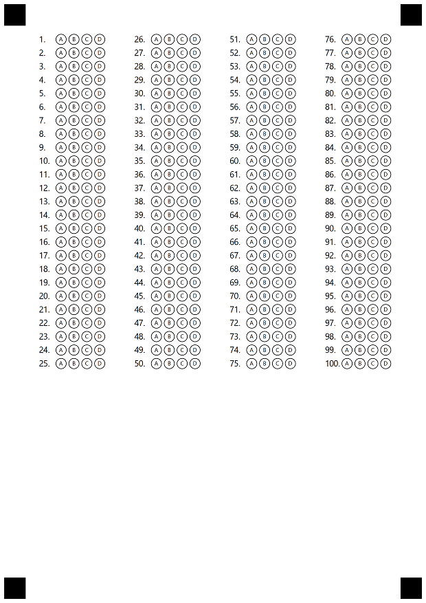

With Aspose.OMR for .NET API you can easily create custom Answer Sheet paper. A wide range of customization options will allow you to create a unique OMR Sheet specifically for your needs.
This guide will walk you through the process of customizing and creating an Answer Sheet.

{} 

Try online! You can test Answer Sheet generator online at https://products.aspose.app/omr/create-answer-sheet

{}

## Create simple Answer Sheet with C#

To create image and template you will need textual Template Markup file (.txt), which describes the elements that will be placed on the generated image. 

Let's take simple Answer Sheet Markup as an example: it contains only two lines of text describing single OMR element - Answer Sheet. "Questions" is the title of each question in Answer Sheet, "elements_count" specifies the number of questions. **?answer_sheet** prefix specifies the type of the OMR element.

```csharp
?answer_sheet=Questions
    elements_count=100
```
The following code snippet demonstrates how to generate any template using Aspose.OMR for .NET, including Answer Sheet as our example.

```csharp
public static void CreateAnswerSheet()
{
    // path to the txt file with Template Markup
    string markupPath = @"AnswerSheet.txt";

    // path to the output folder, where generated image and omr file will be placed 
    string outputPath = @"MyTemplates\AnswerSheet\";
    
    // name of the generated image and omr file
    string resultName = "SimpleAnswerSheet";

    OmrEngine engine = new OmrEngine();
    GenerationResult res = engine.GenerateTemplate(markupPath);
    res.Save(outputPath, resultName);
}
```
The generated Answer Sheet image should look like the image below. Now you can print this image and pass it to the respondents to fill out. Then scan filled papers and recognize them using Aspose.OMR for .NET.



