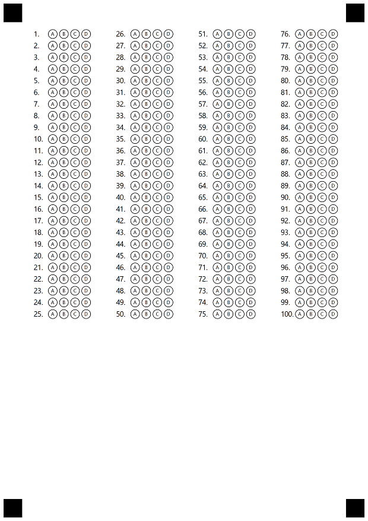

{} 

Try online! You can test Answer Sheet generator online at https://products.aspose.app/omr/create-answer-sheet

{}

## TXT markup
To create template you can pass path to a file with [TXT](https://docs.aspose.com/omr/net/template-generation/txt/) markup.

### AnswerSheet.txt content
```text
?answer_sheet=Questions
	elements_count=100
```
### C# code
```csharp
public static void CreateAnswerSheet()
{
    // path to the txt file with Template Markup
    string markupPath = @"AnswerSheet.txt";

    // path to the output folder, where generated image and omr file will be placed 
    string outputPath = @"MyTemplates\AnswerSheet\";
    
    // name of the generated image and omr file
    string resultName = "SimpleAnswerSheet";

    OmrEngine engine = new OmrEngine();
    GenerationResult res = engine.GenerateTemplate(markupPath);
    res.Save(outputPath, resultName);
}
```

## JSON markup
To create template you can pass path to a file with [JSON](https://docs.aspose.com/omr/net/template-generation/json/) markup.

### AnswerSheet.json content
```json
{
	"element_type": "Template",
	"children": [{
		"element_type": "Page",
		"children": [{
			"element_type": "AnswerSheet",
			"elements_count": 100
		}]
	}]
}
```
### C# code
```csharp
public static void CreateAnswerSheet()
{
    // path to the json file with Template Markup
    string markupPath = @"AnswerSheet.json";

    // path to the output folder, where generated image and omr file will be placed 
    string outputPath = @"MyTemplates\AnswerSheet\";
    
    // name of the generated image and omr file
    string resultName = "SimpleAnswerSheet";

    OmrEngine engine = new OmrEngine();
    GenerationResult res = engine.GenerateJSONTemplate(markupPath);
    res.Save(outputPath, resultName);
}
```

## Object 
To create template you can create and pass TemplateConfig object.
### C# code
```csharp
public static void CreateAnswerSheet()
{
	//root object TemplateConfig with all nested elements
	TemplateConfig config = new TemplateConfig();
	{
		Children = new List<BaseConfig>()
		{
			new PageConfig()
			{
				Children = new List<BaseConfig>()
				{
					new AnswerSheetConfig()
					{
						ElementsCount = 100
					}
				}
			}
		}
	};

    // path to the output folder, where generated image and omr file will be placed 
    string outputPath = @"MyTemplates\AnswerSheet\";
    
    // name of the generated image and omr file
    string resultName = "SimpleAnswerSheet";

    OmrEngine engine = new OmrEngine();
    GenerationResult res = engine.GenerateTemplate(config);
    res.Save(outputPath, resultName);
}
```
## Result
Each of presented examples produce same generated Answer Sheet image below. Now you can print this image and pass it to the respondents to fill out. Then scan filled papers and recognize them using Aspose.OMR for .NET.

