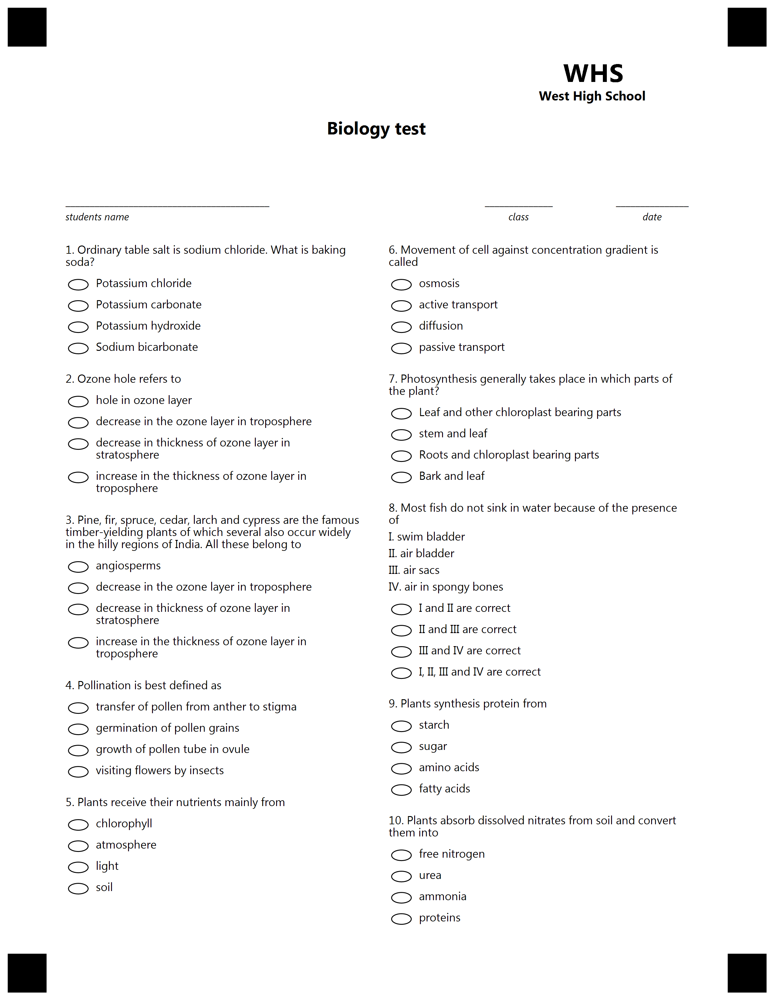

{} 

This example constructed for custom GlobalPageSettings. Please use provided settings from text below for best result.

{}


**Template generation call**

<details>
<summary>C# Code</summary>

````java
var license = new License();
license.SetLicense(@"C:\Users\User\Desktop\Aspose.license");

var engine = new OmrEngine();
var settings = new GlobalPageSettings
{
	PaperSize = PaperSize.Letter,
	Orientation = Orientation.Vertical,
	BubbleColor = Color.Black,
	BubbleSize = BubbleSize.Small,
	FontStyle = FontStyle.Regular,
	FontSize = 9,
	FontFamily = "Segoe UI",
	ImagesPaths = images
};
var configPath = @"C:\Users\User\Desktop\template\template.txt";

var result = engine.GenerateTemplate(configPath, settings);
result.Save(@"C:\Users\User\Desktop\template", "generated_template");
````

</details>

**Template TXT markdown**

<details>
<summary>TXT markdown</summary>

```text
?container=header
	columns_count=3
?block=
	column=2
?empty_line=
	height=200
?content=Biology test
	font_style=bold
	font_size=14
	align=center
&block
?block=
	column=3
?content=WHS
	align=center
	font_style=bold
	font_size=20
&block
?block=
	column=3
?content=West High School
	align=center
	font_style=bold
	font_size=10
&block
&container
?empty_line=
	height=150
?container=
	columns_proportions=60%-20%-20%
?block=
	column=1
?content=__________________________________________
?content=students name
	font_style=italic
	font_size=8
&block
?block=
	column=2
?content=______________
	align=center
?content=class
	font_style=italic
	font_size=8
	align=center
&block
?block=
	column=3
?content=_______________
	align=center
?content=date
	font_style=italic
	font_size=8
	align=center
&block
&container
?container=
	columns_count=2
?block=
	column=1
?content=1. Ordinary table salt is sodium chloride. What is baking soda?
?vertical_choicebox=1. Ordinary table salt is sodium chloride. What is baking soda?
?answer=Potassium chloride
?content=Potassium chloride
&answer
?answer=Potassium carbonate
?content=Potassium carbonate
&answer
?answer=Potassium hydroxide
?content=Potassium hydroxide
&answer
?answer=Sodium bicarbonate
?content=Sodium bicarbonate
&answer
&vertical_choicebox
&block
?block=
	column=1
?content=2. Ozone hole refers to
?vertical_choicebox=2. Ozone hole refers to
?answer=hole in ozone layer
?content=hole in ozone layer
&answer
?answer=decrease in the ozone layer in troposphere
?content=decrease in the ozone layer in troposphere
&answer
?answer=decrease in thickness of ozone layer in stratosphere
?content=decrease in thickness of ozone layer in stratosphere
&answer
?answer=increase in the thickness of ozone layer in troposphere
?content=increase in the thickness of ozone layer in troposphere
&answer
&vertical_choicebox
&block
?block=
	column=1
?content=3. Pine, fir, spruce, cedar, larch and cypress are the famous timber-yielding plants of which several also occur widely in the hilly regions of India. All these belong to
?vertical_choicebox=3.
?answer=angiosperms
?content=angiosperms
&answer
?answer=decrease in the ozone layer in troposphere
?content=decrease in the ozone layer in troposphere
&answer
?answer=decrease in thickness of ozone layer in stratosphere
?content=decrease in thickness of ozone layer in stratosphere
&answer
?answer=increase in the thickness of ozone layer in troposphere
?content=increase in the thickness of ozone layer in troposphere
&answer
&vertical_choicebox
&block
?block=
	column=1
?content=4. Pollination is best defined as
?vertical_choicebox=4.
?answer=transfer of pollen from anther to stigma
?content=transfer of pollen from anther to stigma
&answer
?answer=germination of pollen grains
?content=germination of pollen grains
&answer
?answer=growth of pollen tube in ovule
?content=growth of pollen tube in ovule
&answer
?answer=visiting flowers by insects
?content=visiting flowers by insects
&answer
&vertical_choicebox
&block
?block=
	column=1
?content=5. Plants receive their nutrients mainly from
?vertical_choicebox=5.
?answer=chlorophyll
?content=chlorophyll
&answer
?answer=atmosphere
?content=atmosphere
&answer
?answer=light
?content=light
&answer
?answer=soil
?content=soil
&answer
&vertical_choicebox
&block
?block=
	column=2
?content=6. Movement of cell against concentration gradient is called
?vertical_choicebox=6.
?answer=osmosis
?content=osmosis
&answer
?answer=active transport
?content=active transport
&answer
?answer=diffusion
?content=diffusion
&answer
?answer=passive transport
?content=passive transport
&answer
&vertical_choicebox
&block
?block=
	column=2
?content=7. Photosynthesis generally takes place in which parts of the plant?
?vertical_choicebox=7.
?answer=Leaf and other chloroplast bearing parts
?content=Leaf and other chloroplast bearing parts
&answer
?answer=stem and leaf
?content=stem and leaf
&answer
?answer=Roots and chloroplast bearing parts
?content=Roots and chloroplast bearing parts
&answer
?answer=Bark and leaf
?content=Bark and leaf
&answer
&vertical_choicebox
&block
?block=
	column=2
?content=8. Most fish do not sink in water because of the presence of
?content=I. swim bladder
?content=II. air bladder
?content=III. air sacs
?content=IV. air in spongy bones
?vertical_choicebox=8.
?answer=I and II are correct
?content=I and II are correct
&answer
?answer=II and III are correct
?content=II and III are correct
&answer
?answer=III and IV are correct
?content=III and IV are correct
&answer
?answer=I, II, III and IV are correct
?content=I, II, III and IV are correct
&answer
&vertical_choicebox
&block
?block=
	column=2
?content=9. Plants synthesis protein from
?vertical_choicebox=9.
?answer=starch
?content=starch
&answer
?answer=sugar
?content=sugar
&answer
?answer=amino acids
?content=amino acids
&answer
?answer=fatty acids
?content=fatty acids
&answer
&vertical_choicebox
&block
?block=
	column=2
?content=10. Plants absorb dissolved nitrates from soil and convert them into
?vertical_choicebox=9.
?answer=free nitrogen
?content=free nitrogen
&answer
?answer=urea
?content=urea
&answer
?answer=ammonia
?content=ammonia
&answer
?answer=proteins
?content=proteins
&answer
&vertical_choicebox
&block
&container
```

</details>

**Template result**

****