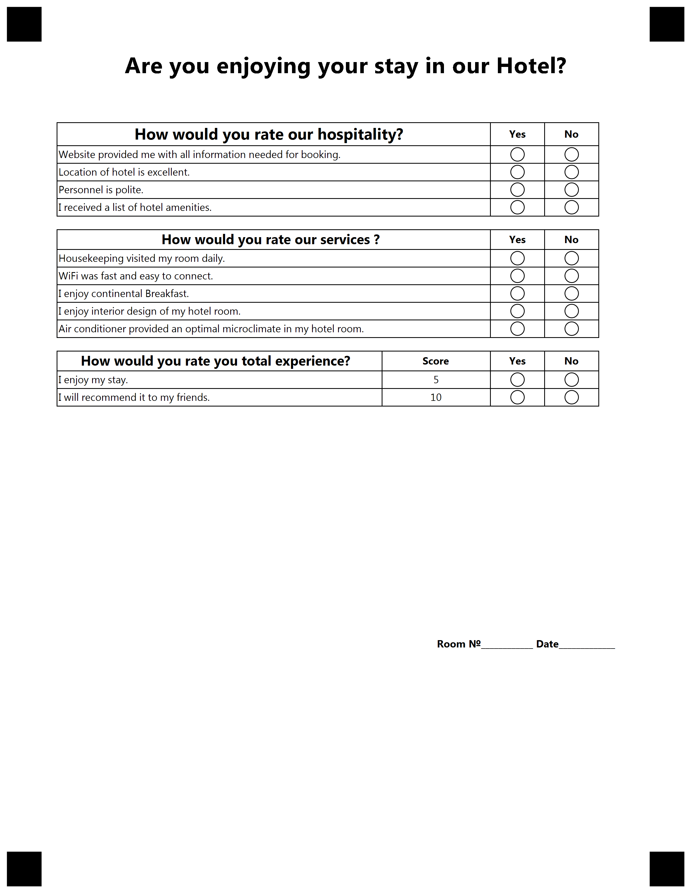

{} 

This example constructed for custom GlobalPageSettings. Please use provided settings from text below for best result.

{}


**Template generation call**

<details>
<summary>C# Code</summary>

````java
var license = new License();
license.SetLicense(@"C:\Users\User\Desktop\Aspose.license");

var engine = new OmrEngine();
var settings = new GlobalPageSettings
{
	PaperSize = PaperSize.Letter,
	Orientation = Orientation.Vertical,
	BubbleColor = Color.Black,
	BubbleSize = BubbleSize.Small,
	FontStyle = FontStyle.Regular,
	FontSize = 9,
	FontFamily = "Segoe UI",
	ImagesPaths = images
};
var configPath = @"C:\Users\User\Desktop\template\template.txt";

var result = engine.GenerateTemplate(configPath, settings);
result.Save(@"C:\Users\User\Desktop\template", "generated_template");
````

</details>

**Template TXT markdown**

<details>
<summary>TXT markdown</summary>

```text
?text=Are you enjoying your stay in our Hotel?
	font_style=bold
	align=center
	font_family=Segoe UI
	font_size=20


?container=main_container
?block=main_block
?score_group=hotel guest survey
	score_type_table=table	
?score_question=How would you rate our hospitality?
	font_size=14
	font_style=bold	
	row_proportions=80%-10%-10%
?score_header=Yes
	font_style=bold
	align=center
	header_type=positive
?score_header=No
	font_style=bold
	align=center
	header_type=negative
?score_answer=Website provided me with all information needed for booking.
	score=1
	align=left
?score_answer=Location of hotel is excellent.
	score=1
	align=left
?score_answer=Personnel is polite.
	score=5
	align=left
?score_answer=I received a list of hotel amenities.
	score=1
	align=left
&score_question	
?score_question=How would you rate our services ?
	font_size=12
	font_style=bold	
	row_proportions=80%-10%-10%
?score_header=Yes
	header_type=positive
	font_style=bold
	align=center
?score_header=No
	font_style=bold
	align=center
	header_type=negative
?score_answer=Housekeeping visited my room daily.
	score=2
	align=left
?score_answer=WiFi was fast and easy to connect.
	score=2
	align=left
?score_answer=I enjoy continental Breakfast.
	score=3
	align=left
?score_answer=I enjoy interior design of my hotel room.
	score=3
	align=left
?score_answer=Air conditioner provided an optimal microclimate in my hotel room.
	score=3
	align=left
&score_question
?score_question=How would you rate you total experience?
	font_size=12
	font_style=bold	
	row_proportions=60%-20%-10%-10%
	score_display=DisplayAsExtraColumn
?score_header=Score
	header_type=Amount
	font_style=bold
	align=center
?score_header=Yes
	header_type=positive
	font_style=bold
	align=center
?score_header=No
	header_type=negative
	font_style=bold
	align=center
?score_answer=I enjoy my stay.
	score=5
	align=left
?score_answer=I will recommend it to my friends.
	score=10
	align=left
&score_question
&score_group
?empty_line=space
	height=800
?content=Room №____________       Date_____________
	align=right
	font_style=bold
&block
&container
```

</details>

**Template result**

****