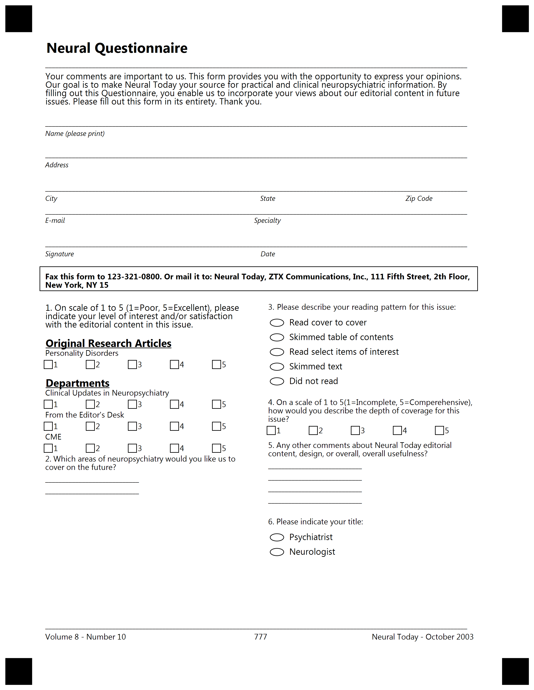

{} 

This example constructed for custom GlobalPageSettings. Please use provided settings from text below for best result.

{}


**Template generation call**

<details>
<summary>C# Code</summary>

````java
var license = new License();
license.SetLicense(@"C:\Users\User\Desktop\Aspose.license");

var engine = new OmrEngine();
var settings = new GlobalPageSettings
{
	PaperSize = PaperSize.Letter,
	Orientation = Orientation.Vertical,
	BubbleColor = Color.Black,
	BubbleSize = BubbleSize.Small,
	FontStyle = FontStyle.Regular,
	FontSize = 9,
	FontFamily = "Segoe UI",
	ImagesPaths = images
};
var configPath = @"C:\Users\User\Desktop\template\template.txt";

var result = engine.GenerateTemplate(configPath, settings);
result.Save(@"C:\Users\User\Desktop\template", "generated_template");
````

</details>

**Template TXT markdown**

<details>
<summary>TXT markdown</summary>

```text
?text=Neural Questionnaire
	align=left
	font_size=16
	font_style=bold
?text=______________________________________________________________________________________________________________________________
?container=
	columns_count=1
?block=
	column=1
?content=Your comments are important to us. This form provides you with the opportunity to express your opinions. Our goal is to make Neural Today your source for practical and clinical neuropsychiatric information. By filling out this Questionnaire, you enable us to incorporate your views about our editorial content in future issues. Please fill out this form in its entirety. Thank you.
	font_size=10
&block
&container
?container=personal info
	columns_count=1
?block=
	column=1
	is_clipped=true
?content=______________________________________________________________________________________________________________________________
?content=Name (please print)
	font_size=8
	font_style=italic
?empty_line=
	height=40
?content=______________________________________________________________________________________________________________________________
?content=Address
	font_size=8
	font_style=italic
&block
&container
?text=______________________________________________________________________________________________________________________________
?container=
	columns_proportions=33%-33%-34%
?block=
	column=1
?content=City
	align=left
	font_size=8
	font_style=italic
&block
?block=
	column=2
?content=State
	align=center
	font_size=8
	font_style=italic
&block
?block=
	column=3
?content=Zip Code
	align=center
	font_size=8
	font_style=italic
&block
?text=______________________________________________________________________________________________________________________________
	columns_proportions=33%-33%-34%
?block=
	column=1
?content=E-mail
	align=left
	font_size=8
	font_style=italic
&block
?block=
	column=2
?content=Specialty
	align=center
	font_size=8
	font_style=italic
&block
&container
?text=______________________________________________________________________________________________________________________________
?container=
	columns_proportions=33%-33%-34%
?block=
	column=1
?content=Signature
	align=left
	font_size=8
	font_style=italic
&block
?block=
	column=2
?content=Date
	align=center
	font_size=8
	font_style=italic
&block
&container
?container=
	columns_count=1
?block=1
	column=1
	border=square
?content=Fax this form to 123-321-0800. Or mail it to: Neural Today, ZTX Communications, Inc., 111 Fifth Street, 2th Floor, New York, NY 15
	font_style=bold
&block
&container
?container=two_columns
	columns_count=2
?block=
	column=1
?content=1. On scale of 1 to 5 (1=Poor, 5=Excellent), please indicate your level of interest and/or satisfaction with the editorial content in this issue.
	font_size=10
?empty_line=
	height=30
?content=Original Research Articles
	font_style=underline, bold
	font_size=12
?content=Personality Disorders
?checkbox=Personality Disorders
	hide_name=true
	bubble_size=extrasmall
?content=1
?content=2
?content=3
?content=4
?content=5
&checkbox
&block
?block=
	column=1
?empty_line=
	height=30
?content=Departments
	font_style=underline, bold
	font_size=12
?content=Clinical Updates in Neuropsychiatry
?checkbox=Clinical Updates in Neuropsychiatry
	hide_name=true
	bubble_size=extrasmall
?content=1
?content=2
?content=3
?content=4
?content=5
&checkbox
&block
?block=
	column=1
?content=From the Editor's Desk
?checkbox=From the Editor's Desk
	hide_name=true
	bubble_size=extrasmall
?content=1
?content=2
?content=3
?content=4
?content=5
&checkbox
&block
?block=
	column=1
?content=CME
?checkbox=CME
	hide_name=true
	bubble_size=extrasmall
?content=1
?content=2
?content=3
?content=4
?content=5
&checkbox
&block
?block=
	column=1
?content=2. Which areas of neuropsychiatry would you like us to cover on the future?
?content=____________________________
?content=____________________________
&block
?block=3.
	column=2
?content=3. Please describe your reading pattern for this issue:	
?vertical_choicebox=reading pattern
?answer=Read cover to cover
?content=Read cover to cover
	font_size=10
&answer
?answer=Skimmed table of contents
?content=Skimmed table of contents
	font_size=10
&answer
?answer=Read select items of interest
?content=Read select items of interest
	font_size=10
&answer
?answer=Skimmed text
?content=Skimmed text
	font_size=10
&answer
?answer=Did not read
?content=Did not read
	font_size=10
&answer
&vertical_choicebox 
&block
?block=4.
	column=2
?content=4. On a scale of 1 to 5(1=Incomplete, 5=Comperehensive), how would you describe the depth of coverage for this issue?
?checkbox=4.
	hide_name=true
	bubble_size=extrasmall
?content=1
?content=2
?content=3
?content=4
?content=5
&checkbox
&block
?empty_line=
	height=20
?block=
	column=2
?content=5. Any other comments about Neural Today editorial content, design, or overall, overall usefulness?
?content=____________________________
?content=____________________________
?content=____________________________
?content=____________________________
&block
?block=
	column=2
?content=6. Please indicate your title:
?vertical_choicebox=title
?answer=Psychiatrist
?content=Psychiatrist
	font_size=10
&answer
?answer=Neurologist
?content=Neurologist
	font_size=10
&answer
&vertical_choicebox 
&block
&container
?empty_line=
	height=250
?text=______________________________________________________________________________________________________________________________
?container=footer
	columns_count=3
?block=
	column=1
?content=Volume 8 - Number 10
	align=left	
&block
?block=
	column=2
?content=777
	align=center
&block
?block=
	column=3
?content=Neural Today - October 2003
	align=right
&block
&container
```

</details>

**Template result**

****