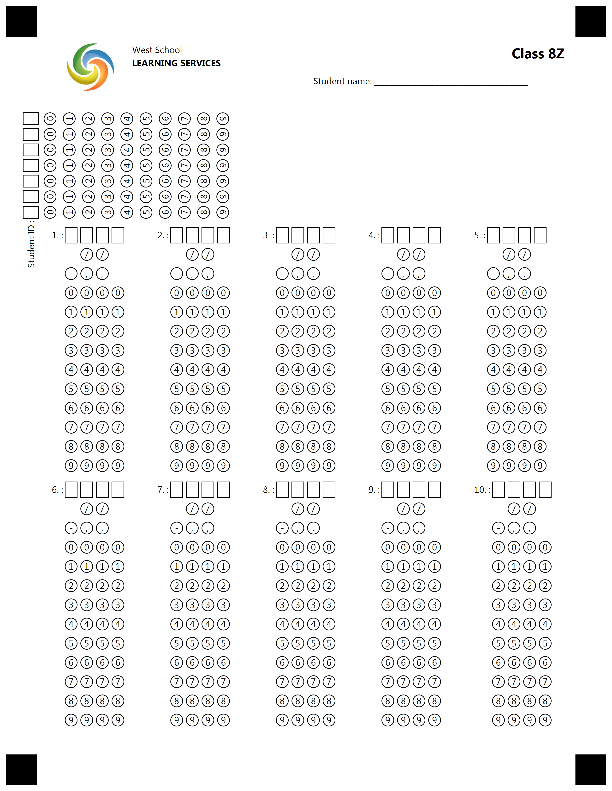

{} 

This example constructed for custom GlobalPageSettings. Please use provided settings from text below for best result.

{}


**Template generation call**

<details>
<summary>C# Code</summary>

````java
var license = new License();
license.SetLicense(@"C:\Users\User\Desktop\Aspose.license");

var engine = new OmrEngine();
var settings = new GlobalPageSettings
{
	PaperSize = PaperSize.Letter,
	Orientation = Orientation.Vertical,
	BubbleColor = Color.Black,
	BubbleSize = BubbleSize.Small,
	FontStyle = FontStyle.Regular,
	FontSize = 9,
	FontFamily = "Segoe UI",
	ImagesPaths = images
};
var configPath = @"C:\Users\User\Desktop\template\template.json";

var result = engine.GenerateJSONTemplate(configPath, settings);
result.Save(@"C:\Users\User\Desktop\template", "generated_template");
````

</details>


**Template JSON markdown**

<details>
<summary>JSON markdown</summary>

```json
{
  "name": null,
  "children": [
    {
      "name": null,
      "children": [
        {
          "name": "header",
          "children": [
            {
              "name": "logo",
              "children": [
                {
                  "align": "Center",
                  "name": "logo.jpg",
                  "image_path": null,
                  "x": -1,
                  "y": -1,
                  "height": 200,
                  "width": 200,
                  "element_type": "Image"
                }
              ],
              "column": 1,
              "border": "None",
              "border_size": 3,
              "border_color": "Black",
              "is_clipped": false,
              "element_type": "Block"
            },
            {
              "name": "logoText",
              "children": [
                {
                  "name": "West School",
                  "font_family": "Segoe UI",
                  "font_style": "Underline",
                  "font_size": 9,
                  "content_type": "Normal",
                  "align": "Left",
                  "element_type": "Content"
                },
                {
                  "name": "LEARNING SERVICES",
                  "font_family": "Segoe UI",
                  "font_style": "Bold",
                  "font_size": 9,
                  "content_type": "Normal",
                  "align": "Left",
                  "element_type": "Content"
                }
              ],
              "column": 2,
              "border": "None",
              "border_size": 3,
              "border_color": "Black",
              "is_clipped": false,
              "element_type": "Block"
            },
            {
              "name": "lastname",
              "children": [
                {
                  "name": "Class 8Z",
                  "font_family": "Segoe UI",
                  "font_style": "Bold",
                  "font_size": 14,
                  "content_type": "Normal",
                  "align": "Right",
                  "element_type": "Content"
                },
                {
                  "name": "1",
                  "height": 0,
                  "element_type": "EmptyLine"
                },
                {
                  "name": "Student name: ________________________________________",
                  "font_family": "Segoe UI",
                  "font_style": "Regular",
                  "font_size": 9,
                  "content_type": "Normal",
                  "align": "Left",
                  "element_type": "Content"
                }
              ],
              "column": 3,
              "border": "None",
              "border_size": 3,
              "border_color": "Black",
              "is_clipped": true,
              "element_type": "Block"
            }
          ],
          "columns_count": 0,
          "columns_proportions": [
            15,
            35,
            50
          ],
          "container_type": "Normal",
          "element_type": "Container"
        },
        {
          "name": "50",
          "height": 50,
          "element_type": "EmptyLine"
        },
        {
          "name": "identification",
          "children": [
            {
              "name": "student_id",
              "children": [
                {
                  "vertical_margin": 0,
                  "bubble_size": "Small",
                  "name": "Student ID",
                  "column": 0,
                  "columns_count": 7,
                  "align": "Left",
                  "header_type": "Square",
                  "header_border_size": 3,
                  "header_border_color": "Black",
                  "orientation": "Horizontal",
                  "x": -1,
                  "y": 370,
                  "values": [
                    "0",
                    "1",
                    "2",
                    "3",
                    "4",
                    "5",
                    "6",
                    "7",
                    "8",
                    "9"
                  ],
                  "extra_row": [],
                  "rotate": -90,
                  "element_type": "CompositeGrid"
                }
              ],
              "column": 1,
              "border": "None",
              "border_size": 3,
              "border_color": "Black",
              "is_clipped": false,
              "element_type": "Block"
            },
            {
              "name": "info",
              "children": [
                {
                  "name": "200",
                  "height": 240,
                  "element_type": "EmptyLine"
                }
              ],
              "column": 2,
              "border": "None",
              "border_size": 3,
              "border_color": "Black",
              "is_clipped": false,
              "element_type": "Block"
            }
          ],
          "columns_count": 0,
          "columns_proportions": [
            50,
            50
          ],
          "container_type": "Normal",
          "element_type": "Container"
        },
        {
          "name": "1-5 grids",
          "children": [
            {
              "name": "1",
              "children": [
                {
                  "vertical_margin": 0,
                  "bubble_size": "Small",
                  "name": "1.",
                  "column": 0,
                  "columns_count": 4,
                  "align": "Left",
                  "header_type": "Square",
                  "header_border_size": 3,
                  "header_border_color": "Black",
                  "orientation": "Horizontal",
                  "x": -1,
                  "y": 962,
                  "values": [
                    "0",
                    "1",
                    "2",
                    "3",
                    "4",
                    "5",
                    "6",
                    "7",
                    "8",
                    "9"
                  ],
                  "extra_row": [
                    [
                      "",
                      "/",
                      "/",
                      ""
                    ],
                    [
                      "-",
                      ",",
                      ",",
                      ""
                    ]
                  ],
                  "rotate": 0,
                  "element_type": "CompositeGrid"
                }
              ],
              "column": 1,
              "border": "None",
              "border_size": 3,
              "border_color": "Black",
              "is_clipped": false,
              "element_type": "Block"
            },
            {
              "name": "2",
              "children": [
                {
                  "vertical_margin": 0,
                  "bubble_size": "Small",
                  "name": "2.",
                  "column": 0,
                  "columns_count": 4,
                  "align": "Left",
                  "header_type": "Square",
                  "header_border_size": 3,
                  "header_border_color": "Black",
                  "orientation": "Horizontal",
                  "x": -1,
                  "y": 962,
                  "values": [
                    "0",
                    "1",
                    "2",
                    "3",
                    "4",
                    "5",
                    "6",
                    "7",
                    "8",
                    "9"
                  ],
                  "extra_row": [
                    [
                      "",
                      "/",
                      "/",
                      ""
                    ],
                    [
                      "-",
                      ",",
                      ",",
                      ""
                    ]
                  ],
                  "rotate": 0,
                  "element_type": "CompositeGrid"
                }
              ],
              "column": 2,
              "border": "None",
              "border_size": 3,
              "border_color": "Black",
              "is_clipped": false,
              "element_type": "Block"
            },
            {
              "name": "3",
              "children": [
                {
                  "vertical_margin": 0,
                  "bubble_size": "Small",
                  "name": "3.",
                  "column": 0,
                  "columns_count": 4,
                  "align": "Left",
                  "header_type": "Square",
                  "header_border_size": 3,
                  "header_border_color": "Black",
                  "orientation": "Horizontal",
                  "x": -1,
                  "y": 962,
                  "values": [
                    "0",
                    "1",
                    "2",
                    "3",
                    "4",
                    "5",
                    "6",
                    "7",
                    "8",
                    "9"
                  ],
                  "extra_row": [
                    [
                      "",
                      "/",
                      "/",
                      ""
                    ],
                    [
                      "-",
                      ",",
                      ",",
                      ""
                    ]
                  ],
                  "rotate": 0,
                  "element_type": "CompositeGrid"
                }
              ],
              "column": 3,
              "border": "None",
              "border_size": 3,
              "border_color": "Black",
              "is_clipped": false,
              "element_type": "Block"
            },
            {
              "name": "4",
              "children": [
                {
                  "vertical_margin": 0,
                  "bubble_size": "Small",
                  "name": "4.",
                  "column": 0,
                  "columns_count": 4,
                  "align": "Left",
                  "header_type": "Square",
                  "header_border_size": 3,
                  "header_border_color": "Black",
                  "orientation": "Horizontal",
                  "x": -1,
                  "y": 962,
                  "values": [
                    "0",
                    "1",
                    "2",
                    "3",
                    "4",
                    "5",
                    "6",
                    "7",
                    "8",
                    "9"
                  ],
                  "extra_row": [
                    [
                      "",
                      "/",
                      "/",
                      ""
                    ],
                    [
                      "-",
                      ",",
                      ",",
                      ""
                    ]
                  ],
                  "rotate": 0,
                  "element_type": "CompositeGrid"
                }
              ],
              "column": 4,
              "border": "None",
              "border_size": 3,
              "border_color": "Black",
              "is_clipped": false,
              "element_type": "Block"
            },
            {
              "name": "5",
              "children": [
                {
                  "vertical_margin": 0,
                  "bubble_size": "Small",
                  "name": "5.",
                  "column": 0,
                  "columns_count": 4,
                  "align": "Left",
                  "header_type": "Square",
                  "header_border_size": 3,
                  "header_border_color": "Black",
                  "orientation": "Horizontal",
                  "x": -1,
                  "y": 962,
                  "values": [
                    "0",
                    "1",
                    "2",
                    "3",
                    "4",
                    "5",
                    "6",
                    "7",
                    "8",
                    "9"
                  ],
                  "extra_row": [
                    [
                      "",
                      "/",
                      "/",
                      ""
                    ],
                    [
                      "-",
                      ",",
                      ",",
                      ""
                    ]
                  ],
                  "rotate": 0,
                  "element_type": "CompositeGrid"
                }
              ],
              "column": 5,
              "border": "None",
              "border_size": 3,
              "border_color": "Black",
              "is_clipped": false,
              "element_type": "Block"
            }
          ],
          "columns_count": 0,
          "columns_proportions": [
            20,
            20,
            20,
            20,
            20
          ],
          "container_type": "Normal",
          "element_type": "Container"
        },
        {
          "name": "6-10 grids",
          "children": [
            {
              "name": "6",
              "children": [
                {
                  "vertical_margin": 0,
                  "bubble_size": "Small",
                  "name": "6.",
                  "column": 0,
                  "columns_count": 4,
                  "align": "Left",
                  "header_type": "Square",
                  "header_border_size": 3,
                  "header_border_color": "Black",
                  "orientation": "Horizontal",
                  "x": -1,
                  "y": -1,
                  "values": [
                    "0",
                    "1",
                    "2",
                    "3",
                    "4",
                    "5",
                    "6",
                    "7",
                    "8",
                    "9"
                  ],
                  "extra_row": [
                    [
                      "",
                      "/",
                      "/",
                      ""
                    ],
                    [
                      "-",
                      ",",
                      ",",
                      ""
                    ]
                  ],
                  "rotate": 0,
                  "element_type": "CompositeGrid"
                }
              ],
              "column": 1,
              "border": "None",
              "border_size": 3,
              "border_color": "Black",
              "is_clipped": false,
              "element_type": "Block"
            },
            {
              "name": "7",
              "children": [
                {
                  "vertical_margin": 0,
                  "bubble_size": "Small",
                  "name": "7.",
                  "column": 0,
                  "columns_count": 4,
                  "align": "Left",
                  "header_type": "Square",
                  "header_border_size": 3,
                  "header_border_color": "Black",
                  "orientation": "Horizontal",
                  "x": -1,
                  "y": -1,
                  "values": [
                    "0",
                    "1",
                    "2",
                    "3",
                    "4",
                    "5",
                    "6",
                    "7",
                    "8",
                    "9"
                  ],
                  "extra_row": [
                    [
                      "",
                      "/",
                      "/",
                      ""
                    ],
                    [
                      "-",
                      ",",
                      ",",
                      ""
                    ]
                  ],
                  "rotate": 0,
                  "element_type": "CompositeGrid"
                }
              ],
              "column": 2,
              "border": "None",
              "border_size": 3,
              "border_color": "Black",
              "is_clipped": false,
              "element_type": "Block"
            },
            {
              "name": "8",
              "children": [
                {
                  "vertical_margin": 0,
                  "bubble_size": "Small",
                  "name": "8.",
                  "column": 0,
                  "columns_count": 4,
                  "align": "Left",
                  "header_type": "Square",
                  "header_border_size": 3,
                  "header_border_color": "Black",
                  "orientation": "Horizontal",
                  "x": -1,
                  "y": -1,
                  "values": [
                    "0",
                    "1",
                    "2",
                    "3",
                    "4",
                    "5",
                    "6",
                    "7",
                    "8",
                    "9"
                  ],
                  "extra_row": [
                    [
                      "",
                      "/",
                      "/",
                      ""
                    ],
                    [
                      "-",
                      ",",
                      ",",
                      ""
                    ]
                  ],
                  "rotate": 0,
                  "element_type": "CompositeGrid"
                }
              ],
              "column": 3,
              "border": "None",
              "border_size": 3,
              "border_color": "Black",
              "is_clipped": false,
              "element_type": "Block"
            },
            {
              "name": "9",
              "children": [
                {
                  "vertical_margin": 0,
                  "bubble_size": "Small",
                  "name": "9.",
                  "column": 0,
                  "columns_count": 4,
                  "align": "Left",
                  "header_type": "Square",
                  "header_border_size": 3,
                  "header_border_color": "Black",
                  "orientation": "Horizontal",
                  "x": -1,
                  "y": -1,
                  "values": [
                    "0",
                    "1",
                    "2",
                    "3",
                    "4",
                    "5",
                    "6",
                    "7",
                    "8",
                    "9"
                  ],
                  "extra_row": [
                    [
                      "",
                      "/",
                      "/",
                      ""
                    ],
                    [
                      "-",
                      ",",
                      ",",
                      ""
                    ]
                  ],
                  "rotate": 0,
                  "element_type": "CompositeGrid"
                }
              ],
              "column": 4,
              "border": "None",
              "border_size": 3,
              "border_color": "Black",
              "is_clipped": false,
              "element_type": "Block"
            },
            {
              "name": "10",
              "children": [
                {
                  "vertical_margin": 0,
                  "bubble_size": "Small",
                  "name": "10.",
                  "column": 0,
                  "columns_count": 4,
                  "align": "Left",
                  "header_type": "Square",
                  "header_border_size": 3,
                  "header_border_color": "Black",
                  "orientation": "Horizontal",
                  "x": -1,
                  "y": -1,
                  "values": [
                    "0",
                    "1",
                    "2",
                    "3",
                    "4",
                    "5",
                    "6",
                    "7",
                    "8",
                    "9"
                  ],
                  "extra_row": [
                    [
                      "",
                      "/",
                      "/",
                      ""
                    ],
                    [
                      "-",
                      ",",
                      ",",
                      ""
                    ]
                  ],
                  "rotate": 0,
                  "element_type": "CompositeGrid"
                }
              ],
              "column": 5,
              "border": "None",
              "border_size": 3,
              "border_color": "Black",
              "is_clipped": false,
              "element_type": "Block"
            }
          ],
          "columns_count": 0,
          "columns_proportions": [
            20,
            20,
            20,
            20,
            20
          ],
          "container_type": "Normal",
          "element_type": "Container"
        }
      ],
      "element_type": "Page"
    }
  ],
  "element_type": "Template"
}
```

</details>

**Template result**

****