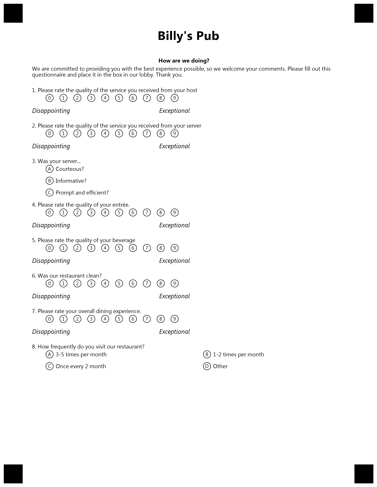

{} 

This example constructed for custom GlobalPageSettings. Please use provided settings from text below for best result.

{}


**Template generation call**

<details>
<summary>C# Code</summary>

````java
var license = new License();
license.SetLicense(@"C:\Users\User\Desktop\Aspose.license");

var engine = new OmrEngine();
var settings = new GlobalPageSettings
{
	PaperSize = PaperSize.Letter,
	Orientation = Orientation.Vertical,
	BubbleColor = Color.Black,
	BubbleSize = BubbleSize.Small,
	FontStyle = FontStyle.Regular,
	FontSize = 9,
	FontFamily = "Segoe UI",
	ImagesPaths = images
};
var configPath = @"C:\Users\User\Desktop\template\template.json";

var result = engine.GenerateJSONTemplate(configPath, settings);
result.Save(@"C:\Users\User\Desktop\template", "generated_template");
````

</details>


**Template JSON markdown**

<details>
<summary>JSON markdown</summary>

```json
{
  "name": null,
  "children": [
    {
      "name": null,
      "children": [
        {
          "name": "Billy's Pub\r\n",
          "font_family": "Segoe UI",
          "font_style": "Bold",
          "font_size": 20,
          "align": "Center",
          "element_type": "Text"
        },
        {
          "name": "",
          "height": 80,
          "element_type": "EmptyLine"
        },
        {
          "name": "header",
          "children": [
            {
              "name": "header",
              "children": [
                {
                  "name": "How are we doing?",
                  "font_family": "Segoe UI",
                  "font_style": "Bold",
                  "font_size": 9,
                  "content_type": "Normal",
                  "align": "Center",
                  "element_type": "Content"
                },
                {
                  "name": "We are committed to providing you with the best experience possible, so we welcome your comments. Please fill out this questionnaire and place it in the box in our lobby. Thank you.",
                  "font_family": "Segoe UI",
                  "font_style": "Regular",
                  "font_size": 9,
                  "content_type": "Normal",
                  "align": "Left",
                  "element_type": "Content"
                }
              ],
              "column": 1,
              "border": "None",
              "border_size": 3,
              "border_color": "Black",
              "is_clipped": false,
              "element_type": "Block"
            }
          ],
          "columns_count": 1,
          "columns_proportions": null,
          "container_type": "Normal",
          "element_type": "Container"
        },
        {
          "name": null,
          "font_family": "Segoe UI",
          "font_style": "Regular",
          "font_size": 9,
          "align": "Left",
          "answers_string": "\t(0) (1) (2) (3) (4) (5) (6) (7) (8) (9)\r\n",
          "question_text": "Please rate the quality of the service you received from your host\r\n",
          "element_type": "ChoiceBox"
        },
        {
          "name": "text",
          "children": [
            {
              "name": "left",
              "children": [
                {
                  "name": "Disappointing",
                  "font_family": "Segoe UI",
                  "font_style": "Italic",
                  "font_size": 10,
                  "content_type": "Normal",
                  "align": "Left",
                  "element_type": "Content"
                }
              ],
              "column": 1,
              "border": "None",
              "border_size": 3,
              "border_color": "Black",
              "is_clipped": false,
              "element_type": "Block"
            },
            {
              "name": "right",
              "children": [
                {
                  "name": "Exceptional",
                  "font_family": "Segoe UI",
                  "font_style": "Italic",
                  "font_size": 10,
                  "content_type": "Normal",
                  "align": "Left",
                  "element_type": "Content"
                }
              ],
              "column": 2,
              "border": "None",
              "border_size": 3,
              "border_color": "Black",
              "is_clipped": false,
              "element_type": "Block"
            }
          ],
          "columns_count": 0,
          "columns_proportions": [
            40,
            60
          ],
          "container_type": "Normal",
          "element_type": "Container"
        },
        {
          "name": null,
          "font_family": "Segoe UI",
          "font_style": "Regular",
          "font_size": 9,
          "align": "Left",
          "answers_string": "\t(0) (1) (2) (3) (4) (5) (6) (7) (8) (9)\r\n",
          "question_text": "Please rate the quality of the service you received from your server\r\n",
          "element_type": "ChoiceBox"
        },
        {
          "name": "text",
          "children": [
            {
              "name": "left",
              "children": [
                {
                  "name": "Disappointing",
                  "font_family": "Segoe UI",
                  "font_style": "Italic",
                  "font_size": 10,
                  "content_type": "Normal",
                  "align": "Left",
                  "element_type": "Content"
                }
              ],
              "column": 1,
              "border": "None",
              "border_size": 3,
              "border_color": "Black",
              "is_clipped": false,
              "element_type": "Block"
            },
            {
              "name": "right",
              "children": [
                {
                  "name": "Exceptional",
                  "font_family": "Segoe UI",
                  "font_style": "Italic",
                  "font_size": 10,
                  "content_type": "Normal",
                  "align": "Left",
                  "element_type": "Content"
                }
              ],
              "column": 2,
              "border": "None",
              "border_size": 3,
              "border_color": "Black",
              "is_clipped": false,
              "element_type": "Block"
            }
          ],
          "columns_count": 0,
          "columns_proportions": [
            40,
            60
          ],
          "container_type": "Normal",
          "element_type": "Container"
        },
        {
          "name": null,
          "font_family": "Segoe UI",
          "font_style": "Regular",
          "font_size": 9,
          "align": "Left",
          "answers_string": "\t(A) Courteous?\r\n\t(B) Informative?\r\n\t(C) Prompt and efficient?\r\n",
          "question_text": "Was your server...\r\n",
          "element_type": "ChoiceBox"
        },
        {
          "name": null,
          "font_family": "Segoe UI",
          "font_style": "Regular",
          "font_size": 9,
          "align": "Left",
          "answers_string": "\t(0) (1) (2) (3) (4) (5) (6) (7) (8) (9)\r\n",
          "question_text": "Please rate the quality of your entrée.\r\n",
          "element_type": "ChoiceBox"
        },
        {
          "name": "text",
          "children": [
            {
              "name": "left",
              "children": [
                {
                  "name": "Disappointing",
                  "font_family": "Segoe UI",
                  "font_style": "Italic",
                  "font_size": 10,
                  "content_type": "Normal",
                  "align": "Left",
                  "element_type": "Content"
                }
              ],
              "column": 1,
              "border": "None",
              "border_size": 3,
              "border_color": "Black",
              "is_clipped": false,
              "element_type": "Block"
            },
            {
              "name": "right",
              "children": [
                {
                  "name": "Exceptional",
                  "font_family": "Segoe UI",
                  "font_style": "Italic",
                  "font_size": 10,
                  "content_type": "Normal",
                  "align": "Left",
                  "element_type": "Content"
                }
              ],
              "column": 2,
              "border": "None",
              "border_size": 3,
              "border_color": "Black",
              "is_clipped": false,
              "element_type": "Block"
            }
          ],
          "columns_count": 0,
          "columns_proportions": [
            40,
            60
          ],
          "container_type": "Normal",
          "element_type": "Container"
        },
        {
          "name": null,
          "font_family": "Segoe UI",
          "font_style": "Regular",
          "font_size": 9,
          "align": "Left",
          "answers_string": "\t(0) (1) (2) (3) (4) (5) (6) (7) (8) (9)\r\n",
          "question_text": "Please rate the quality of your beverage\r\n",
          "element_type": "ChoiceBox"
        },
        {
          "name": "text",
          "children": [
            {
              "name": "left",
              "children": [
                {
                  "name": "Disappointing",
                  "font_family": "Segoe UI",
                  "font_style": "Italic",
                  "font_size": 10,
                  "content_type": "Normal",
                  "align": "Left",
                  "element_type": "Content"
                }
              ],
              "column": 1,
              "border": "None",
              "border_size": 3,
              "border_color": "Black",
              "is_clipped": false,
              "element_type": "Block"
            },
            {
              "name": "right",
              "children": [
                {
                  "name": "Exceptional",
                  "font_family": "Segoe UI",
                  "font_style": "Italic",
                  "font_size": 10,
                  "content_type": "Normal",
                  "align": "Left",
                  "element_type": "Content"
                }
              ],
              "column": 2,
              "border": "None",
              "border_size": 3,
              "border_color": "Black",
              "is_clipped": false,
              "element_type": "Block"
            }
          ],
          "columns_count": 0,
          "columns_proportions": [
            40,
            60
          ],
          "container_type": "Normal",
          "element_type": "Container"
        },
        {
          "name": null,
          "font_family": "Segoe UI",
          "font_style": "Regular",
          "font_size": 9,
          "align": "Left",
          "answers_string": "\t(0) (1) (2) (3) (4) (5) (6) (7) (8) (9)\r\n",
          "question_text": "Was our restaurant clean?\r\n",
          "element_type": "ChoiceBox"
        },
        {
          "name": "text",
          "children": [
            {
              "name": "left",
              "children": [
                {
                  "name": "Disappointing",
                  "font_family": "Segoe UI",
                  "font_style": "Italic",
                  "font_size": 10,
                  "content_type": "Normal",
                  "align": "Left",
                  "element_type": "Content"
                }
              ],
              "column": 1,
              "border": "None",
              "border_size": 3,
              "border_color": "Black",
              "is_clipped": false,
              "element_type": "Block"
            },
            {
              "name": "right",
              "children": [
                {
                  "name": "Exceptional",
                  "font_family": "Segoe UI",
                  "font_style": "Italic",
                  "font_size": 10,
                  "content_type": "Normal",
                  "align": "Left",
                  "element_type": "Content"
                }
              ],
              "column": 2,
              "border": "None",
              "border_size": 3,
              "border_color": "Black",
              "is_clipped": false,
              "element_type": "Block"
            }
          ],
          "columns_count": 0,
          "columns_proportions": [
            40,
            60
          ],
          "container_type": "Normal",
          "element_type": "Container"
        },
        {
          "name": null,
          "font_family": "Segoe UI",
          "font_style": "Regular",
          "font_size": 9,
          "align": "Left",
          "answers_string": "\t(0) (1) (2) (3) (4) (5) (6) (7) (8) (9)\r\n",
          "question_text": "Please rate your overall dining experience.\r\n",
          "element_type": "ChoiceBox"
        },
        {
          "name": "text",
          "children": [
            {
              "name": "left",
              "children": [
                {
                  "name": "Disappointing",
                  "font_family": "Segoe UI",
                  "font_style": "Italic",
                  "font_size": 10,
                  "content_type": "Normal",
                  "align": "Left",
                  "element_type": "Content"
                }
              ],
              "column": 1,
              "border": "None",
              "border_size": 3,
              "border_color": "Black",
              "is_clipped": false,
              "element_type": "Block"
            },
            {
              "name": "right",
              "children": [
                {
                  "name": "Exceptional",
                  "font_family": "Segoe UI",
                  "font_style": "Italic",
                  "font_size": 10,
                  "content_type": "Normal",
                  "align": "Left",
                  "element_type": "Content"
                }
              ],
              "column": 2,
              "border": "None",
              "border_size": 3,
              "border_color": "Black",
              "is_clipped": false,
              "element_type": "Block"
            }
          ],
          "columns_count": 0,
          "columns_proportions": [
            40,
            60
          ],
          "container_type": "Normal",
          "element_type": "Container"
        },
        {
          "name": null,
          "font_family": "Segoe UI",
          "font_style": "Regular",
          "font_size": 9,
          "align": "Left",
          "answers_string": "\t(A) 3-5 times per month (B) 1-2 times per month\r\n\t(C) Once every 2 month (D) Other\r\n",
          "question_text": "How frequently do you visit our restaurant?\r\n",
          "element_type": "ChoiceBox"
        }
      ],
      "element_type": "Page"
    }
  ],
  "element_type": "Template"
}
```

</details>

**Template result**

****