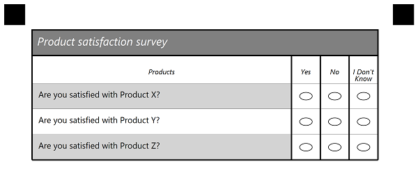
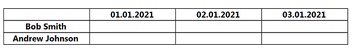

## **Introduction**
Template generation markup supports several types of elements, and most of them have a number of options that define it's properties and appearance. This allows creating functional and nice-looking custom templates for any of your needs i.e. surveys, answer sheets, tests - anything you need.

In this article, we provide a detailed description of table elements and its attributes with the usage examples represented in json markup.
Table element used for drawing table structure e.g. rows and columns.

## **Table element**
Can be used for questionnaires with a set amount of answers.  Grouping element. Supports TableHeader, TableTitle and Question elements as children.
Best used for drawing table structure with rows and columns. Columns described in TableHeader element. Question element represent rows.
TableTitle used when you need an extra row above the table.

### **Attributes**
Table element can be customized with attributes.

|**Attribute**|**Attribute Description**|**Required/Optional**|**Attribute Default Value**|**Attribute Usage Example**|
| :- | :- | :- | :- | :- |
|element_type| type of JSON object|Required|-|"element_type":"table"
|name| Name of the table. Does not displayed|Optional|-|"name":"Survey"
|answers_count|Number of answers(columns) used in table|Required|-|"answers_count":5|
|table_type|Type of table element. Can be striped or normal|Optional|normal|"table_type":"striped"
|children|Child elements which represent table content|Required|-|see examples below

## **TableTitle element**
Represent additional header in table with one column - title.
Text value of this element displayed above the header as the first row.
Good for marking table names.

### **Attributes**
TableTitle element can be customized with attributes.

|**Attribute**|**Attribute Description**|**Required/Optional**|**Attribute Default Value**|**Attribute Usage Example**|
| :- | :- | :- | :- | :- |
|element_type|type of JSON object|Required|-|"element_type":"tableTitle"
|name|Title text|Optional|-|"name":"Quality assurance"
|font_family|The font family of the text|Optional|Segoe UI|"font_family":"arial"|
|font_style|The style of the content|Optional|FontStyle.Regular|"font_style":"bold"|
|font_size|The size of the text content|Optional|12|"font_size":"16"|
|color|Color of the text|Optional|Black|"color":"red"
|background_color|Color of background layer|Optional|-|"background_color":"gray"
|border|Border type of title element|Optional|normal|"border":"rounded"|
|border_size|The size of the border|Optional|3|"border_size":3|
|border_color|Color of the border|Optional|Black|"border_color":"red"|

## **TableHeader element**
Grouping element. Represent columns of the table and content inside them.
Each of the columns(TableAnswer) nested inside of the children property.
**Amount of TableAnswers inside must be equal to answers_count property of Table element**

### **Attributes**
TableHeader element can be customized with attributes.

|**Attribute**|**Attribute Description**|**Required/Optional**|**Attribute Default Value**|**Attribute Usage Example**|
| :- | :- | :- | :- | :- |
|element_type|type of JSON object|Required|-|"element_type":"tableHeader"
|name|Name of table header. Does not displayed.|Optional|-|"name":"First row"
|font_family|The font family of the text|Optional|Segoe UI|"font_family":"arial"|
|font_style|The style of the content|Optional|FontStyle.Regular|"font_style":"bold"|
|font_size|The size of the text content|Optional|12|"font_size":16|
|children|Child elements which represent table content|Required|-|see examples below

## **TableAnswer element**
Can only be positioned inside of the TableHeader element as a child.
Represent answer that can be used for multiple questions. Can only describe one column and text inside of it. 
For multiple columns - use multiple TableAnswer elements

### **Attributes**
|**Attribute**|**Attribute Description**|**Required/Optional**|**Attribute Default Value**|**Attribute Usage Example**|
| :- | :- | :- | :- | :- |
|name|String representation of answer|Required|-|"name":"High quality"
|element_type|type of JSON object|Required|-|"element_type":"tableAnswer"

## **Question element**
Can only be positioned inside of the Table element as a child.
Represent question with multiple answers. Value of this element placed in the first column of the table for each row(Question) element.

### **Attributes**
|**Attribute**|**Attribute Description**|**Required/Optional**|**Attribute Default Value**|**Attribute Usage Example**|
| :- | :- | :- | :- | :- |
|name|String representation of question|Required|-|"name":"How do you assess quality of this product?"
|element_type|type of JSON object|Required|-|"element_type":"question"

### **Example of table structure**
```json
{
    "children": [{
            "children": [{
                    "name": "1",
                    "children": [{
                            "name": "1",
                            "children": [{
                                    "name": "Survey",
                                    "children": [{
                                            "font_style": "Italic",
                                            "font_size": 16,
                                            "color": "White",
                                            "background_color": "Gray",
                                            "border": "Square",
                                            "border_size": 8,
                                            "border_color": "Black",
                                            "name": "Product satisfaction survey",
                                            "element_type": "TableTitle"
                                        }, {
                                            "font_style": "Italic",
											"font_size": 10,
                                            "name": "header",
                                            "children": [{
                                                    "name": "Products",
                                                    "font_style": "Regular",
                                                    "element_type": "Content"
                                                }, {
                                                    "name": "Yes",
                                                    "element_type": "TableAnswer"
                                                }, {
                                                    "name": "No",
                                                    "element_type": "TableAnswer"
                                                }, {
                                                    "name": "I Don't Know",
                                                    "element_type": "TableAnswer"
                                                }
                                            ],
                                            "element_type": "TableHeader"
                                        }, {
                                            "name": "Are you satisfied with Product X?",
                                            "element_type": "Question"
                                        }, {
                                            "name": "Are you satisfied with Product Y?",
                                            "element_type": "Question"
                                        }, {
                                            "name": "Are you satisfied with Product Z?",
                                            "element_type": "Question"
                                        }
                                    ],
                                    "answers_count": 3,
                                    "table_type": "Striped",
                                    "element_type": "Table"
                                }
                            ],
                            "column": 1,
                            "border": "None",
                            "border_size": 3,
                            "border_color": "Black",
                            "element_type": "Block"
                        }
                    ],
                    "container_type": "Normal",
                    "element_type": "Container"
                }
            ],
            "element_type": "Page"
        }
    ],
    "element_type": "Template"
}


````

**Result**

****

### **Example of table structure with equal columns**
```json
{
    "children": [{
            "children": [{
                    "name": "signature_table",
                    "children": [{
                            "font_family": "Segoe UI",
                            "font_style": "Bold",
                            "font_size": 12,
                            "name": "header",
                            "children": [{
                                    "name": "",
                                    "font_family": "Segoe UI",
                                    "font_style": "Regular",
                                    "font_size": 12,
                                    "content_type": "Normal",
                                    "align": "Left",
                                    "element_type": "Content"
                                }, {
                                    "name": "01.01.2021",
                                    "font_family": "Segoe UI",
                                    "font_style": "Bold",
                                    "font_size": 12,
                                    "content_type": "Normal",
                                    "align": "Center",
                                    "element_type": "Content"
                                }, {
                                    "name": "02.01.2021",
                                    "font_family": "Segoe UI",
                                    "font_style": "Bold",
                                    "font_size": 12,
                                    "content_type": "Normal",
                                    "align": "Center",
                                    "element_type": "Content"
                                }, {
                                    "name": "03.01.2021",
                                    "font_family": "Segoe UI",
                                    "font_style": "Bold",
                                    "font_size": 12,
                                    "content_type": "Normal",
                                    "align": "Center",
                                    "element_type": "Content"
                                }, {
                                    "name": "04.01.2021",
                                    "font_family": "Segoe UI",
                                    "font_style": "Bold",
                                    "font_size": 12,
                                    "content_type": "Normal",
                                    "align": "Center",
                                    "element_type": "Content"
                                }
                            ],
                            "element_type": "TableHeader"
                        }, {
                            "name": "Bob Smith",
                            "font_family": "Segoe UI",
                            "font_style": "Bold",
                            "font_size": 12,
                            "content_type": "Normal",
                            "align": "Center",
                            "element_type": "Content"
                        }, {
                            "name": "Andrew Johnson",
                            "font_family": "Segoe UI",
                            "font_style": "Bold",
                            "font_size": 12,
                            "content_type": "Normal",
                            "align": "Center",
                            "element_type": "Content"
                        }
                    ],
                    "answers_count": 4,
                    "table_type": "EqualCells",
                    "element_type": "Table"
                }
            ],
            "element_type": "Page"
        }
    ],
    "element_type": "Template"
}
                                   "name": "1",
                                            "children": [{
                                                    "name": "Products",
                                                    "font_family": "Segoe UI",
                                                    "font_style": "Regular",
                                                    "font_size": 12,
                                                    "element_type": "Content"
                                                }, {
                                                    "name": "Yes",
                                                    "element_type": "TableAnswer"
                                                }, {
                                                    "name": "No",
                                                    "element_type": "TableAnswer"
                                                }, {
                                                    "name": "I Don't Know",
                                                    "element_type": "TableAnswer"
                                                }
                                            ],
                                            "element_type": "TableHeader"
                                        }, {
                                            "name": "Are you satisfied with Product X?",
                                            "element_type": "Question"
                                        }, {
                                            "name": "Are you satisfied with Product Y?",
                                            "element_type": "Question"
                                        }, {
                                            "name": "Are you satisfied with Product Z?",
                                            "element_type": "Question"
                                        }
                                    ],
                                    "answers_count": 3,
                                    "table_type": "Striped",
                                    "element_type": "Table"
                                }
                            ],
                            "column": 1,
                            "border": "None",
                            "border_size": 3,
                            "border_color": "Black",
                            "element_type": "Block"
                        }
                    ],
                    "container_type": "Normal",
                    "element_type": "Container"
                }
            ],
            "element_type": "Page"
        }
    ],
    "element_type": "Template"
}

````

**Result**

****
