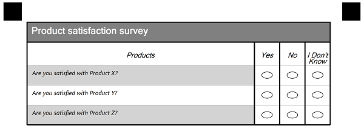

## **Introduction**
Template generation markup supports several types of elements, and most of them have a number of options that define it's properties and appearance. This allows creating functional and nice-looking custom templates for any of your needs i.e. surveys, answer sheets, tests - anything you need.

In this article, we provide a detailed description of each element and its attributes with the usage examples represented in json markup.

## **Text element**
The text element allows us to add text lines to the template. Identified by field **"type"** and it's value **"text"**.

### **Attributes**
Text element can be customized with attributes.

|**Attribute**|**Attribute Description**|**Required/Optional**|**Attribute Default Value**|**Attribute Usage Example**|
| :- | :- | :- | :- | :- |
|type|Type of JSON object| Required|-| "type":"text"
|name|String representation of text| Required|-|"name":"Please fill survey bellow"
|font_family|The font family of the text|Optional|Segoe UI|"font_family":"arial"|
|font_style|The style of the content|Optional|FontStyle.Regular|"font_style":"bold"|
|font_size|The size of the text content|Optional|12|"font_size":16|
|align|Text alignment, indicating where text should be drawn on page|Optional|left|"align":"center"

### **Examples**
**Markup**

```json
{
	"type" : "template",
	"children" : [{
		"type":"page",
		"children": [
		{
			"name": "Header text",
			"type": "text",
			"font_style" : "bold",
			"font_size": 16,
			"align" : "center"
		},
		{
			"type": "emptyLine",
		},
		{
			"type": "text",
			"name" : "right column text",
			"font_style": "italic",
			"align": "right",
		},
		{
			"type": "text",
			"name" : "second line of column text",
			"font_style" : "italic",
			"align": "right",
		}]
	}]
}
````

**Result**

****
## **Answer Sheet element**
AnswerSheet allows adding choice boxes grouped in columns and rows. Use the answer sheet if you want to fit a lot of questions on a page since they are located close to each other.
### **Attributes**
This element can be customized with attributes.

|**Attribute**|**Attribute Description**|**Required/Optional**|**Attribute Default Value**|**Attribute usage example**|
| :- | :- | :- | :- | :- |
|type| Type of JSON object| Required|-|"type":"answersheet"
|name| Name of the sheet, i.e. the prefix of each question in the sheet|Required|-|"name":"Geography"
|elements_count|Determines the total number of questions in the answer sheet.|Required|0|"elements_count":100|
|columns_count|Sets the number of columns to be drawn.|Optional|4|"columns_count":4|
|answers_count|The number of answer options for each question in the answer sheet.|Optional|4|"answers_count":5|
|start_id|<p>The starting number of suffix in the title of each question.</p><p>If set questions in the answer sheet will be named starting with this number.</p><p>If not set numeration will take any added questions on the page into account, so that questions in the answer sheet will continue the numeration.</p>|Optional|-|<p>"start_id":1</p><p>"start_id":51</p>|
|<p>vertical_margin</p>| Vertical margin of answersheet. Set in pixels.|Optional|0|"vertical_margin":200
|bubble_size|The size of a bubble|Optional|Normal|"bubble_size":small
|answers_list|Represent each symbol inside of the bubble.|Optional|-|"answers_list":"(A)(B)(C)(D)"
|column|In multi-column template indicates in which column to draw sheet|Optional|-|"column":2
### **Examples**
**Markup**

````json
{	
  "type": "Template",
  "children": [
    {
      "type": "Page",
      "children": [
        {
          "name": "Questions",
          "elements_count": 60,
          "columns_count": 3,
          "answers_count": 5,
          "start_id": 51,
          "type": "AnswerSheet"
        }
      ]
    }
  ]
}
````

**Result**


**Markup**

	
````json
{
  "type": "Template",
  "children": [
    {
      "type": "Page",
      "children": [
        {
          "name": "Questions",
          "elements_count": 40,
          "answers_list": ["1","2","3","4","5"],
          "type": "AnswerSheet"
        }
      ]
    }
  ]
}
````

**Result**


## **Choice box element**
Choice box (or, simply put, question) is a basic element that represents a single question with a set amount of answers.

The answer options start with parentheses with an answer name or a letter inside (e.g. <**(A)**>) proceeded with the answer text. Question text and answer options can be placed on several lines (see examples).

|**Attribute**|**Attribute Description**|**Required/Optional**|**Attribute Default Value**|**Attribute usage example**|
| :- | :- | :- | :- | :- |
|type|Type of JSON object| Required|-| "type":"choicebox"
|question_text|String representation of question text|Required|-|"question_text":"How would you rate the quality of the product?"
|answers_string| String representation of answer array|Required|-|"answers_string":"() Very high quality () High quality"
|name| Name of choice box|Optional|-|"name":"Product questionnaire"
|font_family|The font family of the text|Optional|Segoe UI|"font_family":"arial"|
|font_style|The style of the content|Optional|FontStyle.Regular|"font_style":"bold"|
|font_size|The size of the text content|Optional|12|"font_size":16|
|align|Text alignment, indicating where text should be drawn on page|Optional|left|"align":"center"

### **Examples**
**Markup**

<details>
<summary>Click to expand json template</summary>

````json
{
  "type": "Template",
  "children": [
    {
      "type": "Page",
      "children": [
        {
          "font_family": "Segoe UI",
          "font_style": "Regular",
          "font_size": 12,
          "align": "Left",
          "answers_string": "(() Yes, indeed! () No",
          "question_text": "Can Aspose.OMR process not only scans, but also photos?\r\n",
          "type": "ChoiceBox"
        },
        {
          "font_family": "Segoe UI",
          "font_style": "Regular",
          "font_size": 12,
          "align": "Left",
          "answers_string": "((Yes) Yes, indeed! (No) No",
          "question_text": "Aspose.OMR works with any kind of OMR forms: tests, exams, questionnaires, surveys, etc.\r\n",
          "type": "ChoiceBox"
        },
        {
          "font_family": "Segoe UI",
          "font_style": "Regular",
          "font_size": 12,
          "align": "Left",
          "answers_string": "(() Very high quality () High quality\r\n() Average quality () Low quality",
          "question_text": "How would you rate the quality of the product:\r\n",
          "type": "ChoiceBox"
        },
        {
          "font_family": "Segoe UI",
          "font_style": "Regular",
          "font_size": 12,
          "align": "Left",
          "answers_string": "(1) (2) (3) (4) (5) (6) (7) (8) (9)",
          "question_text": "How likely is it that you would recommend our company to a friend or colleague?\r\n",
          "type": "ChoiceBox"
        },
      ]
    }
  ]
}
````

</details>

**Result**


## **Grid element**
Grid is a matrix consisting of several similar sections, and for each section there is a list of several options. Grid is best used for fields like ID, phone number, and similar. Another way to think about Grid is a set of identical choice boxes, the result of which is grouped into a single value.
### **Attributes**
Grid element can be customized with attributes.

|**Attribute**|**Attribute Description**|**Required/Optional**|**Attribute Default Value**|**Attribute Usage Example**|
| :- | :- | :- | :- | :- |
|type|Type of JSON object| Required|-| "type":"grid"
|name| Name of choice box|Optional|-|"name":"Algebra"
|options_count|<p>The number of choices for each section in the grid.</p><p>For example, in ID grid options determine possible values for each symbol (e.g. each ID symbol can be in 0-9 range)</p>|Optional|10|"options_count":8|
|align|The horizontal alignment of the grid element on the page.|Optional|left|<p>"align":"left"</p><p>"align":"center"</p><p>"align":"right"</p>|
|header_type|Indicates what type of element to draw at the start of the grid|Optional|underline|"header_type":"square"
|header_border_size|Size of border line in pixels|Optional|3|"header_border_size":3
|header_border_color|Color of border line|Optional|black|"header_border_color":"red"
|orientation|Grid orientation: horizontal or vertical. Determines the position of child choice boxes inside the grid.|Optional|horizontal|<p>"orientation":"horizontal"</p><p>"orientation":"vertical"</p>|
|vertical_margin|Margin between lines|Optional|0|"vertical_margin":20
|bubble_size|Size of bubbles|Optional|normal|<p>"bubble_size":"extrasmall"</p><p>"bubble_size":"small"</p><p>"bubble_size":"normal"</p><p>"bubble_size":"large"</p><p>"bubble_size":"extralarge"</p>||x/y|<p>Sets the X and Y position in absolute coordinates. Allows to position grid element in any place on the page, or position several grids in one line. It overrides the align attribute. </p><p>You can provide both X and Y values, or specify only one (only X or only Y).</p>|Optional|-|<p>X:500</p><p>Y:350</p>|
|column|In multi-column template indicates in which column to draw sheet|Optional|-|"column":2
### **Examples**
**Markup**


```json
{
  "type": "Template",
  "children": [
    {      
      "type": "Page",
      "children": [
        {
          "name": "ID1",
          "sections_count": 6,
          "options_count": 6,
          "x": 200,
          "y": 200,
          "type": "Grid"
        },
        {
          "type": "EmptyLine"
        },
        {
          "name": "ID2",
          "sections_count": 6,
          "options_count": 6,
          "x": 1200,
          "y": 200,
          "type": "Grid"
        }
      ]
    }
  ],
}
````

**Result**


**Markup**


````json
{
  "type": "Template",
  "children": [
    {      
      "type": "Page",
      "children": [
        {
          "name": "ID1",
          "sections_count": 5,
          "options_count": 6,
		  "align":"left",
          "type": "Grid"
        },
        {
          "type": "EmptyLine"
        },
        {
          "name": "ID2",
          "sections_count": 5,
          "options_count": 6,
		  "align":"center",
		  "underlines": false,
          "type": "Grid"
        }
      ]
    }
  ],
}
````

**Result**


## **Image element**
Image element allows adding image files on the page, e.g. logos, instructions blocks, or any other type of image. Please pay attention to the size of the image you want to add so that it fits properly in the desired position and doesn't take too much space. The path to the images is provided in Generation method parameters.
### **Attributes**
The image element can be customized with attributes.

|**Attribute**|**Attribute Description**|**Required/Optional**|**Attribute Default Value**|**Attribute Usage Example**|
| :-: | :-: | :- | :- | :- |
|type| Type of JSON object|Required|-|"type":"image"
|name|Name of picture file|Required|-|"name":"logo.png"
|align|The horizontal alignment of the image element on the page.|Optional|Center|<p>"align":"left"</p><p>"align":"center"</p><p>"align":"right"</p>|
|x/y|<p>Sets the X and Y position in absolute coordinates. Allows to position image element in any place on the page, or position several images in one line. It overrides the align attribute. </p><p>You can provide both X and Y values in pixels, or specify only one (only X or only Y).</p>|Optional|-|<p>"X":500</p><p>"Y":350</p>|
|height|Height of the image in pixels|Optional|-|"height":200
|width|Width of the image in pixels|Optional|-|"width":200
### **Examples**
**Result**


```json
{
  "type": "Template",
  "children": [
    {
      "type": "Page",
      "children": [
        {
          "align": "right",
          "name": "logo.png",
          "type": "Image"
        }
      ],
    }
  ]
}
````

Result


## **Barcode element**
The template generation supports adding barcodes and QR-codes on the page and provides support for lots of barcode types. You can encode a link, ID, or any other value using barcode and position it exactly where you want to use attributes. Aspose.OMR for .NET supports barcode generation and recognition, so any information you decide to encode will be successfully decoded.
### **Attributes**
Barcode element can be customized with attributes.

|**Attribute**|**Attribute Description**|**Required/Optional**|**Attribute Default Value**|**Attribute Usage Example**|
| :- | :- | :- | :- | :- |
|type| Type of JSON object|Required|-|"type":"barcode"
|name|Name of barcode|Required|-|"name":"student id"
|value|The value that barcode encodes|Required|-|"value":"100"|
|barcode_type|The type of barcode to draw|Optional|QR|<p>"barcode_type":"code39standard"</p><p>"barcode_type":"QR"</p><p>"barcode_type":"EAN8"</p>|
|qr_version|The QR version of QR code. Used only for QR codes.|Optional|Auto|"qr_version":"40"|
|align|The horizontal alignment of the barcode element on the page.|Optional|Center|<p>"align":"left"</p><p>"align":"center"</p><p>"align":"right"</p>|
|height|The target height of the barcode image. If the height is not set, the barcode size is determined automatically. If you would like to make the barcode image bigger or smaller, use this attribute.|Optional|Auto|"height":300|
|codetext|Indicates whether to draw barcode codetext (encoded text below barcode image)|Optional|False|<p>"codetext":true</p><p>"codetext":false</p>|
|x/y|<p>Sets the X and Y position in absolute pixel coordinates. Allows to position barcode element in any place on the page, or position several barcodes in one line. Overrides align attribute. </p><p>You can provide both X and Y values, or specify only one (only X or only Y).</p><p>Please note that paper size is standard A4 (2480x3508).</p>|Optional|-|<p>"X":250</p><p>"Y":1500</p>|
### **Examples**
**Markup**


````json
{
  "type": "Template",
  "children": [
    {
      "type": "Page",
      "children": [
        {
          "name": "Test1",
          "value": "AlignLeft",
          "height": 300,
          "codetext": true,
          "type": "Barcode"
        },
        {
          "type": "EmptyLine"
        },
        {
          "name": "Test2",
          "value": "LinedUp",
          "height": 300,
          "codetext": true,
          "X": 2000,
          "Y": 200,
          "type": "Barcode"
        }
      ]
    }
  ]
}
````

**Result**


` `**Markup**


````json
{
  "type": "Template",
  "children": [
    {
      "type": "Page",
      "children": [
        {
          "name": "Test1",
          "value": "code39StandardTest",
          "barcode_type": "code39standard",
          "height": 150,
          "type": "Barcode"
        },
        {
          "name": "Test2",
          "value": "QR",
          "barcode_type": "qr",
          "qr_version": "Auto",
          "align": "left",
          "height": 300,
          "codetext": true,
          "type": "Barcode"
        },
        {
          "name": "Test3",
          "value": "Pdf417",
          "barcode_type": "pdf417",
          "height": 300,
          "codetext": true,
          "type": "Barcode"
        }
      ]
    }
  ]
}
````

**Result**


## **Container element**
Grouping element. Container is not displayed and is intended for breaking the template into columns. 
Children inside Container are aligned according to the child column attribute, but cannot exceed Container columns_count.

### **Attributes**
Container element can be customized with attributes.

|**Attribute**|**Attribute Description**|**Required/Optional**|**Attribute Default Value**|**Attribute Usage Example**|
| :- | :- | :- | :- | :- |
|type| Type of JSON object|Required|-|"type":"container"
|name|Name of container|Optional|-|"name":"Main elements"
|children|Array of other elements nested in this container|Required|-|see examples below
|columns_count|Amount of columns in a container|Required|1|"columns_count":3|
|container_type|Type of Container element|Optional|normal|container_type:footer|

### **Examples**


```json
{
  "type": "Template",
  "children": [
    {
      "type": "Page",
      "children": [
        {
          "name": "1-st",
          "children": [],
          "columns_count": 1,
          "type": "Container"
        }
      ],
    }
  ]
}
```

If you want to create a **footer** in your template you must specify the footer attribute **"type":"footer"** for your container

### **Examples**
<details>
<summary>Click to expand code</summary>


````json
{

    "type": "Template",
    "children": [{
            "type": "Page",
            "children": [{
                    "name": "Test4",
                    "value": "Aspose Pty Ltd",
                    "height": 250,
                    "codetext": true,
                    "X": 2100,
                    "Y": 3030,
                    "type": "Barcode"
                }, {
                    "name": "Footer",
                    "children": [{
                            "name": "1",
                            "children": [{
                                    "name": "1",
                                    "children": [{
                                            "name": "Precinct Aspose Style 1",
                                            "font_style": "Bold",
                                            "font_size": 14,
                                            "type": "Content"
                                        }, {
                                            "name": "� Aspose Pty Ltd 2001-2021",
                                            "font_style": "Regular",
                                            "font_size": 10,
                                            "type": "Content"
                                        }
                                    ],
                                    "paragraph_type": "Normal",
                                    "type": "Paragraph"
                                }
                            ],
                            "column": 1,
                            "border": "None",
                            "border_size": 3,
                            "border_color": "Black",
                            "type": "Block"
                        }, {
                            "column": 2,
                            "border": "None",
                            "border_size": 3,
                            "border_color": "Black",
                            "type": "Block",
                            "name": "2",
                            "children": [{
                                    "name": "2",
                                    "paragraph_type": "Normal",
                                    "type": "Paragraph",
                                    "children": [{
                                            "name": "All Rights Reserved",
                                            "font_style": "Regular",
                                            "font_size": 10,
                                            "type": "Content"
                                        }
                                    ]
                                }
                            ],

                        }, {
                            "name": "3",
                            "children": [{
                                    "name": "3",
                                    "children": [{
                                            "name": "Page 1",
                                            "font_style": "Bold",
                                            "font_size": 14,
                                            "type": "Content"
                                        }, {
                                            "name": "June 26, 2021",
                                            "font_style": "Regular",
                                            "font_size": 10,
                                            "type": "Content"
                                        }
                                    ],
                                    "paragraph_type": "Normal",
                                    "type": "Paragraph"
                                }
                            ],
                            "column": 3,
                            "border": "None",
                            "border_size": 3,
                            "border_color": "Black",
                            "type": "Block"
                        }
                    ],
                    "columns_count": 3,
                    "container_type": "Footer",
                    "type": "Container"
                }
            ]
        }
    ]
}

````

</details>
**Result**

****

## **Block element**
Grouping element. Block can be displayed if it has a **"border":"square"** attribute and is designed to group multiple elements in one column. Can be placed inside Container element

### **Attributes**
Block element can be customized with attributes.

|**Attribute**|**Attribute Description**|**Required/Optional**|**Attribute Default Value**|**Attribute Usage Example**|
| :- | :- | :- | :- | :- |
|type| Type of JSON object|Required|-|"type":"block"
|name|Name of block|Optional|-|"name":"header group"
|children|Array of other elements nested in this block|Required|-|see examples below
|column|Indicates which column of the container will be in|Required|1|"column":1|
|border|Border type of Container element|Optional|normal|-|
|border_size|The size of the border|Optional|3|-|
|border_color|Color of the border|Optional|Black|-|

### **Examples**

````json
{
  "type": "Template",
  "children": [
    {
      "type": "Page",
      "children": [
        {
          "type": "Block",
          "name": "1-st",
          "column": 2
        }
      ]
    }
  ]
}
````

## **Content element**
Special text element. Must be in the inside of the block element.

### **Attributes**
Content element can be customized with attributes.

**Attribute**|**Attribute Description**|**Required/Optional**|**Attribute Default Value**|**Attribute Usage Example**|
| :- | :- | :- | :- | :- |
|type| Type of JSON object|Required|-|"type":"content"
|name| String value of content|Required|-|"name":"Thank you for purchasing!"
|font_family|The font family of the content|Optional|Segoe UI|"font_family":"Arial"|
|font_style|The style of the content|Optional|FontStyle.Regular|"font_style":"Bold"|
|font_size|The size of the text content|Optional|12|"font_size":16|

### **Examples**

````json
{
  "type": "Template",
  "children": [
    {
      "type": "Page",
      "children": [
        {
          "name": "1-st",
          "children": [
            {
              "name": "1-st",
              "children": [
                {
                  "name": "Aspose.OMR for .NET provides a simple Application Programming Interface (API) that is easy to learn and use.",
                  "font_family": "Arial",
                  "font_style": "Bold",
                  "font_size": 16,
                  "type": "Content"
                }
              ],
              "column": 1,
              "type": "Block"
            }
          ],
          "columns_count": 2,
          "container_type": "Normal",
          "type": "Container"
        }
      ]
    }
  ]
}
````

**Result**

****

## **Paragraph element**
Grouping element. A paragraph can consist of both text and text with an image. The image is specified by coordinates x, y. 

### **Attributes**
Paragraph element can be customized with attributes.

|**Attribute**|**Attribute Description**|**Required/Optional**|**Attribute Default Value**|**Attribute Usage Example**|
| :- | :- | :- | :- | :- |
|type| Type of JSON object|Required|-|"type":"paragraph"
|name|Name of paragraph|Optional|-|"name":"Pic and title"
|children|Array of other elements nested in this paragraph|Required|-|see examples below
paragraph_type|Type of Paragraph|Optional|ParagraphTypeEnum.normal|paragraph_type:multiple|

### **Examples**

<details>


<summary>Click to expand code</summary>

````json
{
  "type": "Template",
  "children": [
    {
      "type": "Page",
      "children": [
        {
          "name": "1-st",
          "children": [
            {
              "name": "1-st",
              "children": [
                {
                  "name": "1-st",
                  "children": [
                    {
                      "align": "Center",
                      "name": "logo.png",
                      "x": 680,
                      "y": 280,
                      "height": 175,
                      "width": 200,
                      "type": "Image"
                    },
                    {
                      "name": "Aspose.OMR for .NET",
                      "font_family": "Arial",
                      "font_style": "Bold",
                      "font_size": 16,
                      "type": "Content"
                    },
                    {
                      "name": "provides a simple Application Programming Interface (API) that is easy to learn and use.",
                      "font_family": "Segoe UI",
                      "font_style": "Italic",
                      "font_size": 13,
                      "type": "Content"
                    }
                  ],
                  "paragraph_type": "Multiple",
                  "type": "Paragraph"
                },
                {
                  "name": "2nd",
                  "children": [
                    {
                      "name": "Aspose.OMR for .NET",
                      "font_family": "Arial",
                      "font_style": "Bold",
                      "font_size": 16,
                      "type": "Content"
                    },
                    {
                      "name": "provides a simple Application Programming Interface (API) that is easy to learn and use.",
                      "font_family": "Segoe UI",
                      "font_style": "Italic",
                      "font_size": 13,
                      "type": "Content"
                    }
                  ],
                  "paragraph_type": "Normal",
                  "type": "Paragraph"
                }
              ],
              "column": 1,
              "border": "None",
              "border_size": 3,
              "border_color": "Black",
              "type": "Block"
            }
          ],
          "columns_count": 3,
          "container_type": "Normal",
        }
      ]
    }
  ]
}
````

</details>

**Result**

****

## **VerticalChoiceBox element**
The VerticalChoiceBox consists of a Answer element that contains a short response and Content elements that describe the response option in detail. It can also contain a WriteIn element in which the user can enter his own answer.
Each of these elements must be in the children array.

### **Attributes**
VerticalChoiceBox element can be customized with attributes.

|**Attribute**|**Attribute Description**|**Required/Optional**|**Attribute Default Value**|**Attribute Usage Example**|
| :- | :- | :- | :- | :- |
|type| Type of JSON object|Required|-|"type":"verticalChoiceBox"
|name|Name of block|Optional|-|"name":"Pic and title"
|children|Array of other elements nested in this VerticalChoiceBox|Required|-|see examples below

### **Examples**

<details>
<summary>Click to expand code</summary>


````json
{
  "type": "Template",
  "children": [
    {
      "type": "Page",
      "children": [
        {
          "name": "1-st",
          "children": [
            {
              "name": "Rate",
              "children": [
                {
                  "name": "Rate",
                  "children": [
                    {
                      "name": "Aspose Pty Ltd",
                      "font_family": "Segoe UI",
                      "font_style": "Bold",
                      "font_size": 8,
                      "type": "Content"
                    },
                    {
                      "name": "How would you rate the quality of the product?",
                      "font_family": "Segoe UI",
                      "font_style": "Bold",
                      "font_size": 12,
                      "type": "Content"
                    },
                    {
                      "name": "Choose 1",
                      "font_family": "Segoe UI",
                      "font_style": "Regular",
                      "font_size": 9,
                      "type": "Content"
                    }
                  ],
                  "paragraph_type": "Normal",
                  "type": "Paragraph"
                },
                {
                  "name": "How would you rate the quality of the product:",
                  "children": [
                    {
                      "name": "5",
                      "children": [
                        {
                          "name": "Very high quality",
                          "font_family": "Segoe UI",
                          "font_style": "Bold",
                          "font_size": 10,
                          "type": "Content"
                        },
                        {
                          "name": "of the product",
                          "font_family": "Segoe UI",
                          "font_style": "Regular",
                          "font_size": 10,
                          "type": "Content"
                        }
                      ],
                      "type": "Answer"
                    },
                    {
                      "name": "4",
                      "children": [
                        {
                          "name": "High quality",
                          "font_family": "Segoe UI",
                          "font_style": "Bold",
                          "font_size": 10,
                          "type": "Content"
                        },
                        {
                          "name": "of the product",
                          "font_family": "Segoe UI",
                          "font_style": "Regular",
                          "font_size": 10,
                          "type": "Content"
                        }
                      ],
                      "type": "Answer"
                    },
                    {
                      "name": "3",
                      "children": [
                        {
                          "name": "Average quality",
                          "font_family": "Segoe UI",
                          "font_style": "Bold",
                          "font_size": 10,
                          "type": "Content"
                        },
                        {
                          "name": "of the product",
                          "font_family": "Segoe UI",
                          "font_style": "Regular",
                          "font_size": 10,
                          "type": "Content"
                        }
                      ],
                      "type": "Answer"
                    }
                  ],
                  "type": "VerticalChoiceBox"
                }
              ],
              "column": 2,
              "border": "Square",
              "border_size": 5,
              "border_color": "Black",
              "type": "Block"
            }
          ],
          "columns_count": 3,
          "container_type": "Normal",
          "type": "Container"
        }
      ]
    }
  ]
}
````

</details>

## **Answer element**
Used as a child in VerticalChoiceBox. Can have children. Usually a Content element.

### **Attributes**

|**Attribute**|**Attribute Description**|**Required/Optional**|**Attribute Default Value**|**Attribute Usage Example**|
| :- | :- | :- | :- | :- |
|type| Type of JSON object|Required|-|"type":"answer"
|children| array of nested elements|Required|-|see examples above

**Result**

****

## **WriteIn element**
The WriteIn element is a field in which the user can enter some data and, if necessary, receive it in the form of a picture. If the WriteIn element is part of the VerticalChoiceBox element, its result is preserved if the user fills the bubble associated with it.

### **Attributes**
WriteIn element can be customized with attributes.

|**Attribute**|**Attribute Description**|**Required/Optional**|**Attribute Default Value**|**Attribute Usage Example**|
| :- | :- | :- | :- | :- |
|type| Type of JSON object|Required|-|"type":"writein"
|required|Is clipping of write-in field required|Optional|false|"required":true|

### **Examples**

````json
{
  "type": "template",
  "children": [
    {
      "type": "page",
      "children": [
        {
          "name": "1-st",
          "children": [
            {
              "name": "Process",
              "children": [
                {
                  "name": "Process",
                  "required": true,
                  "type": "writeIn"
                }
              ],
              "column": 1,
            }
          ],
          "columns_count": 3,
          "type": "container"
        }
      ]
    }
  ]
}
````

**Result**

****

**Saved result**

****

## **EmptyLine element**
Placing an EmptyLine element between two others can be used to create empty space between them.
Size of margin is calculated as one line of text using default or GlobalPageSettings font and size.
Or you can specify it in pixels with "height" property

### **Attributes**
WriteIn element can be customized with attributes, each attribute must be on a new line starting with **\t** (tabulation) symbol.

|**Attribute**|**Attribute Description**|**Required/Optional**|**Attribute Default Value**|**Attribute Usage Example**|
| :- | :- | :- | :- | :- |
|type| Type of JSON object|Required|-|"type":"emptyLine"
|height|Vertical margin in pixels that will be used to occupy space with this invisible element|Optional|height of 1 line with default text|"height":300|

### Example

```json
		{
			"name": "Header text",
			"type": "text",
			"font_style" : "bold",
			"font_size": 16,
			"align" : "center"
		},
		{
			"type": "emptyLine",
			"height": 82
		},
		{
			"type": "text",
			"name" : "right column text",
			"font_style": "italic",
			"align": "right",
		},
		{
			"type": "text",
			"name" : "second line of column text",
			"font_style" : "italic",
			"align": "right",
		}
```

****

## **Table element**
Can be used for questionnaires with a set amount of answers.  Grouping element. Supports TableHeader, TableTitle and Question elements as children.
Best used for drawing table structure with rows and columns. Columns described in TableHeader element. Question element represent rows.
TableTitle used when you need an extra row above the table.

### **Attributes**
Table element can be customized with attributes.

|**Attribute**|**Attribute Description**|**Required/Optional**|**Attribute Default Value**|**Attribute Usage Example**|
| :- | :- | :- | :- | :- |
|type| type of JSON object|Required|-|"type":"table"
|name| Name of the table. Does not displayed|Optional|-|"name":"Survey"
|answers_count|Number of answers(columns) used in table|Required|-|"answers_count":5|
|table_type|Type of table element. Can be striped or normal|Optional|normal|"table_type":"striped"
|children|Child elements which represent table content|Required|-|see examples below

## **TableTitle element**
Represent additional header in table with one column - title.
Text value of this element displayed above the header as the first row.
Good for marking table names.

### **Attributes**
TableTitle element can be customized with attributes.

|**Attribute**|**Attribute Description**|**Required/Optional**|**Attribute Default Value**|**Attribute Usage Example**|
| :- | :- | :- | :- | :- |
|type|type of JSON object|Required|-|"type":"tableTitle"
|name|Title text|Optional|-|"name":"Quality assurance"
|font_family|The font family of the text|Optional|Segoe UI|"font_family":"arial"|
|font_style|The style of the content|Optional|FontStyle.Regular|"font_style":"bold"|
|font_size|The size of the text content|Optional|12|"font_size":"16"|
|color|Color of the text|Optional|Black|"color":"red"
|background_color|Color of background layer|Optional|-|"background_color":"gray"
|border|Border type of title element|Optional|normal|"border":"rounded"|
|border_size|The size of the border|Optional|3|"border_size":3|
|border_color|Color of the border|Optional|Black|"border_color":"red"|

## **TableHeader element**
Grouping element. Represent columns of the table and content inside them.
Each of the columns(TableAnswer) nested inside of the children property.
**Amount of TableAnswers inside must be equal to answers_count property of Table element**

### **Attributes**
TableHeader element can be customized with attributes.

|**Attribute**|**Attribute Description**|**Required/Optional**|**Attribute Default Value**|**Attribute Usage Example**|
| :- | :- | :- | :- | :- |
|type|type of JSON object|Required|-|"type":"tableHeader"
|name|Name of table header. Does not displayed.|Optional|-|"name":"First row"
|font_family|The font family of the text|Optional|Segoe UI|"font_family":"arial"|
|font_style|The style of the content|Optional|FontStyle.Regular|"font_style":"bold"|
|font_size|The size of the text content|Optional|12|"font_size":16|
|children|Child elements which represent table content|Required|-|see examples below

## **TableAnswer element**
Can only be positioned inside of the TableHeader element as a child.
Represent answer that can be used for multiple questions. Can only describe one column and text inside of it. 
For multiple columns - use multiple TableAnswer elements

### **Attributes**
|**Attribute**|**Attribute Description**|**Required/Optional**|**Attribute Default Value**|**Attribute Usage Example**|
| :- | :- | :- | :- | :- |
|name|String representation of answer|Required|-|"name":"High quality"
|type|type of JSON object|Required|-|"type":"tableAnswer"

## **Question element**
Can only be positioned inside of the Table element as a child.
Represent question with multiple answers. Value of this element placed in the first column of the table for each row(Question) element.

### **Attributes**
|**Attribute**|**Attribute Description**|**Required/Optional**|**Attribute Default Value**|**Attribute Usage Example**|
| :- | :- | :- | :- | :- |
|name|String representation of question|Required|-|"name":"How do you assess quality of this product?"
|type|type of JSON object|Required|-|"type":"question"

### **Example of table structure**
```json
{
    "children": [{
            "children": [{
                    "name": "1",
                    "children": [{
                            "name": "1",
                            "children": [{
                                    "name": "Survey",
                                    "children": [{
                                            "font_family": "Italic",
                                            "font_style": "Bold",
                                            "font_size": 16,
                                            "color": "White",
                                            "background_color": "Gray",
                                            "border": "Square",
                                            "border_size": 8,
                                            "border_color": "Black",
                                            "name": "Product satisfaction survey",
                                            "type": "TableTitle"
                                        }, {
                                            "font_family": "Italic",
                                            "font_style": "Regular",
                                            "font_size": 12,
                                            "name": "1",
                                            "children": [{
                                                    "name": "Products",
                                                    "font_family": "Segoe UI",
                                                    "font_style": "Regular",
                                                    "font_size": 12,
                                                    "type": "Content"
                                                }, {
                                                    "name": "Yes",
                                                    "type": "TableAnswer"
                                                }, {
                                                    "name": "No",
                                                    "type": "TableAnswer"
                                                }, {
                                                    "name": "I Don't Know",
                                                    "type": "TableAnswer"
                                                }
                                            ],
                                            "type": "TableHeader"
                                        }, {
                                            "name": "Are you satisfied with Product X?",
                                            "type": "Question"
                                        }, {
                                            "name": "Are you satisfied with Product Y?",
                                            "type": "Question"
                                        }, {
                                            "name": "Are you satisfied with Product Z?",
                                            "type": "Question"
                                        }
                                    ],
                                    "answers_count": 3,
                                    "table_type": "Striped",
                                    "type": "Table"
                                }
                            ],
                            "column": 1,
                            "border": "None",
                            "border_size": 3,
                            "border_color": "Black",
                            "type": "Block"
                        }
                    ],
                    "container_type": "Normal",
                    "type": "Container"
                }
            ],
            "type": "Page"
        }
    ],
    "type": "Template"
}

````

**Result**

****