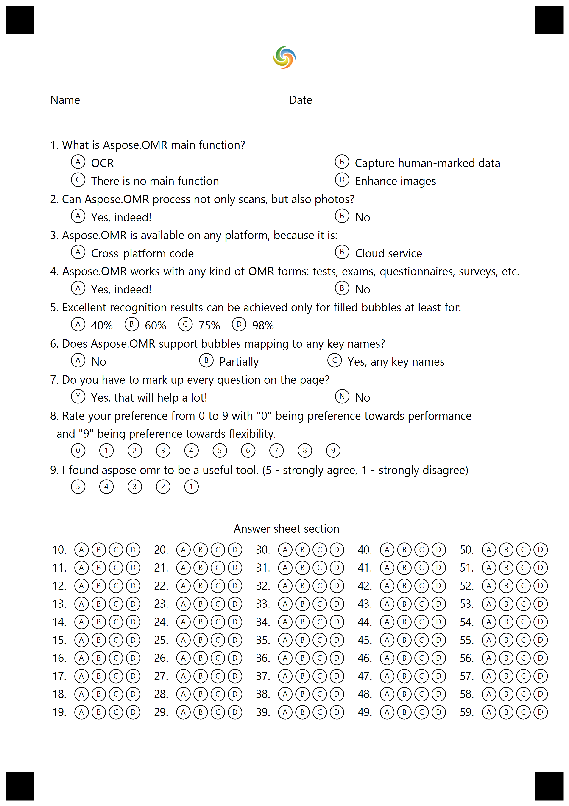

## **Create OMR Templates with images**
To add the image, add the following to the json markup with the name of the image

````json
{
  "children": [
    {
      "children": [
        {		
			"align": "Center",
			"name": "Aspose.jpg",
			"element_type": "Image"
		}
      ],
      "element_type": "Page"
    }
  ],
  "element_type": "Template"
}
````

The following is the complete json markup that is used in the example code snippet to generate the OMR template file.

````json
{
  "children": [
    {
      "children": [
        {
          "align": "Center",
          "name": "Aspose.jpg",
          "element_type": "Image"
        },
        {
          "element_type": "EmptyLine"
        },
        {
          "bubble_size": "Normal",
          "name": "ID",
          "sections_count": 8,
          "options_count": 10,
          "element_type": "Grid"
        },
        {
          "name": null,
          "height": 0.0,
          "element_type": "EmptyLine"
        },
        {
          "answers_string": "\t() OCR\t() Capture human-marked data\r\n\t() There is no main function\t() Enhance images\r\n",
          "question_text": "What is Aspose.OMR main function?\r\n",
          "element_type": "ChoiceBox"
        },
        {
          "answers_string": "\t() Yes, indeed!\t() No\r\n",
          "question_text": "Can Aspose.OMR process not only scans, but also photos?\r\n",
          "element_type": "ChoiceBox"
        },
        {
          "answers_string": "\t() Cross-platform code\t() Cloud service\r\n",
          "question_text": "Aspose.OMR is available on any platform, because it is:\r\n",
          "element_type": "ChoiceBox"
        },
        {
          "answers_string": "\t() Yes, indeed!\t() No\r\n",
          "question_text": "Aspose.OMR works with any kind of OMR forms: tests, exams, questionnaires, surveys, etc.\r\n",
          "element_type": "ChoiceBox"
        },
        {
          "answers_string": "\t() 40%\t() 60%\t() 75%\t() 98%\r\n",
          "question_text": "Excellent recognition results can be achieved only for filled bubbles at least for:\r\n",
          "element_type": "ChoiceBox"
        },
        {
          "answers_string": "\t() No\t() Partially\t() Yes, any key names\r\n",
          "question_text": "Does Aspose.OMR support bubbles mapping to any key names?\r\n",
          "element_type": "ChoiceBox"
        },
        {
          "answers_string": "\t(Yes) Yes, that will help a lot! (No) No\r\n",
          "question_text": "Do you have to mark up every question on the page?\r\n",
          "element_type": "ChoiceBox"
        },
        {
          "answers_string": "\t(0) (1) (2) (3) (4) (5) (6) (7) (8) (9)\r\n",
          "question_text": "Rate your preference from 0 to 9 with \"0\" being preference towards performance \r\n and \"9\" being preference towards flexibility.\r\n",
          "element_type": "ChoiceBox"
        },
        {
          "answers_string": "\t(5) (4) (3) (2) (1)\r\n",
          "question_text": "I found aspose omr to be a useful tool. (5 - strongly agree, 1 - strongly disagree)\r\n",
          "element_type": "ChoiceBox"
        },
        {
          "element_type": "EmptyLine"
        },
        {
          "name": "Answer sheet section\r\n",
          "element_type": "Text"
        },
        {
          "element_type": "EmptyLine"
        },
        {
          "name": "MainQuestions",
          "elements_count": 10,
          "columns_count": 5,
          "element_type": "AnswerSheet"
        },
        {
          "element_type": "EmptyLine"
        },
        {
          "name": "Sign________________________________\r\n",
          "element_type": "Text"
        }
      ],
      "element_type": "Page"
    }
  ],
  "element_type": "Template"
}
````


The following code snippet processes the sample text markup to generate the OMR template file.



The following is the image generated by the sample code.

