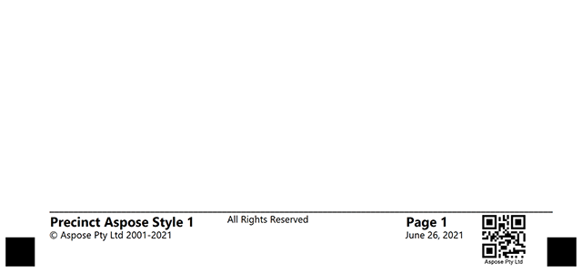
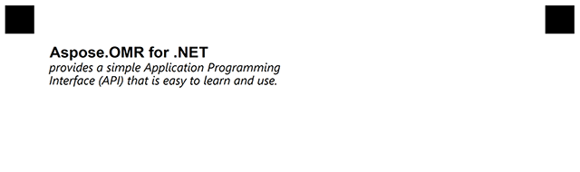
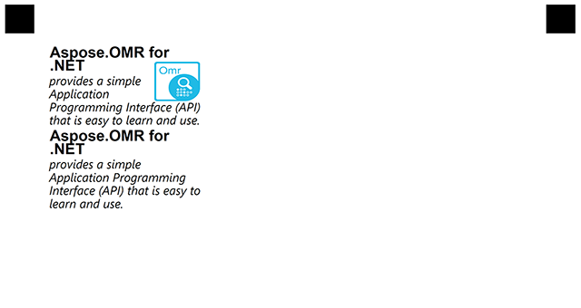
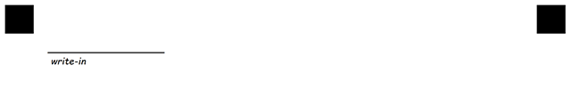
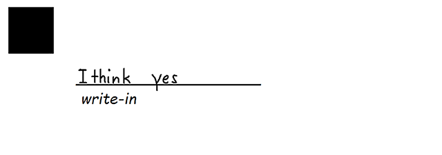
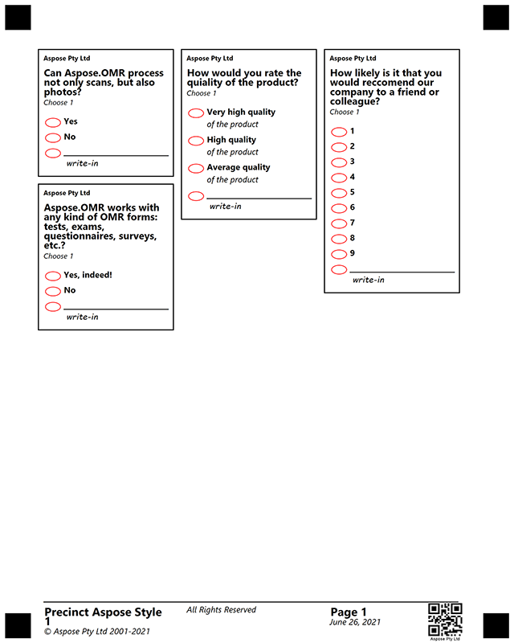

## **Introduction**
Template generation markup supports several types of elements, and most elements have a number of options that define the element' properties and appearance.This allows creating functional and nice-looking custom templates for any of your needs i.e. surveys, answer sheets, tests - anything you need.

In this article, we provide a detailed description of the elements and their attributes with examples of creating a multi-column questionnaire.

{} 

It is important to note that each attribute is parsed successfully only if it starts with a **tabulation** symbol, not just spaces. If you notice strange behavior or errors, the first thing to check will be that all additional attributes in markup start with **\t**.

{} 

## **Container element**
Starts with **?container=** prefix that sets the name of the element. Container is not displayed and is intended for breaking the template into columns. Ends with a **&container** prefix indicating the end of the element's bounds.

### **Attributes**
Container element can be customized with attributes, each attribute must be on a new line starting with **\t** (tabulation) symbol.

|**Element**|**Prefix**|**Attribute**|**Attribute Description**|**Required/Optional**|**Attribute Default Value**|**Attribute Usage Example**|
| :- | :- | :- | :- | :- | :- | :- |
|Container|?container=|columns_count|Amount of columns in a container|Required|1|columns_count=3|
|||type|Type of Container element|Optional|normal|type=footer|

### **Examples**



?container=1-st
    columns_count=3
&container



If you want to create a **footer** in your template you must specify the footer attribute **type=footer** for your container

### **Examples**


?barcode=Test4
	value=Aspose Pty Ltd
	height=250
	codetext=true
	align = right
	Y=3030
	x=2100
?container=Footer
	columns_count=3
	type=footer
?block=1
	column=1
?paragraph=1
?content=Precinct Aspose Style 1
	font_style=Bold
	font_size=14
?content=© Aspose Pty Ltd 2001-2021
	font_style=Regular
	font_size=10
&paragraph
&block
?block=2
	column=2
?paragraph=2
?content=All Rights Reserved
	font_style=Regular
	font_size=10
&paragraph
&block
?block=3
	column=3
?paragraph=3
?content=Page 1
	font_style=Bold
	font_size=14
?content=June 26, 2021
	font_style=Regular
	font_size=10
&paragraph
&block
&container



**Result**

****

## **Block element**
Starts with **?block=** prefix that sets the name of the element. A block can be displayed if it has a **border=Square** attribute and is designed to group multiple elements in one column. Ends with a **&block** prefix indicating the end of the element's bounds.

### **Attributes**
Block element can be customized with attributes, each attribute must be on a new line starting with **\t** (tabulation) symbol.

|**Element**|**Prefix**|**Attribute**|**Attribute Description**|**Required/Optional**|**Attribute Default Value**|**Attribute Usage Example**|
| :- | :- | :- | :- | :- | :- | :- |
|Block|?block=|column|Indicates which column of the container will be in|Required|1|column=1|
|||border|Border type of Container element|Optional|normal|-|
|||border_size|The size of the border|Optional|3|-|
|||border_color|Color of the border|Optional|Black|-|

### **Examples**


?block=1-st
	column=2
&block



## **Content element**
Starts with **?content=** prefix and can be followed by any number of text lines not starting with **\t** (tabulation) until an empty line or another element is found. Must be in the inside of the block element.

### **Attributes**
Content element can be customized with attributes, each attribute must be on a new line starting with **\t** (tabulation) symbol.

|**Element**|**Prefix**|**Attribute**|**Attribute Description**|**Required/Optional**|**Attribute Default Value**|**Attribute Usage Example**|
| :- | :- | :- | :- | :- | :- | :- |
|Content|?content=|font_family|The font family of the content|Optional|Segoe UI|font_family=Arial|
|||font_style|The style of the content|Optional|FontStyle.Regular|font_style=Bold|
|||font_size|The size of the text content|Optional|12|font_size=16|

### **Examples**


?container=1-st
    columns_count=2
?block=1-st
    column=1
?content=Aspose.OMR for .NET provides a simple Application Programming Interface (API) that is easy to learn and use.
    font_family=Arial
    font_style=Bold
    font_size=16
&block
&container



**Result**

****

## **Paragraph element**
Starts with **?paragraph=** prefix that sets the name of the element. A paragraph can consist of both text and text with an image. The image is specified by coordinates x, y. 
Ends with a **&paragraph** prefix indicating the end of the element's bounds.

### **Attributes**
Paragraph element can be customized with attributes, each attribute must be on a new line starting with **\t** (tabulation) symbol.

|**Element**|**Prefix**|**Attribute**|**Attribute Description**|**Required/Optional**|**Attribute Default Value**|**Attribute Usage Example**|
| :- | :- | :- | :- | :- | :- | :- |
|Paragraph|?paragraph=|type|Type of Paragraph|Optional|ParagraphTypeEnum.normal|type=multiple|

### **Examples**


?container=1-st
    columns_count=3
?block=1-st
	column=1
?paragraph=1-st
	type=multiple
?image=logo.png
	x=680
	y=280
	height=175
	width=200
?content=Aspose.OMR for .NET
	font_family=Arial
	font_style=Bold
	font_size=16
?content=provides a simple Application Programming Interface (API) that is easy to learn and use.
	font_style=Italic
	font_size=13
&paragraph
?paragraph=2nd
?content=Aspose.OMR for .NET
	font_family=Arial
	font_style=Bold
	font_size=16
?content=provides a simple Application Programming Interface (API) that is easy to learn and use.
	font_style=Italic
	font_size=13
&paragraph
&block
&container



**Result**

****

## **VerticalChoiceBox element**
Starts with **?verticalChoiceBox=** prefix that sets the name of the element. The VerticalChoiceBox consists of a Answer element that contains a short response and Content elements that describe the response option in detail. It can also contain a WriteIn element in which the user can enter his own answer.
Ends with a **&verticalChoiceBox** prefix indicating the end of the element's bounds.

### **Attributes**
This element has no additional attributes. 

### **Examples**


?container=1-st
	columns_count=3
?block=Rate
	column=2
	border=Square
	border_size=5
	border_color=Black
?paragraph=Rate
?content=Aspose Pty Ltd
	font_style=Bold
	font_size=8
?content=How would you rate the quiality of the product?
	font_style=Bold
	font_size=12
?content=Сhoose 1
	font_style=Regular
	font_size=9	
&paragraph
?vertical_choicebox=How would you rate the quiality of the product:
?answer=5
?content=Very high quality
	font_style=Bold
	font_size=10
?content=of the product
	font_size=10
&answer
?answer=4
?content=High quality
	font_style=Bold
	font_size=10
?content=of the product
	font_size=10
&answer
?answer=3
?content=Average quality
	font_style=Bold
	font_size=10
?content=of the product
	font_size=10
&answer
&vertical_choicebox 	
&block
&container



**Result**

****

## **WriteIn element**
Starts with **?write_in=** prefix that sets the name of the element. The WriteIn element is a field in which the user can enter some data and, if necessary, receive it in the form of a picture. If the WriteIn element is part of the VerticalChoiceBox element, its result is preserved if the user fills the bubble associated with it.

### **Attributes**
WriteIn element can be customized with attributes, each attribute must be on a new line starting with **\t** (tabulation) symbol.

|**Element**|**Prefix**|**Attribute**|**Attribute Description**|**Required/Optional**|**Attribute Default Value**|**Attribute Usage Example**|
| :- | :- | :- | :- | :- | :- | :- |
|WriteIn|?write_in=|required|Indicates obligatory the clipping of write-in field|Optional|false|required=true|

### **Examples**


?container=1-st
	columns_count=3
?block=Process
	column=1
?write_in=Process
	required=true
&block
&container



**Result**

****

**Saved result**

****

### **Example for creating multi-column questionnaire**



?container=1-st
	columns_count=3
?block=Process
	column=1
	border=Square
	border_size=5
	border_color=Black
?paragraph=Process
?content=Aspose Pty Ltd
	font_style=Bold
	font_size=8
?content=Can Aspose.OMR process not only scans, but also photos?
	font_style=Bold
	font_size=12
?content=Сhoose 1
	font_style=Regular
	font_size=9	
&paragraph
?vertical_choicebox=Can Aspose.OMR process not only scans, but also photos?
?answer=Yes
?content=Yes
	font_style=Bold
	font_size=10
&answer
?answer=No
?content=No
	font_style=Bold
	font_size=10
&answer
&vertical_choicebox 	
&block
?block=Rate
	column=2
	border=Square
	border_size=5
	border_color=Black
?paragraph=Rate
?content=Aspose Pty Ltd
	font_style=Bold
	font_size=8
?content=How would you rate the quiality of the product?
	font_style=Bold
	font_size=12
?content=Сhoose 1
	font_style=Regular
	font_size=9	
&paragraph
?vertical_choicebox=How would you rate the quiality of the product:
?answer=5
?content=Very high quality
	font_style=Bold
	font_size=10
?content=of the product
	font_size=10
&answer
?answer=4
?content=High quality
	font_style=Bold
	font_size=10
?content=of the product
	font_size=10
&answer
?answer=3
?content=Average quality
	font_style=Bold
	font_size=10
?content=of the product
	font_size=10
&answer
&vertical_choicebox 	
&block
?block=Forms
	column=1
	border=Square
	border_size=5
	border_color=Black
?paragraph=Forms
?content=Aspose Pty Ltd
	font_style=Bold
	font_size=8
?content=Aspose.OMR works with any kind of OMR forms: tests, exams, questionnaires, surveys, etc.?
	font_style=Bold
	font_size=12
?content=Сhoose 1
	font_style=Regular
	font_size=9	
&paragraph
?vertical_choicebox=Aspose.OMR works with any kind of OMR forms: tests, exams, questionnaires, surveys, etc.?
?answer=Yes
?content=Yes, indeed!
	font_style=Bold
	font_size=10
&answer
?answer=No
?content=No
	font_style=Bold
	font_size=10
&answer
&vertical_choicebox 	
&block
?block=Reccomend
	column=3
	border=Square
	border_size=5
	border_color=Black
?paragraph=Reccomend
?content=Aspose Pty Ltd
	font_style=Bold
	font_size=8
?content=How likely is it that you would reccomend our company to a friend or colleague?
	font_style=Bold
	font_size=12
?content=Сhoose 1
	font_style=Regular
	font_size=9	
&paragraph
?vertical_choicebox=How likely is it that you would reccomend our company to a friend or colleague?
?answer=1
?content=1
	font_style=Bold
	font_size=10
&answer
?answer=2
?content=2
	font_style=Bold
	font_size=10
&answer
?answer=3
?content=3
	font_style=Bold
	font_size=10
&answer
?answer=4
?content=4
	font_style=Bold
	font_size=10
&answer
?answer=5
?content=5
	font_style=Bold
	font_size=10
&answer
?answer=6
?content=6
	font_style=Bold
	font_size=10
&answer
?answer=7
?content=7
	font_style=Bold
	font_size=10
&answer
?answer=8
?content=8
	font_style=Bold
	font_size=10
&answer
?answer=9
?content=9
	font_style=Bold
	font_size=10
&answer
&vertical_choicebox 	
&block
&container

?barcode=Test4
	value=Aspose Pty Ltd
	height=250
	codetext=true
	align = right
	Y=3030
	x=2100
?container=Footer
	columns_count=3
	type=footer
?block=1
	column=1
?paragraph=1
?content=Precinct Aspose Style 1
	font_style=Bold
	font_size=14
?content=© Aspose Pty Ltd 2001-2021
	font_style=Regular
	font_size=10
&paragraph
&block
?block=2
	column=2
?paragraph=2
?content=All Rights Reserved
	font_style=Regular
	font_size=10
&paragraph
&block
?block=3
	column=3
?paragraph=3
?content=Page 1
	font_style=Bold
	font_size=14
?content=June 26, 2021
	font_style=Regular
	font_size=10
&paragraph
&block
&container



****

