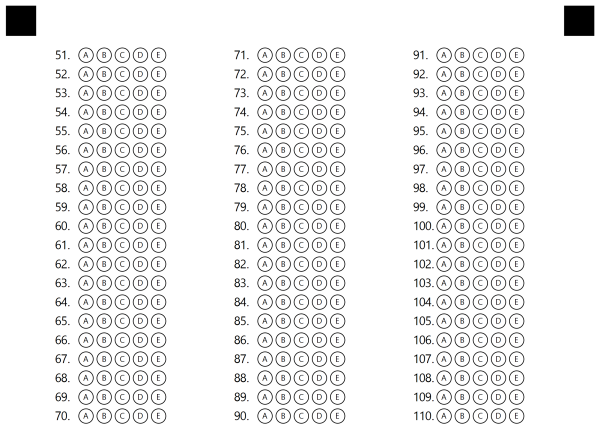
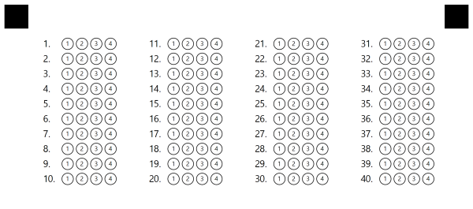
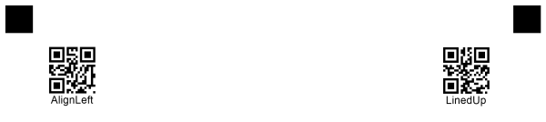
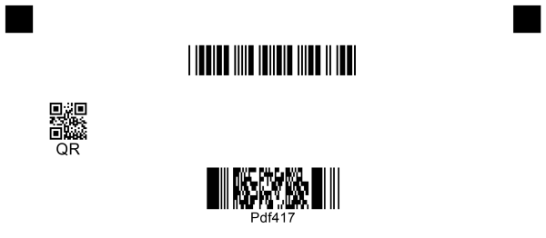

# **Introduction**
Template generation markup supports several types of elements, and most elements have a number of options that define the element' properties and appearance. This allows creating functional and nice-looking custom templates for any of your needs i.e. surveys, answer sheets, tests - anything you need.

In this article, we provide a detailed description of each element and its attributes with the usage examples.

It is important to note that each attribute is parsed successfully only if it starts with a **tabulation** symbol, not just spaces. If you notice strange behavior or errors, the first thing to check will be that all additional attributes in markup start with **\t**.
# **Text element**
Starts with **?text=** prefix and can be followed by any number of text lines not starting with **\t** (tabulation) until an empty line or another element is found. The text element allows us to add text lines to the template and has no additional attributes.
## **Attributes**
This element has no additional attributes.
## **Examples**
**Markup**



 ?text=First line of text

Second line of text                   with lots of spaces in between

Third line of text



**Result**

****
# **Answer Sheet element**
Starts with **?answer_sheet=** prefix that sets the name of the sheet, i.e. the prefix of each question in the sheet. It allows adding choice boxes grouped in columns and rows. Use the answer sheet if you want to fit a lot of questions on a page since they are located close to each other.
## **Attributes**
This element can be customized with attributes, each attribute must be on a new line starting with **\t** (tabulation) symbol. 

|**Element**|**Prefix**|**Attribute**|**Attribute Description**|**Required/Optional**|**Attribute Default Value**|**Attribute usage example**|
| :- | :- | :- | :- | :- | :- | :- |
|Answer Sheet|?answer_sheet=|elements_count|Determines the total number of questions in the answer sheet.|Required|0|elements_count=100|
|||columns_count|Sets the number of columns to be drawn.|Optional|4|columns_count=4|
|||answers_count|The number of answer options for each question in the answer sheet.|Optional|4|answers_count=5|
|||start_id|
The starting number of suffix in the title of each question.

If set, questions in the answer sheet will be named starting with this number.

If not set, numeration will take any added questions on the page into account, so that questions in the answer sheet will continue the numeration.
|Optional|-|
start_id=1

start_id=51
|
## **Examples**
**Markup**



 ?answer_sheet=Questions

    elements_count=60

    columns_count=3

    start_id=51

    answers_count=5



**Result**

**Markup**



 ?answer_sheet=Questions

    elements_count=40

    answers_list=(1)(2)(3)(4)(5)



**Result**

# **Choice box element**
Choice box (or, simply put, question) starts with the # symbol and then continued by the text of the question and answer options. The choice box is a basic element that represents a single question with a set amount of answers.

The answer options start with parentheses with an answer name or a letter inside (e.g. <**(A)**>) proceeded with the answer text. Question text and answer options can be placed on several lines (see examples).
## **Attributes**
This element has no additional attributes. 
## **Examples**
**Markup**



 #Can Aspose.OMR process not only scans, but also photos?

    () Yes, indeed! () No

#Aspose.OMR works with any kind of OMR forms: tests, exams, questionnaires, surveys, etc.

    (Yes) Yes, indeed! (No) No

#How would you rate the quiality of the product:

    () Very high quality () High quality 

    () Average quality () Low quality

#How likely is it that you would reccomend our company to a friend or colleague?

    (1) (2) (3) (4) (5) (6) (7) (8) (9)



**Result**

# **Grid element**
Starts with **?grid=** prefix that sets the name of the element. Grid is a matrix consisting of several similar sections, and for each section there is a list of several options. Grid is best used for fields like ID, phone number, and similar. Another way to think about Grid is a set of identical choice boxes, the result of which is grouped into a single value.
## **Attributes**
Grid element can be customized with attributes, each attribute must be on a new line starting with **\t** (tabulation) symbol.

|**Element**|**Prefix**|**Attribute**|**Attribute Description**|**Required/Optional**|**Attribute Default Value**|**Attribute Usage Example**|
| :- | :- | :- | :- | :- | :- | :- |
|Grid|?grid=|sections_count|
The length of the resulting value in the grid.

For example, in ID grid sections determine the length of the ID value (e.g. 8 symbols long).
|Optional|8|sections_count=6|
|||options_count|
The number of choices for each section in the grid.

For example, in ID grid options determine possible values for each symbol (e.g. each ID symbol can be in 0-9 range)
|Optional|10|options_count=8|
|||align|The horizontal alignment of the grid element on the page.|Optional|left|
align=left

align=center

align=right
|
|||orientation|Grid orientation: horizontal or vertical. Determines the position of child choice boxes inside the grid.|Optional|horizontal|
orientation=horizontal

orientation=vertical
|
|||underlines|Indicates whether to draw underline symbols at the start of the grid or not|Optional|true|
underlines=true

underlines=false
|
|||x/y|
Sets the X and Y position in absolute coordinates. Allows to position grid element in any place on the page, or position several grids in one line. It overrides the align attribute. 

You can provide both X and Y values, or specify only one (only X or only Y).
|Optional|-|
X=500

Y=350
|
## **Examples**
**Markup**



 ?grid=ID1

    sections_count=6

    options_count=6

    x=200

    y=200

?grid=ID2

    sections_count=6

    options_count=6

    x=1200

    y=200

    orientation=vertical



**Result**

**Markup**



 ?grid=ID1

    sections_count=5

    options_count=6

    align=left

?grid=ID2

    sections_count=5

    options_count=6

    align=center

    underlines=false



**Result**

# **Image element**
Starts with **?image=** prefix that sets the title of the image. Image element allows adding image files on the page, e.g. logos, instructions blocks, or any other type of image. Please pay attention to the size of the image you want to add so that it fits properly in the desired position and doesn't take too much space. The path to the images is provided in Generation method parameters.
## **Attributes**
The image element can be customized with attributes, each attribute must be on a new line starting with **\t** (tabulation) symbol.

|**Element**|**Prefix**|**Attribute**|**Attribute Description**|**Required/Optional**|**Attribute Default Value**|**Attribute Usage Example**|
| :- | :- | :-: | :-: | :- | :- | :- |
|Image|?image=|align|The horizontal alignment of the image element on the page.|Optional|Center|
align=left

align=center

align=right
|
## **Examples**
**Result**



 ?image=logo.png

    align=right



Result

# **Barcode element**
Starts with **?barcode=** prefix that sets the name of the barcode element. The template generation supports adding barcodes and QR-codes on the page and provides support for lots of barcode types. You can encode link, ID, or any other value using barcode and position it exactly where you want to use attributes. Aspose.OMR for .NET supports barcode generation and recognition, so any information you decide to encode will be successfully decoded.
## **Attributes**
Barcode element can be customized with attributes, each attribute must be on a new line starting with **\t** (tabulation) symbol.

|**Element**|**Prefix**|**Attribute**|**Attribute Description**|**Required/Optional**|**Attribute Default Value**|**Attribute Usage Example**|
| :- | :- | :- | :- | :- | :- | :- |
|Barcode|?barcode=|value|The value that barcode encodes|Required|-|value=100|
|||barcode_type|The type of barcode to draw|Optional|QR|
barcode_type=code39standard

barcode_type=QR

barcode_type=EAN8
|
|||qr_version|The QR version of QR code. Used only for QR codes.|Optional|Auto|qr_version=40|
|||align|The horizontal alignment of the barcode element on the page.|Optional|Center|
align=left

align=center

align=right
|
|||height|The target height of the barcode image. If the height is not set, the barcode size is determined automatically. If you would like to make the barcode image bigger or smaller, use this attribute.|Optional|Auto|height=300|
|||codetext|Indicates whether to draw barcode codetext (encoded text below barcode image)|Optional|False|
codetext=true

codetext=false
|
|||x/y|
Sets the X and Y position in absolute pixel coordinates. Allows to position barcode element in any place on the page, or position several barcodes in one line. Overrides align attribute. 

You can provide both X and Y values, or specify only one (only X or only Y).

Please note that paper size is standard A4 (2480x3508).
|Optional|-|
X=250

Y=1500
|
## **Examples**
**Markup**



 ?barcode=Test1

    value=AlignLeft

    height=300

    align=left

    codetext=true

?barcode=Test2

    value=LinedUp

    height=300

    codetext=true

    X=2000

    y=200



**Result**

` `**Markup**



 ?barcode=Test1

    value=code39StandardTest

    height=150

    barcode_type=code39standard

?barcode=Test2

    value=QR

    height=300

    codetext=true

    align=left

    barcode_type=QR

?barcode=Test3

    value=Pdf417

    barcode_type=Pdf417

    height=300

    codetext=true



**Result**

