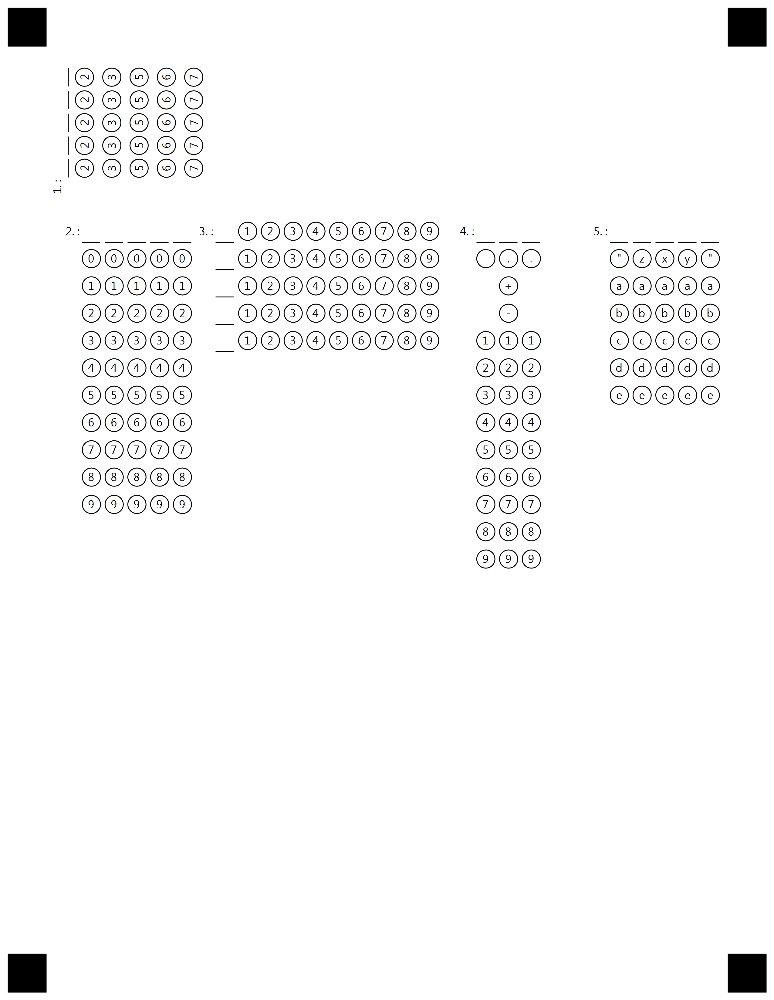
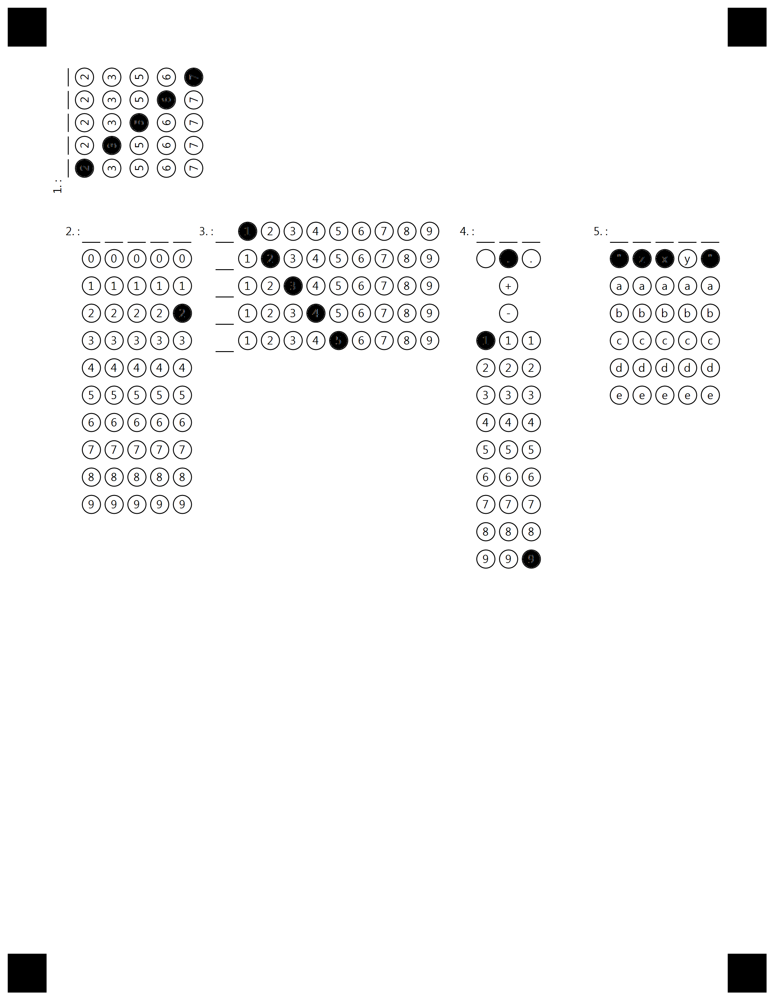

## **Introduction**
Template generation markup the supports several types of elements, and most elements have a number of options that define the element' properties and appearance. This allows creating functional and nice-looking custom templates for any of your needs i.e. surveys, answer sheets, tests - anything you need.

In this article, we provide a detailed description of CompositeGrid element and its attributes with the usage examples represented in .txt markup.

CompositeGrid is an element that allowed surveyed person to input custom value without handwritten text.
By filling bubbles person can input numbers("-1.245", "15") or words("Jim", "Fifth street") or any other symbol
One grid element represent one value. Each column in grid element represent one symbol.

{}

It is important to note that each attribute is parsed successfully only if it starts with a **tabulation** symbol, not just spaces. If you notice strange behavior or errors, the first thing to check will be that all additional attributes in markup start with **\t**.

{}

## **CompositeGrid element**
Starts with **?composite_grid=** prefix that sets the name of the element.
Allow inputting of custom value.
Describe amount of columns(length of custom value) and rows(possible symbols in each cell).
If columns_count=4 and values=(1) (2) (3) - it will create grid with 12 bubbles. 4 sections with 3 possible symbols in each

This element can also be rotated or\and drawn horizontally vertically. For specifics -  look in example below.

### **Attributes**
CompositeGrid element can be customized with attributes, each attribute must be on a new line starting with **\t** (tabulation) symbol.

|**Element**|**Prefix**|**Attribute**|**Attribute Description**|**Required/Optional**|**Attribute Default Value**|**Attribute Usage Example**|
| :- | :- | :- | :- | :- | :- | :- |
|CompositeGrid|?composite_grid=|
|||values|<p>Array of possible symbols for one section. This array will be repeated for each section. Each symbol is enclosed by round bracket|Required|-|values=(1) (2) (3)
|||extra_row|Array of extra symbols that may be unique to specific column. Instead of 'values' each bubble represent one symbol per section <p>() - No bubble will be drawn. To uphold grid structure space will be blank.</p> <p>( ) - bubble with empty space will be drawn </p><p> (+) - bubble with + will be drawn</p><p>This property can be repeated multiple times per element and result will summarize|Optional|-|<p>extra_row= (.) (+) (-) () ( )</p> <p>extra_row= (.) (+) (-) () ( ) </p>
|||rotate|Describe rotation of grid element around its own axis. Inputted degree must divide by 90.|Optional|0|<p>rotate=270</p><p>rotate=-30</p>
|||columns_count|<p>Amount of columns inside grid. Each column represent single symbol in result value.</p>|Optional|5|columns_count=6|
|||align|The horizontal alignment of the grid element on the page.|Optional|left|<p>align=left</p><p>align=center</p><p>align=right</p>|
|||header_type|Indicates what type of element to draw at the start of the grid|Optional|underline|header_type=square
|||header_border_size|Size of border line in pixels|Optional|3|header_border_size=3
|||header_border_color|Color of border line|Optional|Black|header_border_color=red
|||orientation|Grid orientation: horizontal or vertical. Determines the position of child choice boxes inside the grid.|Optional|horizontal|<p>orientation=horizontal</p><p>orientation=vertical</p>|
|||vertical_margin|Margin between lines|Optional|0|vertical_margin=20
|||bubble_size|Size of bubbles|Optional|normal|<p>bubble_size=extrasmall</p><p>bubble_size=small</p><p>bubble_size=normal</p><p>bubble_size=large</p><p>bubble_size=extralarge</p>
|||x/y|<p>Sets the X and Y position in absolute coordinates. Allows to position grid element in any place on the page, or position several grids in one line. It overrides the align attribute. </p><p>You can provide both X and Y values, or specify only one (only X or only Y).</p>|Optional|-|<p>X=500</p><p>Y=350</p>|
|||column|In multi-column template indicates in which column to draw sheet|Optional|-|column=2

### **Example of CompositeGrid structure**
```text
?container=grids2
	columns_count=1
?block=1
	column=1	
?composite_grid=1.
	rotate=-90
	values=(2) (3) (5) (6) (7) 
&block
&container
?container=grids2
	columns_proportions=20%-40%-20%-20%
?block=1
	column=1
?composite_grid=2.
&block
?block=2
	column=2
?composite_grid=3.
	orientation=vertical
	values=(1) (2) (3) (4) (5) (6) (7) (8) (9)
&block
?block=4
	column=3
?composite_grid=4.
	columns_count=3
	extra_row=( ) (.) (.)
	extra_row=() (+) ()
	extra_row=() (-) ()
	values=(1) (2) (3) (4) (5) (6) (7) (8) (9)
&block
?block=5
	column=4
?composite_grid=5.
	columns_count=5
	extra_row=(") (z) (x) (y) (")
	values=(a) (b) (c) (d) (e)
&block
&container
````

**Result**

****

**Inserted values**

****

**Recognition result (.csv)**

```text
Element Name,Value,
1.,"23567"
2.,"2"
3.,"12345"
4.,"1.9"
5.,""zx""
```