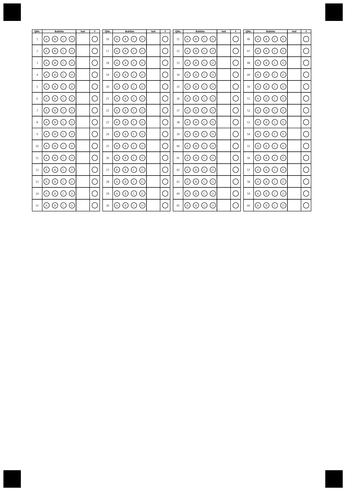
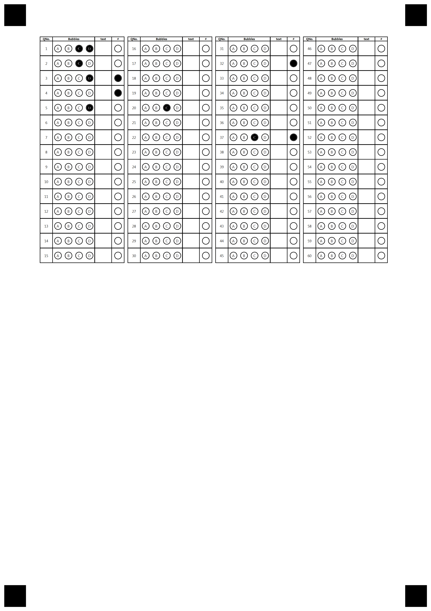

## **Introduction**
Template generation markup supports several types of elements, and most elements have a number of options that define the element' properties and appearance. This allows creating functional and nice-looking custom templates for any of your needs i.e. surveys, answer sheets, tests - anything you need.

In this article, we provide a detailed description of CustomAnswerSheet elements and its attributes with the usage examples represented in txt markup.

CustomAnswerSheet is group of elements that allowed you to create answer sheet, but instead of default bubbles it will be filled with custom array of element you describe in CustomRow. For each question CustomRow will be repeated finite amount of times to represent table structure. 
Recognition of this element is similar to regular AnswerSheet.

{}

It is important to note that each attribute is parsed successfully only if it starts with a **tabulation** symbol, not just spaces. If you notice strange behavior or errors, the first thing to check will be that all additional attributes in markup start with **\t**.

{}

## **CustomAnswerSheet element**
Starts with **?custom_answer_sheet=** prefix that sets the name of the element.
Grouping element. Supports CustomRow and Header as children. 
Describe amount and composition of each CustomRow.
if columns_count=4 and amount=60 - it will create 4 section horizontally with 15 CustomRow inside of each one.
CustomRow allocated vertically inside section as rows in table. Header repeated for each section on top.

### **Attributes**
CustomAnswerSheet element can be customized with attributes, each attribute must be on a new line starting with **\t** (tabulation) symbol.

|**Element**|**Prefix**|**Attribute**|**Attribute Description**|**Required/Optional**|**Attribute Default Value**|**Attribute Usage Example**|
| :- | :- | :- | :- | :- | :- | :- |
|CustomAnswerSheet|?custom_answer_sheet=|columns_count|Describes amount of sections|Required|-|columns_count=4|
|||amount|Total amount of CustomRow repeats|Required|-|amount=60
|||row_proportions|In table structure represent amount of width for each column in percent. Total value must be 100%. Amount of column must be equal to CustomRow children and Header children.|Required|-|row_proportions=15%-50%-20%-15%

## **Header element**
Starts with **?header=** prefix that sets the name of the element.
Grouping element. Support *Column* element as children.
Describe top row(header) for each section in *CustomAnswerSheet* element.
Amount of children inside must be equal to **row_proportions** field of *CustomAnswerSheet* element

### **Attributes**
*Header* element don't have attributes.

## **Column element**
Starts with **?column=** prefix that sets the name of the element and display value.
Can only be positioned inside of *Header* element as child.
Represent column header and content inside it.

### **Attributes**
*Column* element can be customized with attributes, each attribute must be on a new line starting with **\t** (tabulation) symbol.

|**Element**|**Prefix**|**Attribute**|**Attribute Description**|**Required/Optional**|**Attribute Default Value**|**Attribute Usage Example**|
| :- | :- | :- | :- | :- | :- | :- |
|Column|?column=|font_family|The font family of the content|Optional|Segoe UI|font_family=Arial|
|||font_style|The style of the content, can be combined from multiple styles|Optional|FontStyle.Regular|<p>font_style=bold</p><p>font_style=bold, underline</p>|
|||font_size|The size of the text content|Optional|12|font_size=16|
|||align|Type of horizontal alignment inside parent element|Optional|left|<p>align=right</p><p>align=center</p><p>align=left</p>
|||content_type|type of content. <p>Cells - allow to draw circle around each symbol, including space or tab.</p><p>Normal - draw text as is</p>|Optional|Normal|<p>content_type=cells</p><p>content_type=normal</p>


## **CustomRow element**
Starts with **?custom_row=** prefix that sets the name.
Grouping element.
Can only be positioned inside *CustomAnswerSheet* element as child.
Represent one of row which will be repeated for finite amount of times.

**Inside this element exist special constant - %index% which will be replaced for actual index of element e.g. "%index%_name" will be places in config as "4_name" where 4 mean that it's fourth row drawn**

### **Attributes**
*CustomRow* element don't have attributes.

## **BubbleArray element**
Starts with **?bubble_array=** prefix that sets the name.
Can only be positioned inside of *CustomRow* element as child.
Represent bubbles inside *CustomRow*

### **Attributes**
*BubbleArray* element can be customized with attributes, each attribute must be on a new line starting with **\t** (tabulation) symbol.

|**Element**|**Prefix**|**Attribute**|**Attribute Description**|**Required/Optional**|**Attribute Default Value**|**Attribute usage example**|
| :- | :- | :- | :- | :- | :- | :- |
|BubbleArray|?bubble_array=||bubble_size|The size of a bubble|Optional|Normal|bubble_size=small
|||answers_list|Represent symbol inside of bubble and amount of bubbles.|Optional|-|answers_list=(A)(B)(C)(D)
|||font_family|The font family of the text|Optional|Segoe UI|font_family=arial|
|||font_style|The style of the content, can be combined from multiple styles|Optional|FontStyle.Regular|<p>font_style=bold</p><p>font_style=bold, underline</p>|
|||font_size|The size of the text content|Optional|12|font_size=16|

## **CustomTrigger element**
Starts with **?custom_trigger=** prefix that sets the name.
Can only be positioned inside of *CustomRow* element as child.
Implement special behavior based on it's type.
Behavior triggered when bubble is filled

### **Attributes**
*CustomTrigger* element can be customized with attributes, each attribute must be on a new line starting with **\t** (tabulation) symbol.

**Inside this element exist special constant - %index% which will be replaced for actual index of element e.g. "%index%_name" will be places in config as "4_name" where 4 mean that it's fourth row drawn**

|**Element**|**Prefix**|**Attribute**|**Attribute Description**|**Required/Optional**|**Attribute Default Value**|**Attribute usage example**|
| :- | :- | :- | :- | :- | :- | :- |
|CustomTrigger|?custom_trigger=|bubble_size|The size of a bubble|Optional|Normal|bubble_size=small
|||target|Name of target element|Optional|-|target="bubble_array%index%"
|||value|value of trigger. Implementation based of trigger type|Optional|-|"this question is skipped"
|||trigger_type|Type of trigger. Control it's behavior. <p>ReplaceValue = upon filling the bubble find target element by name and replace it's value for value of trigger</p>|Required|ReplaceValue|trigger_type=ReplaceValue

### **Example of CustomAnswerSheet structure**
```text
?custom_answer_sheet=60 questions
	section_border=square
	amount=60
	columns_count=4	
	row_proportions=15%-50%-20%-15%
?header=Header
?column=QNo.
	font_size=4
	font_style=bold
	align=center
?column=Bubbles
	font_size=4
	font_style=bold
	align=center
?column=text
	font_size=4
	font_style=bold
	align=center
?column=#
	font_size=4
	font_style=bold
	align=center
&header
?custom_row=row_%index%
?content=%index%
	font_size=5
	font_style=regular
	align=center
?bubble_array=b_%index%
	font_size=5
	font_style=regular
	answers_list=(A)(B)(C)(D)
	bubble_size=extrasmall
?write_in=insert_your_value
	required=true
?custom_trigger=trigger_to_skip_question
	trigger_type=replaceValue
	value=question skipped
	target=60 questions_%index%
	bubble_size=extrasmall
&custom_row
&custom_answer_sheet
````

**Result**

****

**Inserted values**

****

**Recognition result (.csv)**

```text
Element Name,Value,
60 questions_1,"C,D"
60 questions_2,"C"
60 questions_3,"question skipped"
60 questions_4,"question skipped"
60 questions_5,"D"
60 questions_6,""
60 questions_7,""
60 questions_8,""
60 questions_9,""
60 questions_10,""
60 questions_11,""
60 questions_12,""
60 questions_13,""
60 questions_14,""
60 questions_15,""
60 questions_16,""
60 questions_17,""
60 questions_18,""
60 questions_19,""
60 questions_20,"C"
60 questions_21,""
60 questions_22,""
60 questions_23,""
60 questions_24,""
60 questions_25,""
60 questions_26,""
60 questions_27,""
60 questions_28,""
60 questions_29,""
60 questions_30,""
60 questions_31,""
60 questions_32,"question skipped"
60 questions_33,""
60 questions_34,""
60 questions_35,""
60 questions_36,""
60 questions_37,"question skipped"
60 questions_38,""
60 questions_39,""
60 questions_40,""
60 questions_41,""
60 questions_42,""
60 questions_43,""
60 questions_44,""
60 questions_45,""
60 questions_46,""
60 questions_47,""
60 questions_48,""
60 questions_49,""
60 questions_50,""
60 questions_51,""
60 questions_52,""
60 questions_53,""
60 questions_54,""
60 questions_55,""
60 questions_56,""
60 questions_57,""
60 questions_58,""
60 questions_59,""
60 questions_60,""
trigger_to_skip_question,",,,"


```