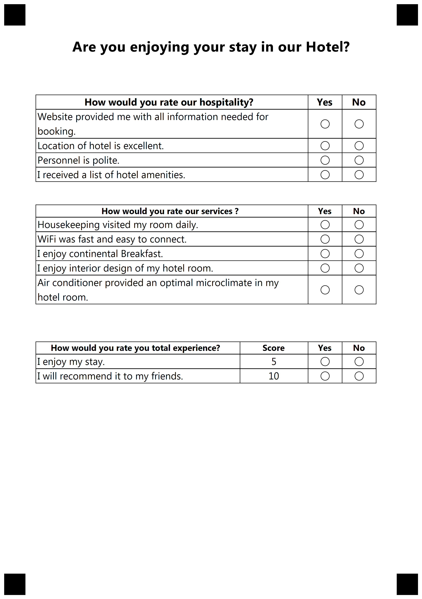
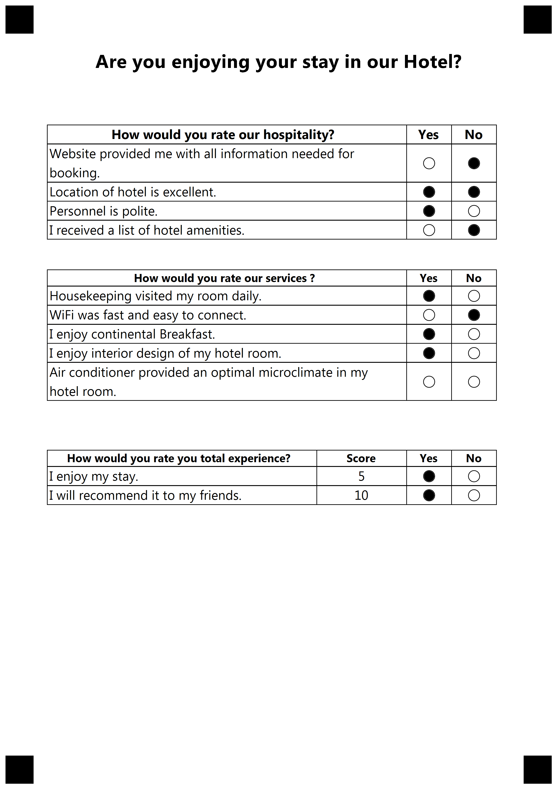

## **Introduction**
Template generation markup supports several types of elements, and most elements have a number of options that define the element' properties and appearance. This allows creating functional and nice-looking custom templates for any of your needs i.e. surveys, answer sheets, tests - anything you need.

In this article, we provide a detailed description of score elements and its attributes with the usage examples represented in txt markup.
Score element used for drawing table structure e.g. rows and columns.
Inside table structure positioned bubbles with score's attached to each one.
Upon filling bubble score is added to group score and question score.

{}

It is important to note that each attribute is parsed successfully only if it starts with a **tabulation** symbol, not just spaces. If you notice strange behavior or errors, the first thing to check will be that all additional attributes in markup start with **\t**.

{}

## **ScoreGroup element**
Starts with **?score_group=** prefix that sets the name of the element.
Can be used for grouping ScoreQuestion into logic sections. Supports ScoreQuestion elements as children.
Upon recognition return total amount of each ScoreQuestion summarized.

### **Attributes**
ScoreGroup element can be customized with attributes, each attribute must be on a new line starting with **\t** (tabulation) symbol.

|**Element**|**Prefix**|**Attribute**|**Attribute Description**|**Required/Optional**|**Attribute Default Value**|**Attribute Usage Example**|
| :- | :- | :- | :- | :- | :- | :- |
|ScoreGroup|?score_group=|score_type_table|Describe a display structure for each element inside it|Optional|table|score_type_table=table|

## **ScoreQuestion element**
Starts with **?score_question=** prefix that sets the name of the element and display value.
Represent question with multiple answers. Each answer holding a specific amount of value(score).
Upon recognition returns summarized value of each selected ScoreAnswer.
Grouping element. Support ScoreHeader and ScoreAnswer as child elements.
In table type ScoreHeader describe column header and ScoreAnswer row.

### **Attributes**
ScoreQuestion element can be customized with attributes, each attribute must be on a new line starting with **\t** (tabulation) symbol.

|**Element**|**Prefix**|**Attribute**|**Attribute Description**|**Required/Optional**|**Attribute Default Value**|**Attribute Usage Example**|
| :- | :- | :- | :- | :- | :- | :- |
|ScoreQuestion|?score_question=|row_proportions|In table structure represent amount of width for each column in percent. Total value must be 100%. Amount of column must be equal to ScoreHeader children + 1(ScoreAnswer)|Required|-|row_proportions=80%-10%-10%|
|||font_family|The font family of the text|Optional|Segoe UI|font_family=arial|
|||font_style|The style of the content|Optional|FontStyle.Regular|font_style=bold|
|||font_size|The size of the text content|Optional|12|font_size=16|


## **ScoreHeader element**
Starts with **?score_header=** prefix that sets the name of the element.
Can only be positioned inside of ScoreQuestion element as child.
In table structure represent column header of the table and content inside them.
**Amount of ScoreHeader inside must be equal to row_proportions property of ScoreQuestion element**
Based on type bubbles inside this column will either add Score to ScoreQuestion or display Score amount or do nothing.
**If you don't want to display Score amount for each answer you must omit ScoreHeader=Amount. It will affect only displaying. Recognition will summarize Score still.**

### **Attributes**
ScoreHeader element can be customized with attributes, each attribute must be on a new line starting with **\t** (tabulation) symbol.

|**Element**|**Prefix**|**Attribute**|**Attribute Description**|**Required/Optional**|**Attribute Default Value**|**Attribute Usage Example**|
| :- | :- | :- | :- | :- | :- | :- |
|ScoreHeader|?score_header=|header_type|Set content behavior inside this column <p>Positive = Value will be added upon bubble filling. </p> <p>Amount = Only displaying of value. </p> <p>Negative = upon filling value will not be added</p>|Required|Positive|<p>score_header_type=amount</p><p>score_header_type=positive</p><p>score_header_type=negative</p>


## **ScoreAnswer element**
Starts with **?score_answer=** prefix that sets the name and value of the element.
Can only be positioned inside of ScoreQuestion element as child.
Represent one of question answer and score value behind it

### **Attributes**
ScoreAnswer element can be customized with attributes, each attribute must be on a new line starting with **\t** (tabulation) symbol.

|**Element**|**Prefix**|**Attribute**|**Attribute Description**|**Required/Optional**|**Attribute Default Value**|**Attribute Usage Example**|
| :- | :- | :- | :- | :- | :- | :- |
|ScoreAnswer|?score_answer=|score|number value that will be added to total sum of ScoreQuestion|Required|-|score=5
|||font_family|The font family of the content|Optional|Segoe UI|font_family=Arial|
|||font_style|The style of the content|Optional|FontStyle.Regular|font_style=Bold|
|||font_size|The size of the text content|Optional|12|font_size=16|
|||align|type of horizontal alignment for this text inside it's cell|Optional|left|<p>align=left</p><p>align=right</p><p>align=center</p>


### **Example of ScoreGroup structure**
```text
?text=Are you enjoying your stay in our Hotel?
	font_style=bold
	align=center
	font_family=Segoe UI
	font_size=20


?container=main_container
?block=main_block
?score_group=hotel guest survey
	score_type_table=table	
?score_question=How would you rate our hospitality?
	font_size=14
	font_style=bold	
	row_proportions=80%-10%-10%
?score_header=Yes
	header_type=positive
?score_header=No
	header_type=negative
?score_answer=Website provided me with all information needed for booking.
	score=1
	align=left
?score_answer=Location of hotel is excellent.
	score=1
	align=left
?score_answer=Personnel is polite.
	score=5
	align=left
?score_answer=I received a list of hotel amenities.
	score=1
	align=left
&score_question	
?score_question=How would you rate our services ?
	font_size=12
	font_style=bold	
	row_proportions=80%-10%-10%
?score_header=Yes
	header_type=positive
?score_header=No
	header_type=negative
?score_answer=Housekeeping visited my room daily.
	score=2
	align=left
?score_answer=WiFi was fast and easy to connect.
	score=2
	align=left
?score_answer=I enjoy continental Breakfast.
	score=3
	align=left
?score_answer=I enjoy interior design of my hotel room.
	score=3
	align=left
?score_answer=Air conditioner provided an optimal microclimate in my hotel room.
	score=3
	align=left
&score_question
?score_question=How would you rate you total experience?
	font_size=12
	font_style=bold	
	row_proportions=60%-20%-10%-10%
?score_header=Score
	header_type=Amount
?score_header=Yes
	header_type=positive
?score_header=No
	header_type=negative
?score_answer=I enjoy my stay.
	score=5
	align=left
?score_answer=I will recommend it to my friends.
	score=10
	align=left
&score_question
&score_group
&block
&container
````

**Result**

****

**Inserted values**

****

**Recognition result (.csv)**

```text
Element Name,Value,
How would you rate our hospitality?,"Location of hotel is excellent.,Personnel is polite."
How would you rate our hospitality?_total,"6"
How would you rate our services ?,"Housekeeping visited my room daily.,I enjoy continental Breakfast.,I enjoy interior design of my hotel room."
How would you rate our services ?_total,"8"
How would you rate you total experience?,"I enjoy my stay.,I will recommend it to my friends."
How would you rate you total experience?_total,"15"
hotel guest survey,"29"

```