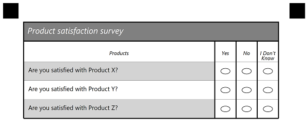
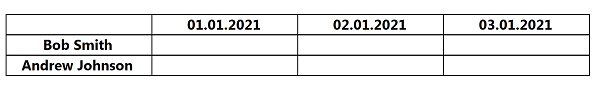

## **Introduction**
Template generation markup supports several types of elements, and most elements have a number of options that define the element' properties and appearance. This allows creating functional and nice-looking custom templates for any of your needs i.e. surveys, answer sheets, tests - anything you need.

In this article, we provide a detailed description of table elements and its attributes with the usage examples represented in txt markup.
Table element used for drawing table structure e.g. rows and columns.

{}

It is important to note that each attribute is parsed successfully only if it starts with a **tabulation** symbol, not just spaces. If you notice strange behavior or errors, the first thing to check will be that all additional attributes in markup start with **\t**.

{}

## **Table element**
Starts with **?table=** prefix that sets the name of the element.
Can be used for questionnaire with set amount of answers.  Grouping element. Supports TableHeader, TableTitle and Question elements as children.
Best used for drawing table structure with rows and columns. Columns described in TableHeader element. Question element represent rows.
TableTitle used when need extra row above table.

### **Attributes**
Table element can be customized with attributes, each attribute must be on a new line starting with **\t** (tabulation) symbol.

|**Element**|**Prefix**|**Attribute**|**Attribute Description**|**Required/Optional**|**Attribute Default Value**|**Attribute Usage Example**|
| :- | :- | :- | :- | :- | :- | :- |
|Table|?table=|answers_count|Number of answers(columns) used in table|Required|-|answers_count=5|
|||table_type|Type of table element. Can be striped\normal\equalCells. Equal cells divide available space into equal columns(cells_|Optional|normal|<p>table_type=striped</p> table_type=EqualCells

## **TableTitle element**
Starts with **?table_title=** prefix that sets the name of the element and display value.
Represent additional header in table with one column - title.
Text value of this element displayed above header as first row.
Good for marking table name.

### **Attributes**
TableTitle element can be customized with attributes, each attribute must be on a new line starting with **\t** (tabulation) symbol.

|**Element**|**Prefix**|**Attribute**|**Attribute Description**|**Required/Optional**|**Attribute Default Value**|**Attribute Usage Example**|
| :- | :- | :- | :- | :- | :- | :- |
|TableTitle|?table_title=|answers_count|Number of answers(columns) used in table|Required|-|answers_count=5|
|||font_family|The font family of the text|Optional|Segoe UI|font_family=arial|
|||font_style|The style of the content|Optional|FontStyle.Regular|font_style=bold|
|||font_size|The size of the text content|Optional|12|font_size=16|
|||color|Color of the text|Optional|Black|color=red
|||background_color|Color of background layer|Optional|-|background_color=gray
|||border|Border type of title element|Optional|normal|-|
|||border_size|The size of the border|Optional|3|-|
|||border_color|Color of the border|Optional|Black|-|

## **TableHeader element**
Starts with **?table_header=** prefix that sets the name of the element.
Grouping element. Represent columns of the table and content inside them.
Each of columns(TableAnswer) placed below.
**Amount of TableAnswers inside must be equal to answers_count property of Table element**

### **Attributes**
TableHeader element can be customized with attributes, each attribute must be on a new line starting with **\t** (tabulation) symbol.

|**Element**|**Prefix**|**Attribute**|**Attribute Description**|**Required/Optional**|**Attribute Default Value**|**Attribute Usage Example**|
| :- | :- | :- | :- | :- | :- | :- |
|TableHeader|?table_header=|answers_count|Number of answers(columns) used in table|Required|-|answers_count=5|
|||font_family|The font family of the text|Optional|Segoe UI|font_family=arial|
|||font_style|The style of the content|Optional|FontStyle.Regular|font_style=bold|
|||font_size|The size of the text content|Optional|12|font_size=16|

## **TableAnswer element**
Starts with **?answer_value=** prefix that sets the name and value of the element.
Can only be positioned inside of TableHeader element as child.
Represent answer that can be used for multiple questions. Can only describe one column and text inside of it. 
For multiple columns - use multiple TableAnswer elements

### **Attributes**
This element has no additional attributes. 

## **Question element**
Starts with **?question=** prefix that sets the name and value of the element.
Can only be positioned inside of Table element as child.
Represent question with multiple answers. Value of this element placed in first column of table for each row(Question) element.

### **Attributes**
This element has no additional attributes. 

### **Example of table structure**
```text
?table=Survey
	answer_count=3
	table_type=striped
?table_title=Product satisfaction survey
	font_family=Italic
	font_size=16
	font_style=Bold
	color=White
	background_color=Gray
	border=Square
	border_size=8
	border_color=Black
?table_header=1
	font_family=Italic
	font_size=12
?content=Products
?answer_value=Yes
?answer_value=No
?answer_value=I Don't Know
&table_header
?question=Are you satisfied with Product X?
?question=Are you satisfied with Product Y?
?question=Are you satisfied with Product Z?
&table
````

**Result**

****


### **Example of table structure with equal columns**

```
?table=signature_table
	answers_count=4
	table_type=equalcells
?table_header=header
	font_style=bold
?content=
?content=01.01.2021
	font_style=bold
	align=center
?content=02.01.2021
	font_style=bold
	align=center
?content=03.01.2021
	font_style=bold
	align=center
?content=04.01.2021
	font_style=bold
	align=center
&table_header
?content=Bob Smith
	font_style=bold
	align=center
?content=Andrew Johnson
	font_style=bold
	align=center
&table
```

**Result**

****