## **Introduction**
Template generation markup supports several types of elements, and most elements have a number of options that define the element' properties and appearance. This allows creating functional and nice-looking custom templates for any of your needs i.e. surveys, answer sheets, tests - anything you need.

In this article, we provide a detailed description of each element and its attributes with the usage examples represented in txt markup.

{}

It is important to note that each attribute is parsed successfully only if it starts with a **tabulation** symbol, not just spaces. If you notice strange behavior or errors, the first thing to check will be that all additional attributes in markup start with **\t**.

{}


## **Text element**
Starts with **?text=** prefix and can be followed by any number of text lines not starting with **\t** (tabulation) until an empty line or another element is found. The text element allows us to add text lines to the template and has no additional attributes.
Empty lines can be used to create vertical margin between elements in template.

### **Attributes**
Text element can be customized with attributes, each attribute must be on a new line starting with **\t** (tabulation) symbol.

|**Element**|**Prefix**|**Attribute**|**Attribute Description**|**Required/Optional**|**Attribute Default Value**|**Attribute Usage Example**|
| :- | :- | :- | :- | :- | :- | :- |
|Text|?text=|font_family|The font family of the text|Optional|Segoe UI|font_family=arial|
|||font_style|The style of the content|Optional|FontStyle.Regular|font_style=bold|
|||font_size|The size of the text content|Optional|12|font_size=16|
|||align|Text alignment, indicating where text should be drawn on page|Optional|left|align=center

### **Examples**
**Markup**

```text
?text=Header text
	font_style=bold
	font_size=16
	align=center

?text=right column text
second line of column text
	align=right
	font_style=italic
````

**Result**

**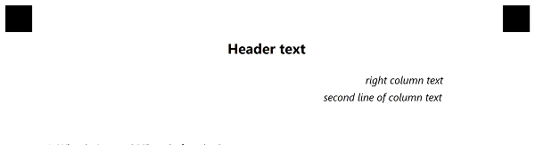**
## **Answer Sheet element**
Starts with **?answer_sheet=** prefix that sets the name of the sheet, i.e. the prefix of each question in the sheet. It allows adding choice boxes grouped in columns and rows. Use the answer sheet if you want to fit a lot of questions on a page since they are located close to each other.
### **Attributes**
This element can be customized with attributes, each attribute must be on a new line starting with **\t** (tabulation) symbol. 

|**Element**|**Prefix**|**Attribute**|**Attribute Description**|**Required/Optional**|**Attribute Default Value**|**Attribute usage example**|
| :- | :- | :- | :- | :- | :- | :- |
|Answer Sheet|?answer_sheet=|elements_count|Determines the total number of questions in the answer sheet.|Required|0|elements_count=100|
|||columns_count|Sets the number of columns to be drawn.|Optional|4|columns_count=4|
|||answers_count|The number of answer options for each question in the answer sheet.|Optional|4|answers_count=5|
|||start_id|<p>The starting number of suffix in the title of each question.</p><p>If set, questions in the answer sheet will be named starting with this number.</p><p>If not set, numeration will take any added questions on the page into account, so that questions in the answer sheet will continue the numeration.</p>|Optional|-|<p>start_id=1</p><p>start_id=51</p>|
|||<p>vertical_margin</p>| Vertical margin of answersheet. Set in pixels.|Optional|0|vertical_margin=200
|||bubble_size|The size of a bubble|Optional|Normal|bubble_size=small
|||answers_list|Represent symbol inside of bubble.|Optional|-|answers_list=(A)(B)(C)(D)
|||column|In multi-column template indicates in which column to draw sheet|Optional|-|column=2
### **Examples**
**Markup**

````text
 ?answer_sheet=Questions  
	elements_count=60
	columns_count=3
	start_id=51
	answers_count=5
````

**Result**

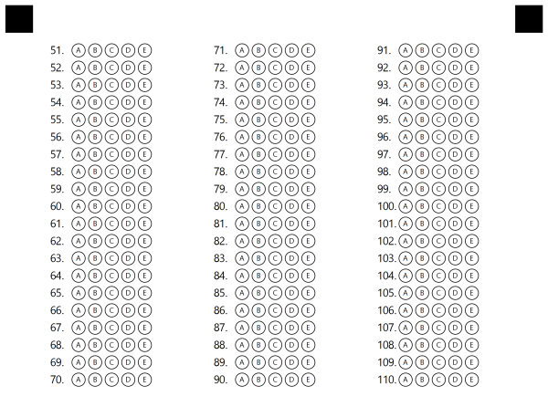

**Markup**

````text
 ?answer_sheet=Questions
	elements_count=40
	answers_list=(1)(2)(3)(4)(5)
````

**Result**

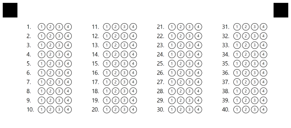
## **Choice box element**
Choice box (or, simply put, question) starts with the # symbol and then continued by the text of the question and answer options. The choice box is a basic element that represents a single question with a set amount of answers.

The answer options start with parentheses with an answer name or a letter inside (e.g. <**(A)**>) proceeded with the answer text. Question text and answer options can be placed on several lines (see examples).
### **Attributes**
This element has no additional attributes. 
### **Examples**
**Markup**

````text
#Can Aspose.OMR process not only scans, but also photos?
	() Yes, indeed! () No

#Aspose.OMR works with any kind of OMR forms: tests, exams, questionnaires, surveys, etc.
	(Yes) Yes, indeed! (No) No

#How would you rate the quality of the product:
	() Very high quality () High quality 
	() Average quality () Low quality

#How likely is it that you would recommend our company to a friend or colleague?
	(1) (2) (3) (4) (5) (6) (7) (8) (9)
````

**Result**


## **Grid element**
Starts with **?grid=** prefix that sets the name of the element. Grid is a matrix consisting of several similar sections, and for each section there is a list of several options. Grid is best used for fields like ID, phone number, and similar. Another way to think about Grid is a set of identical choice boxes, the result of which is grouped into a single value.
### **Attributes**
Grid element can be customized with attributes, each attribute must be on a new line starting with **\t** (tabulation) symbol.

|**Element**|**Prefix**|**Attribute**|**Attribute Description**|**Required/Optional**|**Attribute Default Value**|**Attribute Usage Example**|
| :- | :- | :- | :- | :- | :- | :- |
|Grid|?grid=|sections_count|<p>The length of the resulting value in the grid.</p><p>For example, in ID grid sections determine the length of the ID value (e.g. 8 symbols long).</p>|Optional|8|sections_count=6|
|||options_count|<p>The number of choices for each section in the grid.</p><p>For example, in ID grid options determine possible values for each symbol (e.g. each ID symbol can be in 0-9 range)</p>|Optional|10|options_count=8|
|||align|The horizontal alignment of the grid element on the page.|Optional|left|<p>align=left</p><p>align=center</p><p>align=right</p>|
|||header_type|Indicates what type of element to draw at the start of the grid|Optional|underline|header_type=square
|||header_border_size|Size of border line in pixels|Optional|3|header_border_size=3
|||header_border_color|Color of border line|Optional|Black|header_border_color=red
|||orientation|Grid orientation: horizontal or vertical. Determines the position of child choice boxes inside the grid.|Optional|horizontal|<p>orientation=horizontal</p><p>orientation=vertical</p>|
|||vertical_margin|Margin between lines|Optional|0|vertical_margin=20
|||bubble_size|Size of bubbles|Optional|normal|<p>bubble_size=extrasmall</p><p>bubble_size=small</p><p>bubble_size=normal</p><p>bubble_size=large</p><p>bubble_size=extralarge</p>
|||x/y|<p>Sets the X and Y position in absolute coordinates. Allows to position grid element in any place on the page, or position several grids in one line. It overrides the align attribute. </p><p>You can provide both X and Y values, or specify only one (only X or only Y).</p>|Optional|-|<p>X=500</p><p>Y=350</p>|
|||column|In multi-column template indicates in which column to draw sheet|Optional|-|column=2
### **Examples**
**Markup**

```text
?grid=ID1
	sections_count=6
	options_count=6
	x=200
	y=200

?grid=ID2
	sections_count=6
	options_count=6
	x=1200
	y=200
	orientation=vertical
````

**Result**

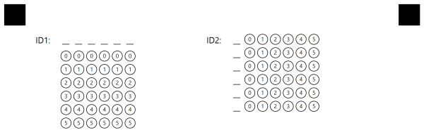

**Markup**

````text
?grid=ID1
	sections_count=5
	options_count=6
	align=left

?grid=ID2
	sections_count=5
	options_count=6
	align=center
	underlines=false
````

**Result**


## **Image element**
Starts with **?image=** prefix that sets the title of the image. Image element allows adding image files on the page, e.g. logos, instructions blocks, or any other type of image. Please pay attention to the size of the image you want to add so that it fits properly in the desired position and doesn't take too much space. The path to the images is provided in Generation method parameters.
### **Attributes**
The image element can be customized with attributes, each attribute must be on a new line starting with **\t** (tabulation) symbol.

|**Element**|**Prefix**|**Attribute**|**Attribute Description**|**Required/Optional**|**Attribute Default Value**|**Attribute Usage Example**|
| :- | :- | :-: | :-: | :- | :- | :- |
|Image|?image=|align|The horizontal alignment of the image element on the page.|Optional|Center|<p>align=left</p><p>align=center</p><p>align=right</p>|
|||x/y|<p>Sets the X and Y position in absolute coordinates. Allows to position image element in any place on the page, or position several images in one line. It overrides the align attribute. </p><p>You can provide both X and Y values in pixels, or specify only one (only X or only Y).</p>|Optional|-|<p>X=500</p><p>Y=350</p>|
|||height|Height of the image in pixels|Optional|-|height=200
|||width|Width of the image in pixels|Optional|-|width=200
### **Examples**
**Result**

```text
?image=logo.png
    align=right
````

Result


## **Barcode element**
Starts with **?barcode=** prefix that sets the name of the barcode element. The template generation supports adding barcodes and QR-codes on the page and provides support for lots of barcode types. You can encode link, ID, or any other value using barcode and position it exactly where you want to use attributes. Aspose.OMR for .NET supports barcode generation and recognition, so any information you decide to encode will be successfully decoded.
### **Attributes**
Barcode element can be customized with attributes, each attribute must be on a new line starting with **\t** (tabulation) symbol.

|**Element**|**Prefix**|**Attribute**|**Attribute Description**|**Required/Optional**|**Attribute Default Value**|**Attribute Usage Example**|
| :- | :- | :- | :- | :- | :- | :- |
|Barcode|?barcode=|value|The value that barcode encodes|Required|-|value=100|
|||barcode_type|The type of barcode to draw|Optional|QR|<p>barcode_type=code39standard</p><p>barcode_type=QR</p><p>barcode_type=EAN8</p>|
|||qr_version|The QR version of QR code. Used only for QR codes.|Optional|Auto|qr_version=40|
|||align|The horizontal alignment of the barcode element on the page.|Optional|Center|<p>align=left</p><p>align=center</p><p>align=right</p>|
|||height|The target height of the barcode image. If the height is not set, the barcode size is determined automatically. If you would like to make the barcode image bigger or smaller, use this attribute.|Optional|Auto|height=300|
|||codetext|Indicates whether to draw barcode codetext (encoded text below barcode image)|Optional|False|<p>codetext=true</p><p>codetext=false</p>|
|||x/y|<p>Sets the X and Y position in absolute pixel coordinates. Allows to position barcode element in any place on the page, or position several barcodes in one line. Overrides align attribute. </p><p>You can provide both X and Y values, or specify only one (only X or only Y).</p><p>Please note that paper size is standard A4 (2480x3508).</p>|Optional|-|<p>X=250</p><p>Y=1500</p>|
### **Examples**
**Markup**

````text
?barcode=Test1
	value=AlignLeft
	height=300
	align=left
	codetext=true

?barcode=Test2
	value=LinedUp
	height=300
	codetext=true
	X=2000
	y=200
````

**Result**

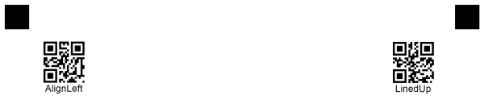

` `**Markup**

````text
?barcode=Test1
	value=code39StandardTest
	height=150
	barcode_type=code39standard
?barcode=Test2
	value=QR
	height=300
	codetext=true
	align=left
	barcode_type=QR
?barcode=Test3
	value=Pdf417
	barcode_type=Pdf417
	height=300
	codetext=true
````

**Result**

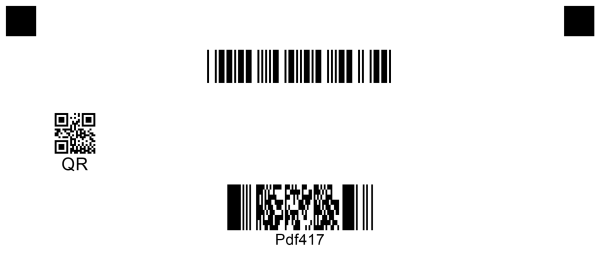


## **Container element**
Starts with **?container=** prefix that sets the name of the element. Container is not displayed and is intended for breaking the template into columns. Ends with a **&container** prefix indicating the end of the element's bounds.

### **Attributes**
Container element can be customized with attributes, each attribute must be on a new line starting with **\t** (tabulation) symbol.

|**Element**|**Prefix**|**Attribute**|**Attribute Description**|**Required/Optional**|**Attribute Default Value**|**Attribute Usage Example**|
| :- | :- | :- | :- | :- | :- | :- |
|Container|?container=|columns_count|Amount of columns in a container|Required|1|columns_count=3|
|||type|Type of Container element|Optional|normal|type=footer|

### **Examples**

```text
?container=1-st
	columns_count=3
&container
```

If you want to create a **footer** in your template you must specify the footer attribute **type=footer** for your container

### **Examples**

````text
?barcode=Test4
	value=Aspose Pty Ltd
	height=250
	codetext=true
	align = right
	Y=3030
	x=2100
?container=Footer
	columns_count=3
	type=footer
?block=1
	column=1
?paragraph=1
?content=Precinct Aspose Style 1
	font_style=Bold
	font_size=14
?content=© Aspose Pty Ltd 2001-2021
	font_style=Regular
	font_size=10
&paragraph
&block
?block=2
	column=2
?paragraph=2
?content=All Rights Reserved
	font_style=Regular
	font_size=10
&paragraph
&block
?block=3
	column=3
?paragraph=3
?content=Page 1
	font_style=Bold
	font_size=14
?content=June 26, 2021
	font_style=Regular
	font_size=10
&paragraph
&block
&container
````

**Result**

**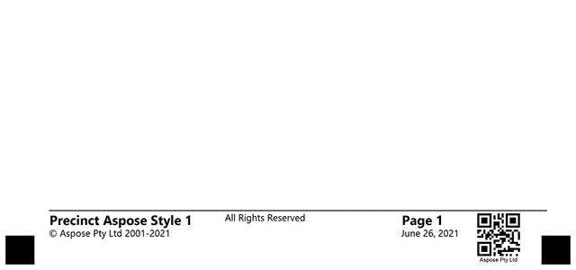**

## **Block element**
Starts with **?block=** prefix that sets the name of the element. A block can be displayed if it has a **border=Square** attribute and is designed to group multiple elements in one column. Ends with a **&block** prefix indicating the end of the element's bounds.

### **Attributes**
Block element can be customized with attributes, each attribute must be on a new line starting with **\t** (tabulation) symbol.

|**Element**|**Prefix**|**Attribute**|**Attribute Description**|**Required/Optional**|**Attribute Default Value**|**Attribute Usage Example**|
| :- | :- | :- | :- | :- | :- | :- |
|Block|?block=|column|Indicates which column of the container will be in|Required|1|column=1|
|||border|Border type of Container element|Optional|normal|-|
|||border_size|The size of the border|Optional|3|-|
|||border_color|Color of the border|Optional|Black|-|
|||is_clipped|if set to true - block with all content will be clipped as picture upon recognition|Optional|false|is_clipped=true

### **Examples**

````text
?container=common_container
	columns_count=2
?block=1-st
	column=2
&block
&container
````

## **Content element**
Starts with **?content=** prefix and can be followed by any number of text lines not starting with **\t** (tabulation) until an empty line or another element is found. Must be in the inside of the block element.

### **Attributes**
Content element can be customized with attributes, each attribute must be on a new line starting with **\t** (tabulation) symbol.

|**Element**|**Prefix**|**Attribute**|**Attribute Description**|**Required/Optional**|**Attribute Default Value**|**Attribute Usage Example**|
| :- | :- | :- | :- | :- | :- | :- |
|Content|?content=|font_family|The font family of the content|Optional|Segoe UI|font_family=Arial|
|||font_style|The style of the content|Optional|FontStyle.Regular|font_style=Bold|
|||font_size|The size of the text content|Optional|12|font_size=16|
|||align|Type of horizontal alignment inside parent element|Optional|left|<p>align=right</p><p>align=center</p><p>align=left</p>
|||content_type|type of content. <p>Cells - allow to draw circle around each symbol, including space or tab.</p><p>Normal - draw text as is</p>|Optional|Normal|<p>content_type=cells</p><p>content_type=normal</p>


### **Examples**

````text
?container=1-st
	columns_count=2
?block=1-st
	column=1
?content=Aspose.OMR for .NET provides a simple Application Programming Interface (API) that is easy to learn and use.
	font_family=Arial
	font_style=Bold
	font_size=16
&block
&container
````

**Result**

**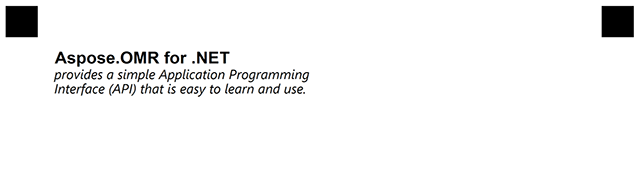**

## **Paragraph element**
Starts with **?paragraph=** prefix that sets the name of the element. A paragraph can consist of both text and text with an image. The image is specified by coordinates x, y. 
Ends with a **&paragraph** prefix indicating the end of the element's bounds.

### **Attributes**
Paragraph element can be customized with attributes, each attribute must be on a new line starting with **\t** (tabulation) symbol.

|**Element**|**Prefix**|**Attribute**|**Attribute Description**|**Required/Optional**|**Attribute Default Value**|**Attribute Usage Example**|
| :- | :- | :- | :- | :- | :- | :- |
|Paragraph|?paragraph=|type|Type of Paragraph|Optional|ParagraphTypeEnum.normal|type=multiple|

### **Examples**

````text
?container=1-st
	columns_count=3
?block=1-st
	column=1
?paragraph=1-st
	type=multiple
?image=logo.png
	x=680
	y=280
	height=175
	width=200
?content=Aspose.OMR for .NET
	font_family=Arial
	font_style=Bold
	font_size=16
?content=provides a simple Application Programming Interface (API) that is easy to learn and use.
	font_style=Italic
	font_size=13
&paragraph
?paragraph=2nd
?content=Aspose.OMR for .NET
	font_family=Arial
	font_style=Bold
	font_size=16
?content=provides a simple Application Programming Interface (API) that is easy to learn and use.
	font_style=Italic
	font_size=13
&paragraph
&block
&container
````

**Result**

**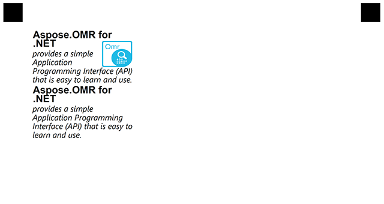**

## **VerticalChoiceBox element**
Starts with **?verticalChoiceBox=** prefix that sets the name of the element. The VerticalChoiceBox consists of a Answer element that contains a short response and Content elements that describe the response option in detail. It can also contain a WriteIn element in which the user can enter his own answer.
Ends with a **&verticalChoiceBox** prefix indicating the end of the element's bounds.

### **Attributes**
This element has no additional attributes. 

### **Examples**

````text
?container=1-st
	columns_count=3
?block=Rate
	column=2
	border=Square
	border_size=5
	border_color=Black
?paragraph=Rate
?content=Aspose Pty Ltd
	font_style=Bold
	font_size=8
?content=How would you rate the quality of the product?
	font_style=Bold
	font_size=12
?content=Choose 1
	font_style=Regular
	font_size=9	
&paragraph
?vertical_choicebox=How would you rate the quality of the product:
?answer=5
?content=Very high quality
	font_style=Bold
	font_size=10
?content=of the product
	font_size=10
&answer
?answer=4
?content=High quality
	font_style=Bold
	font_size=10
?content=of the product
	font_size=10
&answer
?answer=3
?content=Average quality
	font_style=Bold
	font_size=10
?content=of the product
	font_size=10
&answer
&vertical_choicebox 	
&block
&container
````

**Result**

**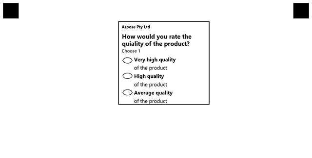**

## **WriteIn element**
Starts with **?write_in=** prefix that sets the name of the element. The WriteIn element is a field in which the user can enter some data and, if necessary, receive it in the form of a picture. If the WriteIn element is part of the VerticalChoiceBox element, its result is preserved if the user fills the bubble associated with it.

### **Attributes**
WriteIn element can be customized with attributes, each attribute must be on a new line starting with **\t** (tabulation) symbol.

|**Element**|**Prefix**|**Attribute**|**Attribute Description**|**Required/Optional**|**Attribute Default Value**|**Attribute Usage Example**|
| :- | :- | :- | :- | :- | :- | :- |
|WriteIn|?write_in=|required|Is clipping of write-in field required|Optional|false|required=true|

### **Examples**

````text
?container=1-st
	columns_count=3
?block=Process
	column=1
?write_in=Process
	required=true
&block
&container
````

**Result**

**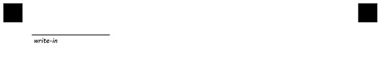**

**Saved result**

****

## **EmptyLine element**
In txt markup empty lines of text(\r\n) is recognized as vertical margin.
Placing empty line of text between two element can be used two create empty space between them.
Size of margin is calculated as one line of text using default or GlobalPageSettings font and size
You can **also** add element empty_line with attribute height to skip custom height in pixels.
Starts with **?empty_line=** prefix that sets the name of the element

### **Attributes**
EmptyLine element can be customized with attributes, each attribute must be on a new line starting with **\t** (tabulation) symbol.

|**Element**|**Prefix**|**Attribute**|**Attribute Description**|**Required/Optional**|**Attribute Default Value**|**Attribute Usage Example**|
| :- | :- | :- | :- | :- | :- | :- |
|EmptyLine|?empty_line=|height|Height in pixels to draw.|Optional|false|required=true|

## **InputGroup element**
Starts with **?input_group=** prefix that sets the name of the element. 
InputGroup is grouping element. It is used for drawing input field with description(label).
Two Content element must be will be places inside.First ContentElement describe label and second input field.
Does not participate in recognition.

### **Attributes**
InputGroup element can be customized with attributes, each attribute must be on a new line starting with **\t** (tabulation) symbol.

|**Element**|**Prefix**|**Attribute**|**Attribute Description**|**Required/Optional**|**Attribute Default Value**|**Attribute Usage Example**|
| :- | :- | :- | :- | :- | :- | :- |
|InputGroup|?input_group=|label_border|Describe borderType for label element|Optional|None|label_border=square|
|||input_border|Describe borderType for input element|Optional|None|input_border=square|
|||border_size|Describe size of border line in pixels|Optional|3|border_size=3
|||border_color|Describe color of border line|Optional|Black|border_color=red

**Example**

```text
?container=all
	columns_count=2
?block=left_size
	column=1
?input_group=name
	input_border=square
?content=First name
	font_style=bold
	font_size=7
?content=John
	align=center
	font_size=6
&input_group
?input_group=middle_name
	input_border=square
?content=Middle name
	font_size=7
	font_style=bold
?content= Abraham
	align=center
	font_size=6
&input_group
?input_group=last_name
	input_border=square
?content=Last name
	font_size=7
	font_style=bold
?content=Smith
	align=center
	font_size=6
&input_group
&block
&container
```

**Result**

**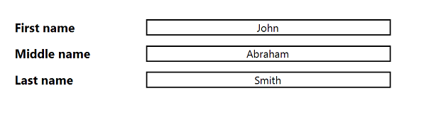**
