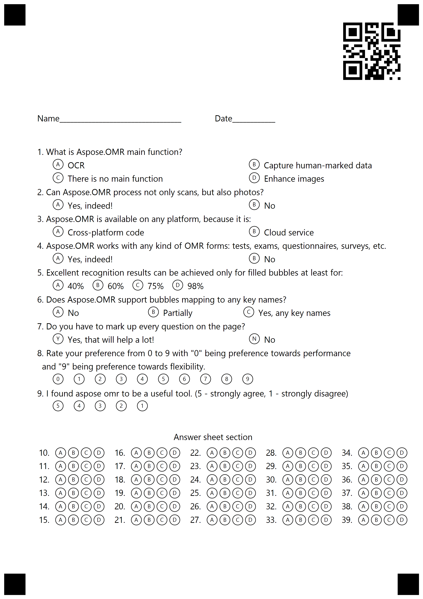

## **Create OMR Templates with Barcodes**
Aspose.OMR for .NET provides the option to generate OMR template (.omr) files containing barcodes. For this, you need to add the following part in the text markup.

```text
?barcode=AsposeWebsite
	value=aspose.com
	barcode_type=qr
	qr_version=1
	x=2000
	y=120
	height=360
```


### Full template content

```text
?barcode=AsposeWebsite
	value=aspose.com
	barcode_type=qr
	qr_version=1
	x=2000
	y=120
	height=360

?text=Name__________________________________ Date____________

#What is Aspose.OMR main function?
	() OCR	() Capture human-marked data
	() There is no main function	() Enhance images
#Can Aspose.OMR process not only scans, but also photos?
	() Yes, indeed!	() No
#Aspose.OMR is available on any platform, because it is:
	() Cross-platform code	() Cloud service
#Aspose.OMR works with any kind of OMR forms: tests, exams, questionnaires, surveys, etc.
	() Yes, indeed!	() No
#Excellent recognition results can be achieved only for filled bubbles at least for:
	() 40%	() 60%	() 75%	() 98%
#Does Aspose.OMR support bubbles mapping to any key names?
	() No	() Partially	() Yes, any key names
#Do you have to mark up every question on the page?
	(Yes) Yes, that will help a lot! (No) No
#Rate your preference from 0 to 9 with "0" being preference towards performance 
 and "9" being preference towards flexibility.
	(0) (1) (2) (3) (4) (5) (6) (7) (8) (9)
#I found aspose omr to be a useful tool. (5 - strongly agree, 1 - strongly disagree)
	(5) (4) (3) (2) (1)
?text= Answer sheet section

?answer_sheet=MainQuestions
	elements_count=30
	columns_count=5
```

The following code snippet processes the sample text markup to generate the OMR template file.





The following is the image generated by the sample code.

